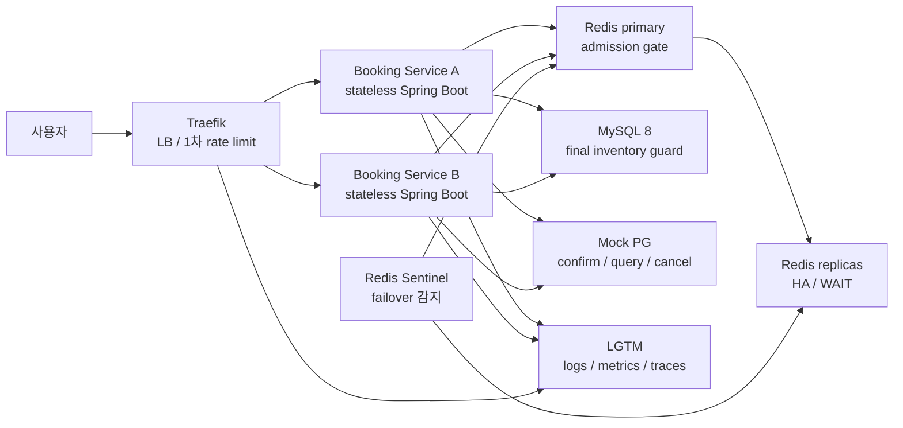
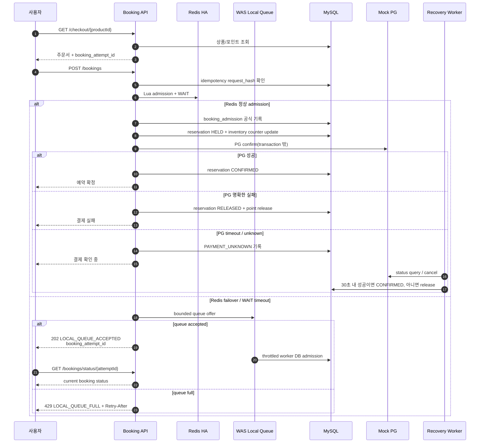
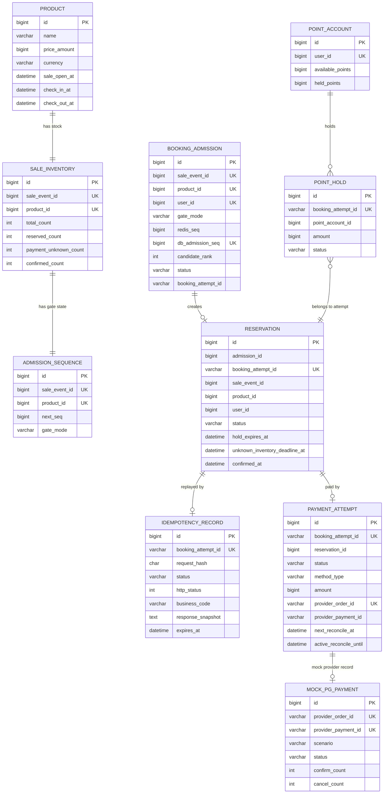

# Peak Booking System

[한국어](README.md) | [English](README-en.md)


`00:00`에 열리는 `10개 한정` 숙소 상품을 선착순으로 예약하고 결제하는 백엔드입니다.

이 프로젝트의 핵심은 "빠르게 10건을 판다"가 아니라, 피크 트래픽과 장애가 겹쳐도 아래 불변식을 지키는 것입니다.

- 확정 예약은 절대 `10건`을 초과하지 않는다.
- 같은 사용자의 중복 클릭은 구매 확률을 높이지 못한다.
- 결제 실패는 확정 예약을 만들지 않는다.
- Redis 장애는 초과판매나 DB 붕괴로 이어지지 않는다.
- PG timeout/응답 유실 뒤에도 재고가 영구히 잠기지 않는다.

## 목차

- [시스템 개요](#시스템-개요)
- [아키텍처](#아키텍처)
- [실행 방법](#실행-방법)
- [API 사용 예시](#api-사용-예시)
- [예약/결제 시퀀스](#예약결제-시퀀스)
- [ERD와 DDL](#erd와-ddl)
- [테스트와 관측](#테스트와-관측)
- [주요 문서](#주요-문서)

## 시스템 개요

요구사항은 평시 `50 TPS`, 프로모션 오픈 직후 `1~5분` 동안 `500~1000 TPS` 급증을 가정합니다. 또한 인프라 증설이 제한적이고, `2개 이상`의 stateless WAS replica를 전제로 합니다.

이 조건에서 모든 요청을 깊은 DB transaction까지 들여보내면 성공 예약은 10건뿐인데 실패 요청이 DB를 압박합니다. 그래서 정상 경로는 Redis admission gate가 빠르게 후보를 거르고, MySQL은 공식 admission ledger와 최종 정합성 원장으로 사용합니다. 상품 가격/오픈 시각 같은 metadata read는 짧은 TTL cache로 보호하며, 핵심 목표는 inventory write path를 피크 전체 요청에서 분리하는 것입니다.

Redis는 최종 재고 원장이 아닙니다. Redis HA로 정상 admission을 빠르게 처리하되, Redis failover 중에는 request thread가 DB로 직접 우회하지 않습니다. 대신 WAS-local bounded queue가 요청을 `202 LOCAL_QUEUE_ACCEPTED`로 받아두고, background worker가 설정된 속도로만 MySQL admission ledger를 갱신합니다. Redis가 복구되어도 local queue가 비거나 drain-grace가 지날 때까지 새 요청은 로컬 큐에 유지합니다.

## 아키텍처



| 구성요소 | 역할 | 정합성 책임 |
|---|---|---|
| Traefik | WAS 앞단의 LB와 1차 rate limit | 공정성/중복 방지 원장이 아님 |
| Redis HA | 정상 경로 admission gate, 중복 사용자 빠른 차단, 후보군 제한 | 최종 재고 원장이 아님 |
| WAS-local queue | Redis 장애 중 bounded in-memory 대기열과 throttled worker 제공 | durable/global FIFO 원장이 아님 |
| MySQL | admission ledger, reservation, idempotency, payment 상태 저장 | 최종 재고 정합성 원장 |
| Booking Service | 예약/결제 흐름 조정, bulkhead, recovery scheduler | stateless 유지 |
| Mock PG | 승인/조회/취소/timeout/unknown 시뮬레이션 | 실제 PG 연동을 대체하는 테스트 포트 |
| LGTM | Grafana, Loki, Tempo, Mimir 기반 관측 | 병목과 장애 결과 확인 |

핵심 재고 불변식은 MySQL에서 보장합니다.

```text
HELD + PAYMENT_UNKNOWN + CONFIRMED <= total_stock
total_stock = 10
```

## 실행 방법

코드 수정 없이 실행할 수 있습니다. 로컬 실행에 필요한 인프라는 Docker Compose가 함께 올립니다.

### 사전 준비

- Java 21
- Docker / Docker Compose
- Kubernetes 검증 시 `kubectl`, `kustomize`, k3s 또는 호환 Kubernetes cluster

### 추가 인프라 구성

| 목적 | 로컬 기본 실행 | k8s/loadtest 실행 |
|---|---|---|
| DB | MySQL 8 container | MySQL manifest |
| Redis | 단일 Redis container | Redis primary + replica 2 + Sentinel 3 |
| LB/API gateway | Docker port mapping | Traefik Ingress |
| 관측 | LGTM container | LGTM manifest + Grafana dashboard |
| 부하 테스트 | k6 container | 외부 k6 또는 k6 script |

로컬 Docker Compose는 빠른 기능 확인용이라 Redis 단일 인스턴스를 사용합니다. Redis HA/failover 검증은 `k8s/loadtest` overlay에서 수행합니다.

### 로컬 실행

```bash
# 1. 테스트
cd backend
./gradlew test --no-daemon
cd ..

# 2. MySQL, Redis, LGTM, booking-service 실행
docker compose up -d mysql redis lgtm booking-service

# 3. 헬스체크
curl http://localhost:8080/api/v1/health

# 4. 주문서 진입
curl -H "X-User-Id: 1001" \
  http://localhost:8080/api/v1/checkout/1

# 5. 예약/결제 요청
curl -X POST http://localhost:8080/api/v1/bookings \
  -H "Content-Type: application/json" \
  -H "X-User-Id: 1001" \
  -d '{
    "sale_event_id": 1,
    "product_id": 1,
    "booking_attempt_id": "checkout-response-booking-attempt-id",
    "payment_methods": [
      {"type": "CREDIT_CARD", "amount": 10000}
    ],
    "total_amount": 10000,
    "currency": "KRW"
  }'

# 6. smoke 부하 테스트
docker compose run --rm -e RATE=20 -e DURATION=10s k6

# 7. 종료
docker compose down
```

기본 seed data는 [backend/src/main/resources/data.sql](backend/src/main/resources/data.sql)에 있습니다.

- `product_id = 1`
- `sale_event_id = 1`
- 가격 `10000 KRW`
- 재고 `10`

Grafana는 `http://localhost:3000`에서 확인할 수 있습니다.

### Kubernetes manifest 렌더링

```bash
kubectl kustomize k8s/base
kubectl kustomize k8s/loadtest
```

`k8s/loadtest`는 Redis HA와 Traefik rate limit, LGTM dashboard를 포함합니다.

## API 사용 예시

| Method | Endpoint | 설명 | 구현 상태 |
|---|---|---|---|
| `GET` | `/api/v1/health` | 서비스 헬스체크 | 구현 |
| `GET` | `/api/v1/checkout/{productId}` | 주문서 진입, 상품/가격/Y포인트/`booking_attempt_id` 발급 | 구현 |
| `POST` | `/api/v1/bookings` | 멱등성 확인, admission, 재고 점유, PG confirm, 예약 확정 | 구현 |

`POST /bookings`의 결제 수단은 아래를 지원합니다.

| 결제 수단 | 단독 결제 | 포인트 복합 결제 | 비고 |
|---|---:|---:|---|
| `CREDIT_CARD` | 가능 | 가능 | `Y_PAY`와 혼용 불가 |
| `Y_PAY` | 가능 | 가능 | `CREDIT_CARD`와 혼용 불가 |
| `Y_POINT` | 가능 | 해당 없음 | hold -> capture -> release |

Mock PG scenario는 운영 API 계약이 아니라 **local/test/load-test profile에서만 쓰는 장애 주입 값입니다**. k6와 통합 테스트는 `SUCCESS`, `FAILURE`, `TIMEOUT`, `LATE_SUCCESS`로 실제 PG의 승인/조회/취소/응답 유실 흐름을 흉내냅니다. production profile에서는 사용자가 결제 결과를 선택하는 API로 노출하면 안 됩니다.

## 예약/결제 시퀀스



이 설계에서 PG 호출은 DB transaction 안에서 수행하지 않습니다. 외부 결제 지연이 DB connection과 lock을 오래 잡지 않게 하기 위해서입니다.

## ERD와 DDL

주문/결제 도메인 중심 ERD입니다. 실제 DDL은 [backend/src/main/resources/schema.sql](backend/src/main/resources/schema.sql)에 있습니다.



주요 unique key는 비즈니스 불변식을 직접 표현합니다.

| Table | Unique key | 의미 |
|---|---|---|
| `sale_inventory` | `(sale_event_id, product_id)` | 이벤트/상품별 재고 원장 1개 |
| `booking_admission` | `(sale_event_id, product_id, user_id)` | 같은 사용자는 한 이벤트 상품에서 한 번만 admission chance 획득 |
| `booking_admission` | `(sale_event_id, product_id, db_admission_seq)` | 공식 admission 순서 중복 방지 |
| `reservation` | `booking_attempt_id` | 같은 주문서 시도에서 예약 중복 생성 방지 |
| `idempotency_record` | `booking_attempt_id` | 멱등성 replay 기준 |
| `payment_attempt` | `booking_attempt_id`, `provider_order_id` | 결제 side effect 중복 방지 |
| `point_hold` | `booking_attempt_id` | 포인트 이중 hold 방지 |

## 테스트와 관측

### 테스트

```bash
cd backend
./gradlew test --no-daemon
cd ..

docker compose run --rm -e RATE=20 -e DURATION=10s k6
```

주요 테스트 축은 다음입니다.

- 단위 테스트: 결제 조합, request hash, admission gate 판단
- 통합 테스트: MySQL + Redis + Mock PG를 포함한 예약/결제 상태 전이
- k6 resilience: 정상 피크, 중복 클릭, PG timeout, Redis failover, WAS 1대 down, mixed
- 불변식 확인: confirmed `<= 10`, occupied stock `<= 10`, duplicate PG confirm `0`

### 관측

Grafana dashboard는 `k8s/observability`와 `infra/observability` 아래에 있습니다. 주요 관측 지표는 다음입니다.

| 영역 | 확인 지표 |
|---|---|
| API | endpoint별 p95/p99, 2xx/4xx/5xx, shedding ratio |
| DB | Hikari active/idle/pending, MySQL connection/running thread |
| Redis | exporter up, client 수, failover 중 app latency |
| JVM | heap/non-heap, thread, CPU |
| 정합성 | confirmed count, occupied count, late success cancel/manual review |

## 주요 문서

| 문서 | 목적 |
|---|---|
| [요구사항](docs/requirements.md) | 공개 가능한 요구사항 요약 |
| [의사결정 기록](docs/decisions/DECISIONS.md) | Redis 장애 대응, 멱등성, 결제 실패, 결제 확장성, rate limit 판단 |
| [Software Design Document](docs/system-design/sdd.md) | 전체 시스템 설계와 상태 전이 |
| [Mock Interview Design](docs/system-design/mock-interview.md) | 설계 질문/답변 흐름 |
| [부하 테스트 결과 정리 폼](docs/testing/loadtest-evidence-index.md) | 기존 v1 결과와 local queue fallback 수정 후 결과 비교 정리 |
| [AI Usage](docs/ai/AI_USAGE.md) | AI 사용 범위와 사람 검증 경계 |
