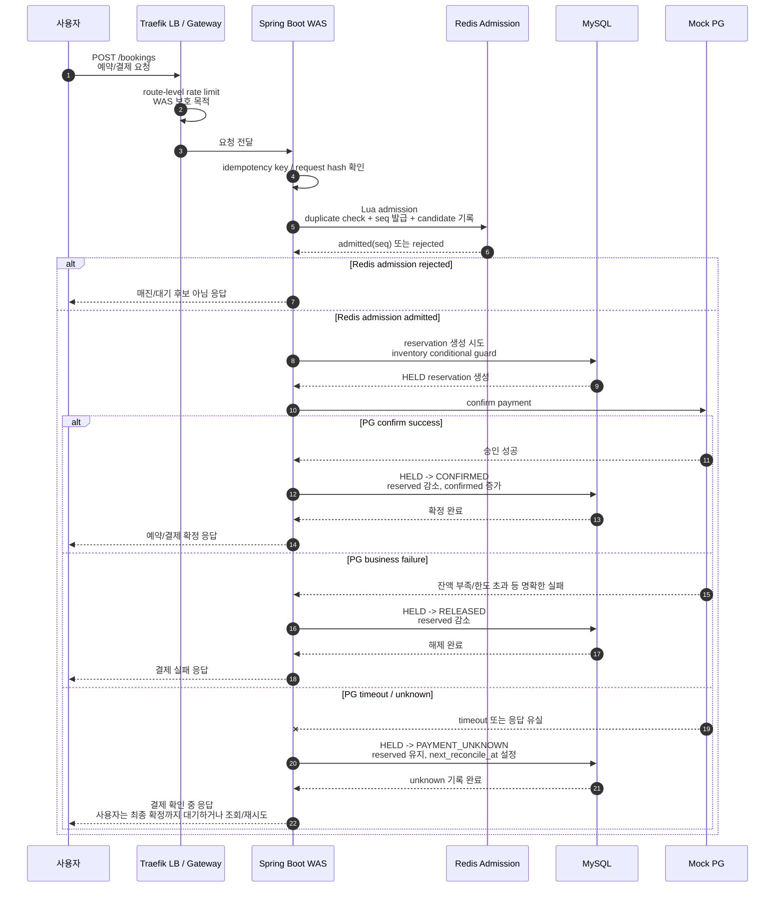
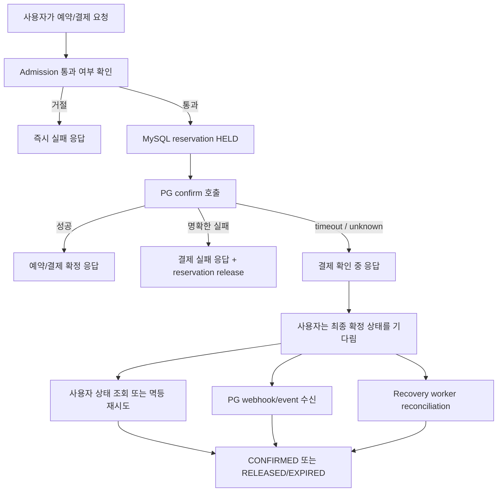
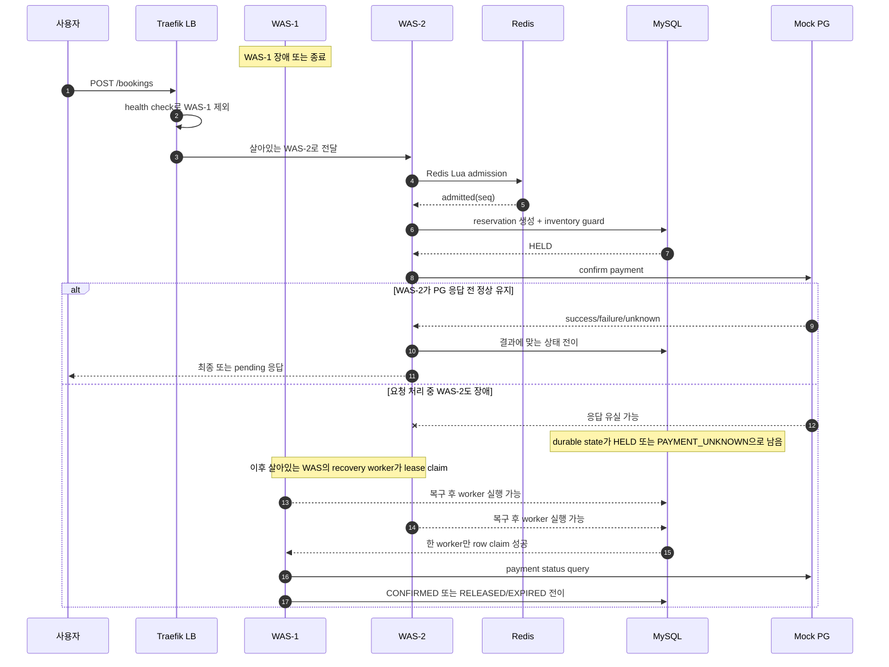
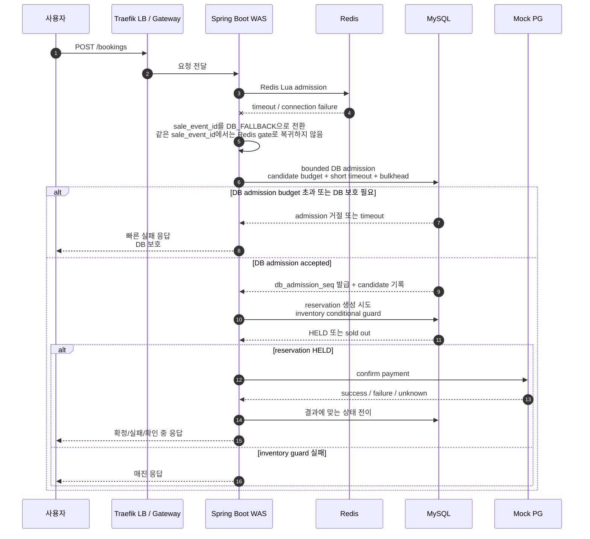
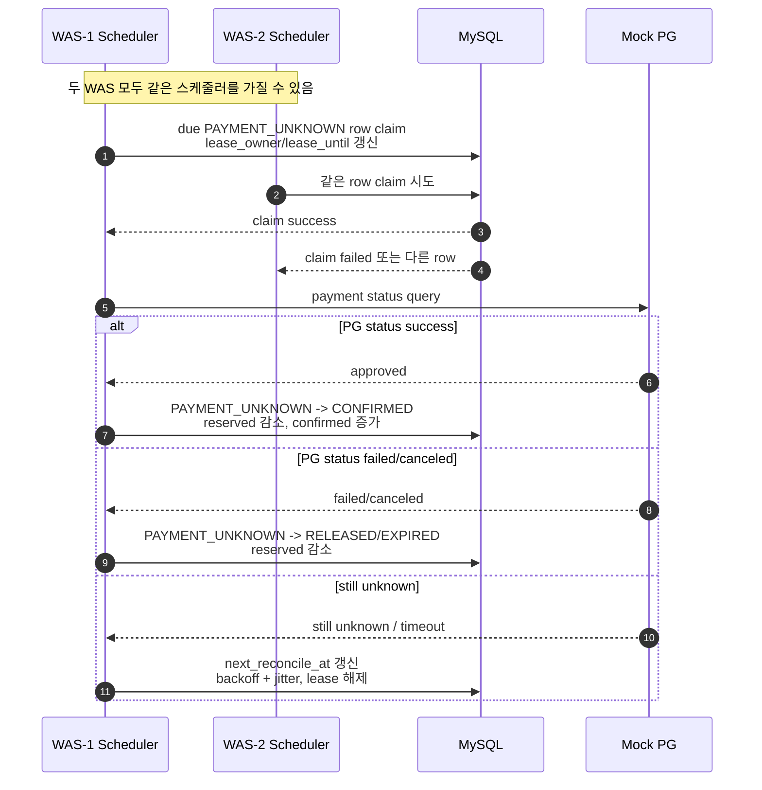
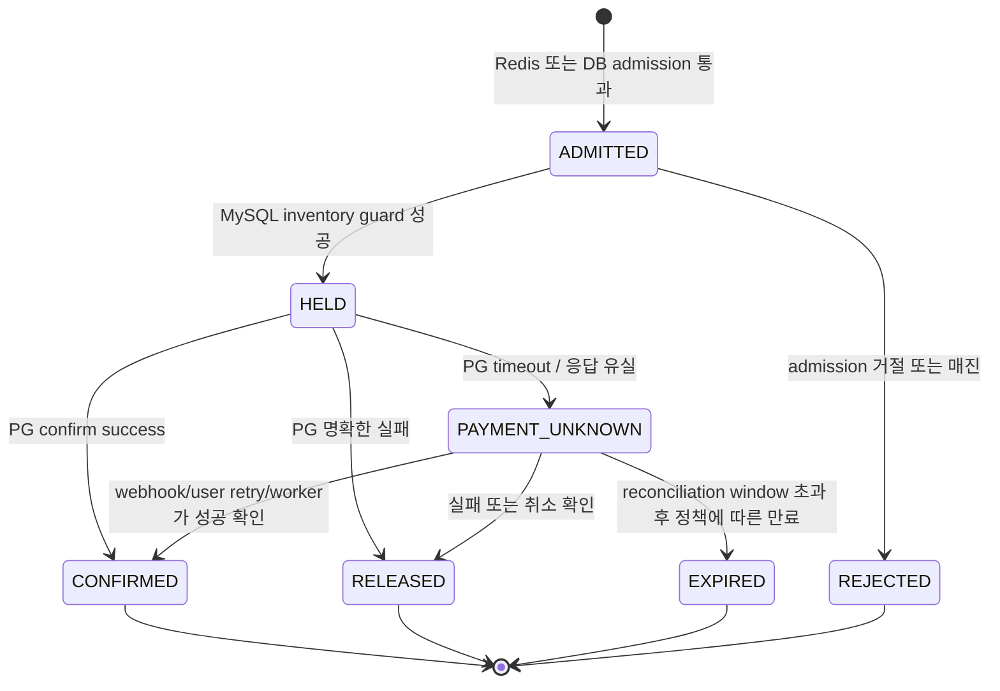

# Booking 사용자 흐름 Mermaid

> 이 문서는 사용자의 예약 요청부터 결제 확정/복구까지의 주요 흐름을 Mermaid로 요약한다. 최종 결정의 원문은 `docs/decisions/DECISIONS.md`, 상세 설계 기준은 `docs/system-design/sdd.md`를 따른다.

## 전제

- 정상 admission은 Redis Lua script가 담당한다.
- Redis 장애 시 같은 `sale_event_id`에서는 DB bounded admission fallback으로 전환한다.
- 최종 재고 정합성은 MySQL inventory guard와 reservation 상태 전이로 보장한다.
- PG confirm timeout/unknown은 즉시 실패로 처리하지 않고 `PAYMENT_UNKNOWN`으로 두며, webhook/user retry/recovery worker가 reconciliation한다.
- Recovery worker는 기존 WAS 내부에서 작은 thread/batch/concurrency budget으로 실행되며, MySQL lease로 중복 처리를 막는다.

## 1. 정상 상황

## 2. 사용자가 기다려야 하는 지점

## 3. WAS 한 대가 내려간 상황

## 4. Redis 장애 상황

## 5. Recovery worker 흐름

## 6. 전체 상태 전이 요약

