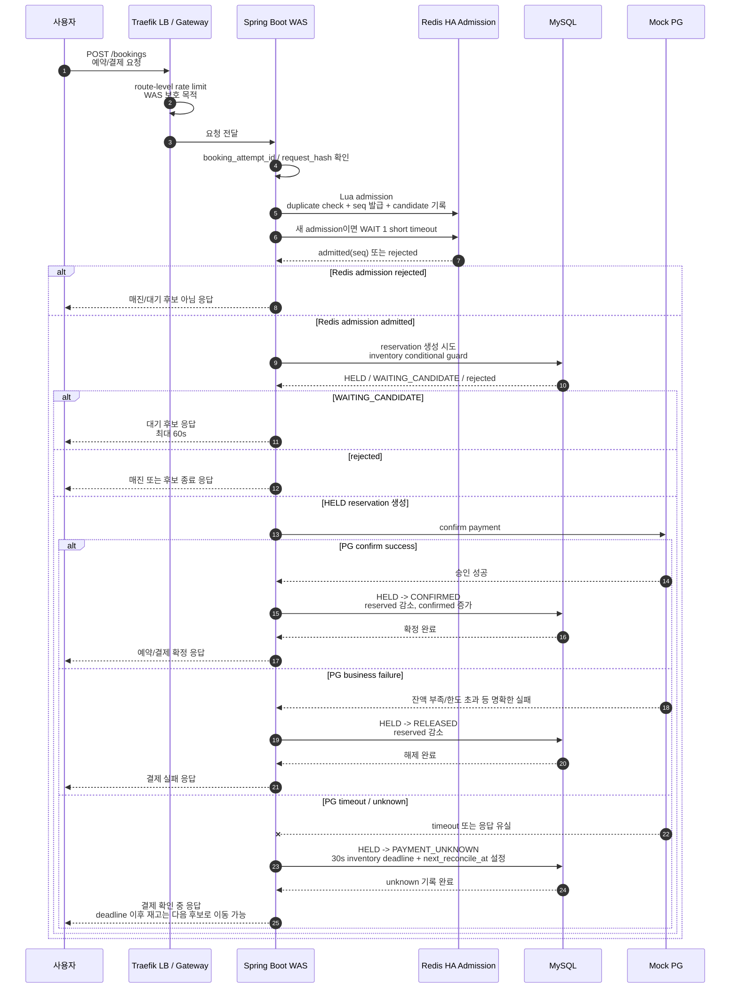
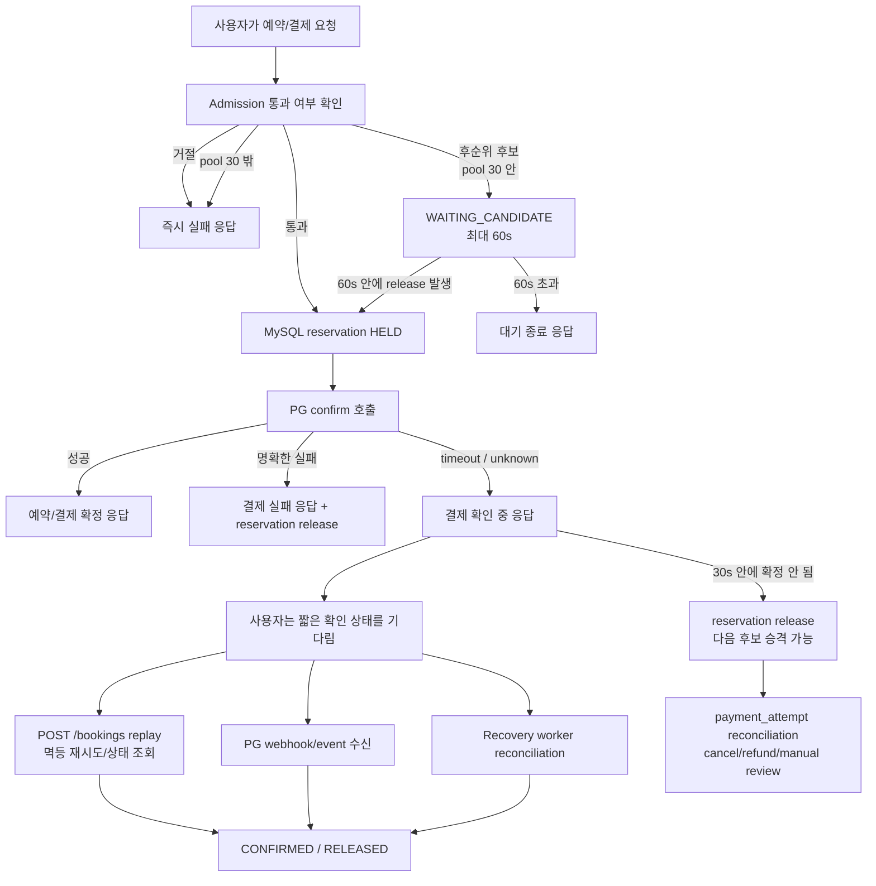
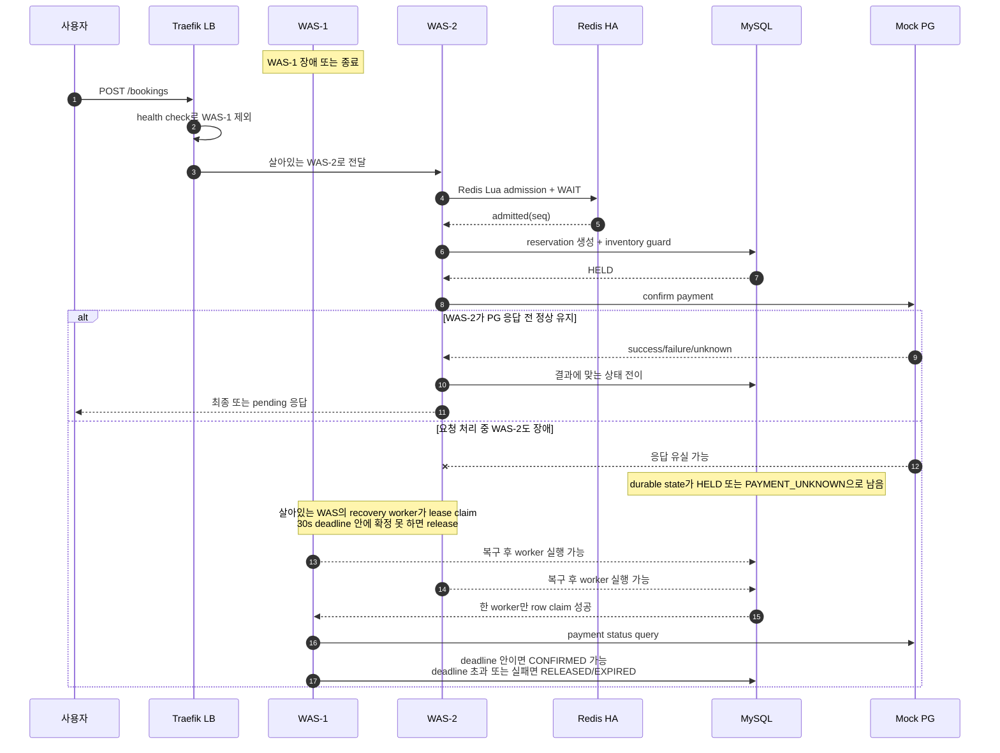
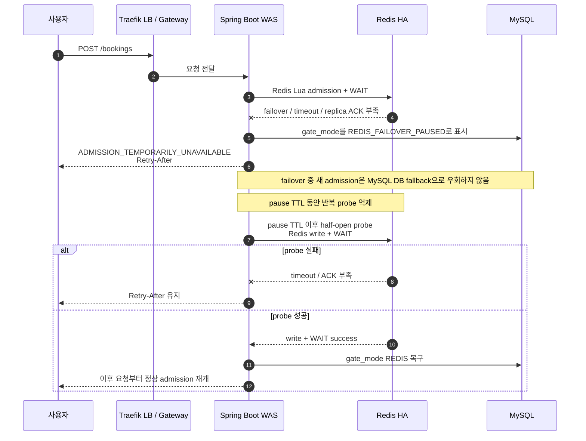
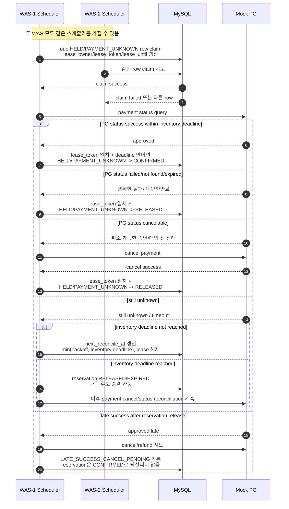
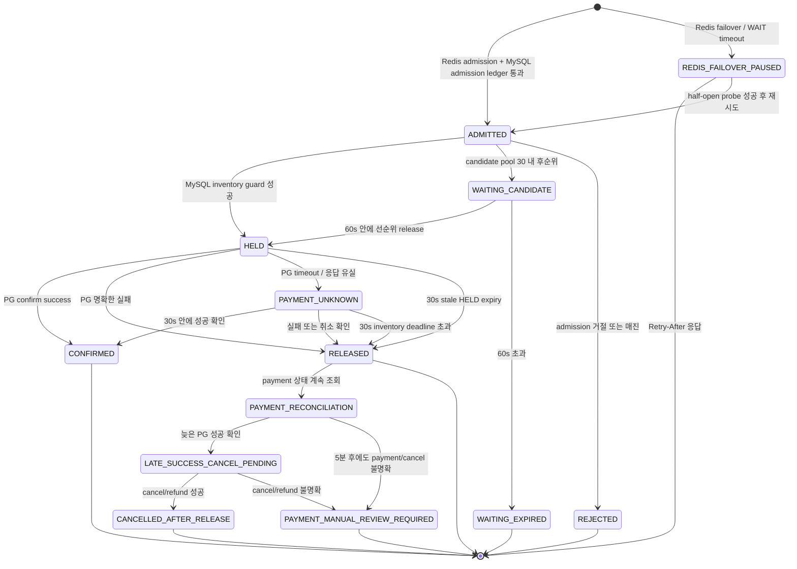

# Booking 사용자 흐름 Mermaid

> 이 문서는 사용자의 예약 요청부터 결제 확정/복구까지의 주요 흐름을 Mermaid로 요약한다. 최종 결정의 원문은 `docs/decisions/DECISIONS.md`, 상세 설계 기준은 `docs/system-design/sdd.md`를 따른다.

## 전제

- 정상 admission은 Redis HA의 Lua script가 담당한다.
- Redis failover, `WAIT` timeout, min-replica 조건 불만족 시 새 admission은 DB fallback으로 우회하지 않고 `ADMISSION_TEMPORARILY_UNAVAILABLE + Retry-After`로 짧게 pause한다.
- 최종 재고 정합성은 MySQL inventory guard와 reservation 상태 전이로 보장한다.
- PG confirm timeout/unknown은 즉시 성공/실패로 확정하지 않고 `PAYMENT_UNKNOWN`으로 두되, 재고 점유는 `30s` deadline까지만 허용한다.
- Recovery worker는 기존 WAS 내부에서 작은 thread/batch/concurrency budget으로 실행되며, MySQL lease로 stale `HELD`와 `PAYMENT_UNKNOWN` 중복 처리를 막는다.
- 후순위 `WAITING_CANDIDATE`는 재고를 점유하지 않으며, 사용자-facing 대기 window는 최대 `60s`다.
- candidate pool은 sale event당 `30`으로 고정하며, 추가 tranche는 열지 않는다.
- `PAYMENT_UNKNOWN`이 `30s` 안에 확정되지 않으면 reservation은 `RELEASED/EXPIRED`로 닫고 다음 후보에게 판매 기회를 넘긴다.
- reservation release 이후에도 payment_attempt는 `5분` 동안 status/cancel reconciliation을 계속하며, 끝까지 불명확하면 payment-only `MANUAL_REVIEW_REQUIRED`로 전이한다.

## 1. 정상 상황

## 2. 사용자가 기다려야 하는 지점

## 3. WAS 한 대가 내려간 상황

## 4. Redis failover 상황

## 5. Recovery worker 흐름

## 6. 전체 상태 전이 요약

