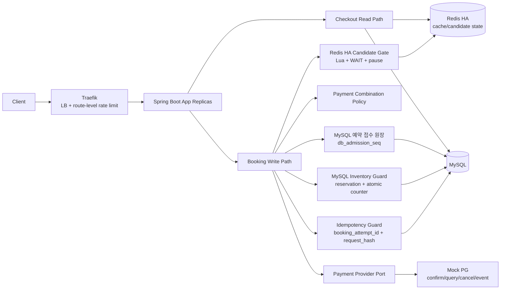
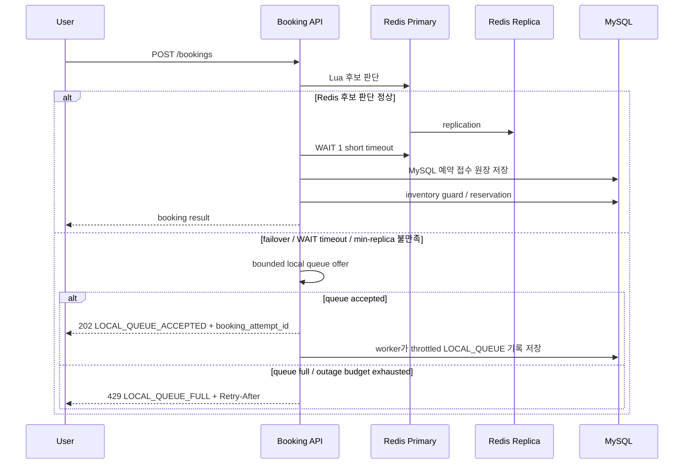
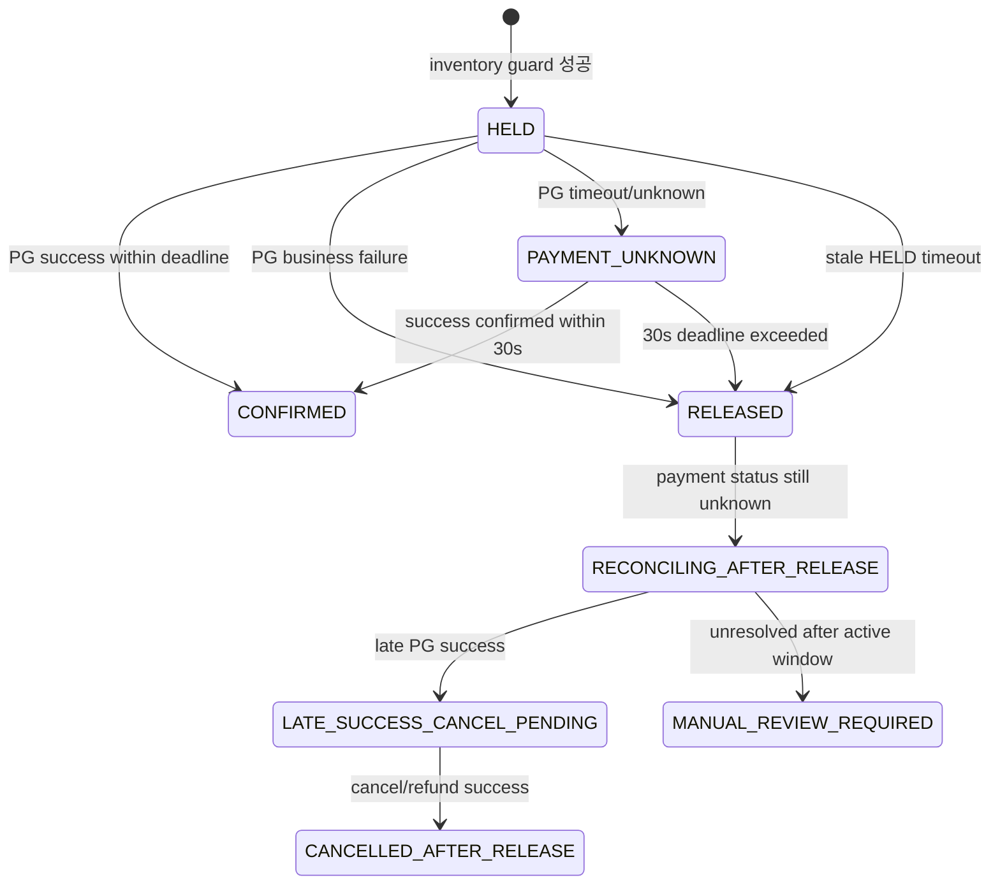

# Peak Booking System — Mock Interview Notes

> **문서 목적**
> 이 문서는 `00시` 오픈, `10개 한정` 초특가 숙소 예약/결제 backend 설계를 면접식으로 설명하기 위한 작업 문서다. 최종 의사결정 원장은 `docs/decisions/DECISIONS.md`이며, 이 문서는 그 결정을 쉽게 설명하는 보조 문서다.

---

## 1. 요구사항 재정리

### 기능 요구사항

- 주문서 진입 API는 상품명, 가격, 입/퇴실 시간, 사용 가능한 Y포인트, 서버 발급 `booking_attempt_id`를 반환한다.
- 예약 API는 결제 입력을 검증하고, 재고를 점유한 뒤 결제 결과에 따라 최종 예약을 확정하거나 release한다.
- 결제 수단은 신용카드, Y페이, Y포인트를 지원한다.
- 허용 조합은 신용카드+Y포인트, Y페이+Y포인트다.
- 신용카드와 Y페이 혼용은 금지한다.
- 짧은 간격의 연속 결제 요청은 중복 booking/payment effect를 만들면 안 된다.
- Redis 장애 fallback 전략과 결제 실패 처리 전략을 제시해야 한다.

### 비기능 요구사항

- 대상 재고는 `10개`다.
- 평시 `50 TPS`, 프로모션 시작 후 `1~5분` 동안 `500~1000 TPS` burst를 고려한다.
- 애플리케이션 서버는 `2대 이상` stateless replica로 동작해야 한다.
- 인프라 scale-up/out은 제한적이라고 가정한다.
- 초과판매와 영구 재고 누수는 막아야 한다.
- 모든 사용자가 동등한 확률로 상품을 구매할 수 있는 구조를 고민해야 한다.
- 실제 PG 연동은 제외하지만 Mock PG는 confirm/query/cancel/webhook-like 흐름을 구조적으로 제공해야 한다.

---

## 2. 한 줄 설계

정상 경로에서는 Traefik이 1차로 spike를 줄이고, Redis HA가 후보를 빠르게 추린다. MySQL은 `booking_admission` 예약 접수 원장과 최종 재고 guard를 담당한다. Redis failover 중에는 새 요청을 DB로 직접 우회하지 않고, WAS-local bounded queue에 일부 요청만 받아 throttled worker가 DB 예약 접수 원장을 기록한다. 결제는 `HELD`를 먼저 durable하게 남긴 뒤 DB transaction 밖에서 PG를 호출하고, timeout/unknown은 bounded recovery로 정리한다.

단, Redis master failover의 최종 k6 성능 수치는 원시 결과 파일과 함께 다시 남겨야 한다. 현재 repository가 확실하게 담고 있는 것은 local queue fallback, half-open, drain-grace의 코드 테스트와, 정상 peak/중복/PG timeout/WAS 1대 down/Redis hard-down/shared DB pressure의 로컬 k6 요약이다. 증거 연결 상태는 [부하 테스트 증거 인덱스](../testing/loadtest-evidence-index.md)를 기준으로 본다.



---

## 3. 핵심 설계 설명

### 3.1 재고 정합성

최종 재고 정합성은 Redis가 아니라 MySQL이 보장한다. Redis는 빠른 후보 pre-gate일 뿐이다.

MySQL의 핵심 불변식은 다음이다.

```text
HELD + PAYMENT_UNKNOWN + CONFIRMED <= 10
```

초기 재고 점유는 `sale_inventory` 조건부 update와 `reservation.HELD` 생성을 같은 transaction에 넣는다. PG confirm은 이 transaction 안에서 호출하지 않는다.

```sql
UPDATE sale_inventory
SET reserved_count = reserved_count + 1
WHERE sale_event_id = ?
  AND product_id = ?
  AND reserved_count + payment_unknown_count + confirmed_count < total_count;
```

affected row가 `1`인 경우에만 `reservation.HELD`를 만든다. affected row가 `0`이면 재고 점유에 실패한 것이다.

### 3.2 공정성

공정성 기준은 클라이언트 클릭 시각이 아니다. 서버가 검증하고 감사할 수 있는 DB 확정 순서다.

- Redis는 정상 경로에서 provisional sequence와 candidate pool을 빠르게 판단한다.
- MySQL `booking_admission.db_admission_seq`가 DB 확정 순서다.
- 같은 `(sale_event_id, product_id, user_id)`는 접수 기회를 하나만 갖는다.
- 중복 클릭이나 retry가 같은 사용자의 구매 확률을 높이면 안 된다.
- candidate pool은 sale event당 `30`으로 제한한다.

### 3.3 Redis 장애 대응

기존 bounded DB fallback 후보는 버렸다. 이유는 Redis down 중 `500~1000 TPS`를 DB fallback으로 받아보면, 동시 허용치를 작게 잡을 때는 너무 많이 거절되고, 크게 잡을 때는 공유 DB가 위험해지기 때문이다.

현재 채택한 구조는 Redis HA + WAS-local bounded in-memory queue fallback이다. Kafka/MQ 같은 durable queue를 넣으면 장애 중 전역 순서와 내구성을 더 잘 보장할 수 있지만, 현재 프로젝트는 인프라 추가 비용과 queue/consumer 운영 복잡도를 피하는 쪽을 선택한다. 대신 공정성과 crash durability를 일부 포기하고, bounded queue와 throttled worker로 DB 붕괴를 막으며 제한적인 판매 연속성을 확보한다.



정책은 다음과 같다.

- Redis HA는 primary + replica 2대 + Sentinel 3대를 권장한다.
- Redis server에는 `min-replicas-to-write 1`, `min-replicas-max-lag 1~2s`를 둔다.
- 새 후보 write 이후에는 `WAIT 1`을 짧게 수행한다.
- failover, WAIT timeout, Redis command timeout이 발생하면 request thread는 DB로 새 후보를 직접 뽑지 않는다.
- 장애 중 요청은 WAS-local bounded queue에 offer한다.
- queue accepted는 `202 LOCAL_QUEUE_ACCEPTED`, queue full 또는 장애 episode 수용 예산 초과는 `429 LOCAL_QUEUE_FULL`로 응답한다.
- local queue worker만 fixed-delay/batch-size budget 안에서 MySQL 예약 접수 원장을 기록한다.
- worker가 `SERVICE_BUSY`, DB timeout, connection failure를 만나면 complete하지 않고 retry/backoff 후 재큐잉한다.
- pause TTL 이후 half-open probe를 수행한다.
- probe는 Redis write + WAIT가 성공해야 통과한다.
- probe가 성공해도 local queue가 비거나 drain-grace가 지날 때까지 새 외부 요청은 local queue에 유지한다.
- DB write budget은 Redis sequence를 먼저 소비한 뒤 DB 저장에 실패하는 후보 손실을 막기 위해 예약 접수 원장 저장 구간에 둔다. 기준 순서는 Redis sequence가 아니라 MySQL `db_admission_seq`의 DB 확정 순서다.

이 구조는 Redis 장애 중에도 모든 요청을 계속 판매 처리하겠다는 의미가 아니다. Redis HA로 장애 시간을 줄이고, failover 중에는 request thread의 직접 DB fallback을 막으며, 작은 bounded local queue와 장애 episode 수용 예산 안에서만 제한적으로 판매를 이어간다는 의미다. replica 간 전역 FIFO와 WAS crash durability는 보장하지 않는다.

Redis 장애 중에도 판매를 계속해야 하는 강한 요구가 추가되면, Redis 앞 또는 Redis 옆에 durable 접수 로그를 추가해야 한다.

### 3.4 멱등성

멱등성 key는 client가 임의로 보내는 값이 아니라, 서버가 checkout 진입 시 발급하는 `booking_attempt_id`다.

정책은 다음과 같다.

- 서버가 checkout에서 signed attempt token을 발급한다.
- 같은 `booking_attempt_id`와 같은 `request_hash`는 같은 논리 결제 시도다.
- `booking_attempt_id`는 Redis 후보 상태에 저장하지 않는다. Redis에는 `userId -> redisSeq`와 ZSET 순번만 저장하고, MySQL이 idempotency/예약 접수/reservation/payment의 권위 있는 저장소다.
- checkout 직후의 attempt는 signed token일 뿐 DB row가 아닐 수 있다. `POST /bookings` 중 `idempotency_record`가 생기고, 예약 접수/reservation/payment 단계가 진행되며 각 DB table에 attempt id가 기록된다.
- Redis 장애 중 `LOCAL_QUEUE_ACCEPTED` 직후부터 worker가 DB 예약 접수 원장에 기록하기 전까지는 attempt가 WAS local memory에만 존재할 수 있다.
- terminal 상태는 저장된 logical response를 replay한다.
- in-progress 또는 `PAYMENT_UNKNOWN` replay는 새 PG confirm을 만들지 않는다.
- 같은 `booking_attempt_id`에서 side-effect 필드가 바뀌면 `request_hash` conflict로 거절한다.
- retention은 `24h`다.

### 3.5 결제 실패와 unknown

PG confirm은 DB transaction 밖에서 호출한다. 외부 PG 지연을 DB connection/lock과 묶지 않기 위해서다.



핵심 기준은 다음이다.

- `PAYMENT_UNKNOWN`은 재고를 무기한 잡지 않는다.
- 재고 점유 deadline은 `30s`다.
- `30s` 안에 성공을 확인하지 못하면 reservation은 release/expire하고 다음 후보에게 판매 기회를 넘긴다.
- release 이후 늦은 PG 성공이 확인되어도 reservation을 다시 confirmed로 되살리지 않는다.
- 늦은 성공은 cancel/refund/reconciliation으로 처리한다.
- PG 취소 수수료나 CS 비용은 accepted compensation cost다.

Recovery worker는 WAS 내부 scheduler로 두되, MySQL lease와 bounded concurrency로 중복 처리를 막는다. Worker는 stale `HELD`, `PAYMENT_UNKNOWN`, release 이후 reconciliation 상태를 처리한다.

### 3.6 결제 확장성

Booking API가 결제 수단별 if/else를 계속 늘리는 구조는 거절한다.

채택 구조는 다음이다.

| 구성요소 | 책임 |
|---|---|
| `PaymentPlan` | 결제 수단/금액/포인트 사용액을 정규화 |
| `CombinationPolicy` | 신용카드+Y페이 혼용 금지, 포인트 조합 허용 검증 |
| `PaymentProcessor` | 수단별 hold/confirm/capture/release 실행 |
| `PaymentProviderPort` | Mock PG 또는 외부 PG confirm/query/cancel interface |
| `PointHold` | Y포인트 `hold -> capture -> release` 멱등 상태 |

Y포인트도 결제 수단이다. 단순 차감이 아니라 `hold -> capture -> release` 상태를 가진다.

### 3.7 피크 트래픽 방어

Traefik은 2개 이상 WAS replica 앞의 LB/API gateway이자 1차 rate limiter다. 단, Traefik은 공정성 원장이나 중복 방지 수단이 아니다.

- Traefik rate limit은 WAS 보호용이다.
- Traefik Redis-backed distributed limiter는 쓰지 않는다. Redis 장애와 gateway 보호막을 결합하지 않기 위해서다.
- 사용자별 중복 방지는 MySQL unique constraint와 idempotency policy가 담당한다.
- DB write, PG confirm, recovery worker는 각각 별도 concurrency budget을 갖는다.

---

## 4. 결정 요약

| 쟁점 | 결정 |
|---|---|
| 재고 정합성/공정성 | MySQL 예약 접수 원장의 DB 확정 순서 + reservation/atomic counter final guard |
| Redis 장애 대응 | Redis HA + WAIT/min-replicas + WAS-local bounded queue fallback + half-open/drain-grace |
| 멱등성 | 서버 발급 `booking_attempt_id` + `request_hash` + stored logical replay |
| 결제 실패 | `HELD` commit 후 transaction 밖 PG confirm, `PAYMENT_UNKNOWN` 30s deadline |
| 결제 확장성 | `PaymentPlan` + `CombinationPolicy` + `PaymentProcessor` |
| 과부하 방어 | Traefik 1차 rate limit + app bulkhead + local queue capacity/outage budget shedding |
| 테스트 | TDD + integration + k6 resilience + LGTM dashboard |

---

## 5. 남은 검증 포인트

| 검증 포인트 | 현재 상태 |
|---|---|
| Redis failover 중 MySQL DB fallback으로 새 요청이 우회하지 않는지 | unit/controller test로 확인. Redis master failover k6 원시 결과는 재실측 필요 |
| half-open probe가 Redis write + WAIT 성공 후에만 Redis 경로를 재개하는지 | unit test로 확인 |
| Redis failover 중 local queue accepted/full 비율과 DB pressure가 기준을 만족하는지 | 최신 k6 증거 파일 필요 |
| duplicate request가 PG confirm owner를 2개 만들지 않는지 | integration/idempotency test로 확인 |
| stale `HELD`와 `PAYMENT_UNKNOWN`이 `30s` 안에 release되는지 | recovery/integration test로 확인 |
| release 이후 늦은 PG success가 reservation을 되살리지 않고 cancel/refund/reconciliation으로 흐르는지 | integration test로 확인 |
| `WAITING_CANDIDATE`가 `60s`를 초과해 사용자-facing 대기 상태로 남지 않는지 | 정책 수용. mixed k6 재실측 필요 |

---

## References

- [Requirements](../requirements.md)
- [Decision log](../decisions/DECISIONS.md)
- [Software Design Document](sdd.md)
- [Load-test result summary form](../testing/loadtest-evidence-index.md)
