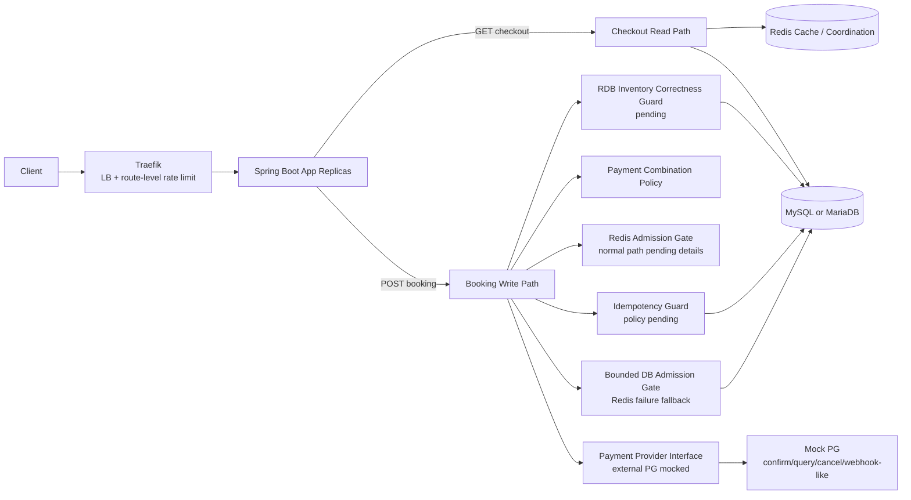

# Peak Booking System — System Design (Mock Interview Style)

> **문서 목적**
> 현재 `docs/requirements.md`에 명시된 요구사항만 기준으로 시스템 설계를 쉽게 설명하는 작업 문서다. 요구사항에 없는 항목은 확정하지 않고 `Open Questions` 또는 `DECISIONS.md`의 미결정 쟁점으로 보낸다.

---

## 0. Metadata

| 항목 | 값 |
|---|---|
| Topic | Limited-stock booking/payment backend |
| Reviewer Persona | Backend/System Design reviewer |
| Date | 2026-05-30 |
| Requirement Source | `docs/requirements.md` |
| Decision Rule | 기술 선택의 최종 권한자는 user이며, 이 문서는 임의로 결정을 확정하지 않는다. |

---

## 1. Clarifying Questions

### 1.1 Functional Requirements From Current Requirements

- [x] FR-1: 사용자는 주문서 진입 시 상품명, 가격, 입/퇴실 시간, 가용 Y포인트 등 checkout 정보를 조회할 수 있다.
- [x] FR-2: 사용자는 주문서 정보를 제출해 결제를 진행하고 최종 주문/예약 생성을 요청할 수 있다.
- [x] FR-3: 시스템은 신용카드, `Y페이`, `Y포인트` 결제를 지원한다.
- [x] FR-4: 시스템은 `신용카드 + Y포인트`, `Y페이 + Y포인트` 복합 결제를 허용하고, 신용카드와 `Y페이` 혼용은 막아야 한다.
- [x] FR-5: 짧은 간격의 연속 결제 요청이 중복 처리되지 않도록 멱등성을 제공해야 한다.
- [x] FR-6: Redis 장애 시 fallback 전략과 근거를 제시해야 한다.
- [x] FR-7: 한도 초과 등 결제 실패 케이스에 대한 대응 로직을 설계해야 한다.

### 1.2 Non-Functional / Quality Requirements From Current Requirements

- [x] NFR-1: `00시` 트래픽 집중 상황에서 초과판매와 미달 판매가 발생하지 않도록 재고 정합성을 보장해야 한다.
- [x] NFR-2: 모든 사용자가 동등한 확률로 상품을 구매할 수 있는 구조를 고민해야 한다.
- [x] NFR-3: 대상 초특가 숙소 상품 재고는 `10개`로 제한된다.
- [x] NFR-4: 평시 `50 TPS`, 프로모션 시작 후 약 `1~5분` 동안 `500~1000 TPS` 급증을 고려해야 한다.
- [x] NFR-5: 인프라 증설(scale-up/out)이 제한적인 상황을 가정한다.
- [x] NFR-6: 시스템 붕괴를 막기 위한 구조와 선택 근거를 `DECISIONS.md`에 기록해야 한다.
- [x] NFR-7: 실제 PG사 연동은 생략하되, 실제 PG의 결제 승인/조회/취소 또는 웹훅 흐름과 유사한 Mock interface로 구조적 흐름이 이어져야 한다.
- [x] NFR-8: 회원 인증 및 로그인 보안 처리는 구현 범위에서 제외한다.

### 1.3 Scale & Constraints

| 항목 | 현재 요구사항 기준 |
|---|---|
| Stock quantity | `10` units |
| Normal traffic | `50 TPS` |
| Peak traffic | `500~1000 TPS` |
| Peak duration | `1~5분` |
| App topology | 애플리케이션 서버 `2대 이상` 분산 환경 |
| Language / Framework | Java 21 / Spring Boot 3.x. DEC-000에서 user가 승인한 baseline |
| Concrete RDB | MySQL 8. DEC-000에서 user가 승인한 baseline |
| Cache | Redis |
| Load-test tool | k6. DEC-000에서 user가 승인한 baseline |
| Observability stack | LGTM stack. DEC-000에서 user가 승인한 baseline |
| Local ingress / LB candidate | k3s + Traefik. DEC-007에서 1차 과부하 방어 수단으로 부분 수용 |

### 1.4 Out of Scope / Not Currently Specified

- [x] 실제 PG사와의 운영 계약/API 세부 연동은 생략한다.
- [x] 회원 인증 및 로그인 보안 처리는 구현 범위에서 제외한다.
- [x] 숙소 검색, 추천, 리뷰, 관리자 백오피스는 현재 요구사항에 없다.
- [x] 멀티 리전 active-active, 글로벌 트래픽 라우팅, CDN 최적화는 현재 요구사항에 없다.
- [x] production-grade waiting room/bot mitigation 제품은 현재 요구사항에 없다.
- [x] UI wireframe, mobile flow, SEO, analytics pipeline은 현재 요구사항에 없다.
- [x] Java 21, Spring Boot 3.x, MySQL 8, k6, LGTM은 DEC-000에서 user가 승인한 baseline이다.

---

## 2. High Level Design

### 2.1 Back-of-the-Envelope Estimation

| Metric | 계산 | 값 / 해석 |
|---|---|---|
| Normal write pressure | 요구사항 기준 | 약 `50 TPS` |
| Peak write pressure | 요구사항 기준 | 약 `500~1000 TPS` |
| Peak window attempts | `500~1000 TPS * 60~300초` | 약 `30,000~300,000` booking attempts |
| Successful bookings | `min(10, valid successful attempts)` | 최대 `10`건 |
| Failure-dominant ratio | peak attempts 대비 성공 가능 건수 `10` | 대부분 요청은 빠른 실패, 재응답, 또는 대기/거절 경로를 타야 할 가능성이 높음 |

### 2.2 Core Entities (Conceptual, Not Final DDL)

- **User**: 인증 시스템에서 전달된 사용자 식별자, 가용 Y포인트.
- **Product / Accommodation**: 상품명, 가격, 입/퇴실 시간, 판매 시작 시각.
- **Inventory**: 상품별 한정 재고 수량과 현재 예약/확정 상태.
- **Booking / Order**: 주문서 입력을 기반으로 생성되는 예약/주문 상태.
- **Payment**: 결제 수단, 금액, 결제 결과, 외부 결제 참조.
- **Idempotency Record**: 연속 결제 요청의 중복 처리를 막기 위한 식별/상태 저장소. 구체 key/hash/replay 정책은 DEC-004에서 결정한다.

### 2.3 API Contract (Draft)

| Method | Path | Purpose | Notes |
|---|---|---|---|
| `GET` | `/api/v1/checkout/{productId}` | 상품/가격/입퇴실/Y포인트 등 주문서 정보 조회 | 인증 방식은 범위 밖. 사용자 식별자는 전달된다고 가정 |
| `POST` | `/api/v1/bookings` | 결제 입력 검증, 멱등성 처리, 재고 정합성 확인, 최종 주문/예약 생성 | 멱등성 전달 방식은 미결정 |

### 2.4 Architecture Diagram

---

## 3. Drill Down: Design Surfaces To Decide

### 3.1 Inventory Correctness

- 현재 요구사항은 `10개 한정` 재고에서 초과판매와 미달 판매를 모두 막아야 한다고 말하지만, 구체 DB guard 방식은 지정하지 않는다.
- RDB final guard, Redis admission, queue/waiting strategy 등은 모두 후보일 뿐이다.
- 결정 필요: 재고를 어떤 상태 모델로 관리할지, RDB에서 어떤 제약/트랜잭션으로 보장할지.

### 3.2 Fairness

- 공정성은 클라이언트 클릭 시각이 아니라, 이벤트 오픈 이후 유효한 첫 Booking 시도가 권위 있는 admission gate에서 부여받은 순서로 판단한다.
- 정상 상태의 gate는 Redis이며, Redis 장애 fallback 상태의 gate는 MySQL 기반 bounded DB admission gate다.
- 중복 클릭/재시도가 같은 사용자/상품의 성공 확률을 높이면 안 된다.
- Traefik rate limit은 WAS/DB 보호 수단이지 선착순 공정성 원장이 아니다.
- 결정 필요: Redis 정상 상태 admission 자료구조, 사용자/상품 중복 제한의 정확한 DB 제약, gate 전환 epoch.

### 3.3 Idempotency

- 현재 요구사항은 "짧은 간격의 연속 결제 요청이 중복 처리되지 않아야 한다"까지만 확정한다.
- `Idempotency-Key`, request hash, stored response replay, conflict response는 후보 정책이다.
- 결정 필요: 멱등성 key 범위, body 비교 여부, 저장 TTL, 처리 중 상태 복구 방식.

### 3.4 Redis Failure And Fallback

- 현재 요구사항은 Redis 장애 fallback 전략과 근거를 요구한다.
- Redis 장애 시 Booking write path를 단순 fail-closed로 닫지 않고 bounded DB admission gate로 제한 fallback한다.
- 단, 모든 요청을 DB로 보내는 unlimited fallback은 금지한다.
- DB fallback은 candidate pool, gateway/app rate limit, semaphore/bulkhead, 짧은 timeout으로 제한한다.
- 같은 event epoch에서 Redis 장애가 감지되면 `DB_FALLBACK`으로 전환하고 Redis가 복구되어도 Redis gate로 돌아가지 않는다.
- 결정 필요: candidate pool 크기, fallback rate limit, semaphore/connection budget.

### 3.4.1 Redis Normal Admission Detail

- Redis는 정상 상태의 fast admission pre-gate이며, MySQL DB write amplification을 줄이는 역할이다.
- 자료구조는 ZSET + Hash + String counter를 사용하고 Lua script로 중복 확인, candidate limit 확인, sequence 발급, queue 삽입을 원자 처리한다.
- Redis transaction과 distributed lock은 기본 admission 구현에서 사용하지 않는다.
- Redis sequence만으로는 유효 admission이 아니며, MySQL admission row 저장 성공 후에만 admission이 유효하다.
- TTL/eviction/persistence 세부는 `docs/system-design/redis-admission-design.md`에 정리한다.

### 3.5 Payment Failure And PG Abstraction

- 실제 PG 연동은 생략하지만, 인터페이스를 통해 흐름은 이어져야 한다.
- Toss Payments와 PortOne 공식 문서를 기준으로 보면 실제 PG는 결제 승인, 결제 조회, 취소, 웹훅 또는 상태 동기화 흐름을 제공한다.
- 따라서 Mock PG도 `confirm`, `query/status`, `cancel`, `status changed webhook/event`, timeout/unknown 시뮬레이션을 후보 interface로 둔다.
- 결제 실패가 최종 주문/예약을 만들면 안 된다는 점은 요구사항상 자연스럽게 도출된다.
- 결정 필요: 결제 요청과 DB transaction을 분리할지, 실패/timeout/unknown 결과를 어떤 상태로 다룰지.

### 3.6 High Availability / Overload Defense

- `500~1000 TPS`를 `1~5분` 동안 고려해야 하지만, p95/p99, timeout, pool size, 실패 응답 기준은 지정되지 않았다.
- k3s + Traefik은 LB/API gateway 역할의 1차 과부하 방어 수단으로 둔다.
- Traefik rate limit은 `POST /bookings`의 WAS 보호용이며, 중복 방지/사용자별 공정성 원장으로 사용하지 않는다.
- 결정 필요: 시스템 붕괴를 무엇으로 정의할지, Traefik/app/DB admission limit과 backpressure 기준을 어떤 지표로 검증할지.

---

## 4. Open Decisions

| ID | Topic | Why It Is Open |
|---|---|---|
| DEC-000 | 현재 repo stack/tooling 채택 | Java 21, Spring Boot 3.x, MySQL 8, k6, LGTM은 user가 승인한 baseline이다. |
| DEC-001 | 재고 상태 모델/공정성 정의 | authoritative admission gate 순서 기반 공정성은 부분 수용되었고, Redis 자료구조/DB 제약 세부는 미정이다. |
| DEC-002 | Redis 장애 fallback 정책 | bounded DB admission gate는 수용되었고, fallback budget과 gate 전환 세부는 미정이다. |
| DEC-003 | RDB 재고 정합성 guard | MySQL/MariaDB 계열은 요구되지만 구체 locking/constraint 방식은 미정이다. |
| DEC-004 | 멱등성 정책 | 중복 처리 방지는 요구되지만 key/hash/replay/TTL 정책은 미정이다. |
| DEC-005 | 결제 실패/timeout 처리와 PG abstraction | 실제 PG 연동은 생략되지만 실패 흐름과 interface contract는 필요하다. |
| DEC-006 | 결제 수단 확장 구조 | Booking API 수정 최소화 구조가 필요하지만 패턴 선택은 미정이다. |
| DEC-007 | TPS 급증 방어 | Traefik 1차 route-level rate limit과 app/DB bulkhead 방향은 부분 수용되었고, 수치와 pass/fail 기준은 미정이다. |
| DEC-008 | 테스트/관측/부하 전략 | k6/LGTM은 승인되었고, 부하 시나리오와 pass/fail 기준은 미정이다. |

---

## 5. References

- [Requirements](../requirements.md)
- [Decision log](../decisions/DECISIONS.md)
- [Redis admission design](redis-admission-design.md)
- [Source-backed research note](../research/source-backed-research-note.md)
