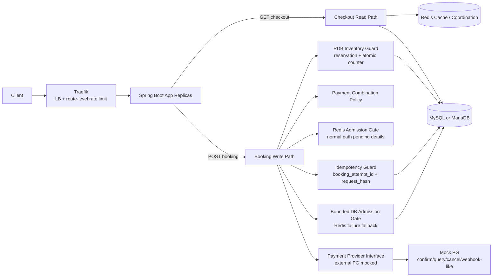

# Peak Booking System — System Design (Mock Interview Style)

> **문서 목적**
> 현재 `docs/requirements.md`에 명시된 요구사항만 기준으로 시스템 설계를 쉽게 설명하는 작업 문서다. 요구사항에 없는 항목은 확정하지 않고 미결정 질문 또는 `DECISIONS.md`의 미결정 쟁점으로 보낸다.

---

## 0. Metadata

| 항목 | 값 |
|---|---|
| 주제 | 한정 재고 booking/payment backend |
| 리뷰 관점 | Backend/System Design reviewer |
| 날짜 | 2026-05-30 |
| 요구사항 출처 | `docs/requirements.md` |
| 결정 규칙 | 기술 선택의 최종 권한자는 user이며, 이 문서는 임의로 결정을 확정하지 않는다. |

---

## 1. 요구사항 확인

### 1.1 현재 요구사항에서 확인한 기능 요구사항

- [x] FR-1: 사용자는 주문서 진입 시 상품명, 가격, 입/퇴실 시간, 가용 Y포인트 등 checkout 정보를 조회할 수 있다.
- [x] FR-2: 사용자는 주문서 정보를 제출해 결제를 진행하고 최종 주문/예약 생성을 요청할 수 있다.
- [x] FR-3: 시스템은 신용카드, `Y페이`, `Y포인트` 결제를 지원한다.
- [x] FR-4: 시스템은 `신용카드 + Y포인트`, `Y페이 + Y포인트` 복합 결제를 허용하고, 신용카드와 `Y페이` 혼용은 막아야 한다.
- [x] FR-5: 짧은 간격의 연속 결제 요청이 중복 처리되지 않도록 멱등성을 제공해야 한다.
- [x] FR-6: Redis 장애 시 fallback 전략과 근거를 제시해야 한다.
- [x] FR-7: 한도 초과 등 결제 실패 케이스에 대한 대응 로직을 설계해야 한다.

### 1.2 현재 요구사항에서 확인한 비기능/품질 요구사항

- [x] NFR-1: `00시` 트래픽 집중 상황에서 초과판매와 미달 판매가 발생하지 않도록 재고 정합성을 보장해야 한다.
- [x] NFR-2: 모든 사용자가 동등한 확률로 상품을 구매할 수 있는 구조를 고민해야 한다.
- [x] NFR-3: 대상 초특가 숙소 상품 재고는 `10개`로 제한된다.
- [x] NFR-4: 평시 `50 TPS`, 프로모션 시작 후 약 `1~5분` 동안 `500~1000 TPS` 급증을 고려해야 한다.
- [x] NFR-5: 인프라 증설(scale-up/out)이 제한적인 상황을 가정한다.
- [x] NFR-6: 시스템 붕괴를 막기 위한 구조와 선택 근거를 `DECISIONS.md`에 기록해야 한다.
- [x] NFR-7: 실제 PG사 연동은 생략하되, 실제 PG의 결제 승인/조회/취소 또는 웹훅 흐름과 유사한 Mock interface로 구조적 흐름이 이어져야 한다.
- [x] NFR-8: 회원 인증 및 로그인 보안 처리는 구현 범위에서 제외한다.

### 1.3 규모와 제약

| 항목 | 현재 요구사항 기준 |
|---|---|
| 재고 수량 | `10` units |
| 평시 트래픽 | `50 TPS` |
| 피크 트래픽 | `500~1000 TPS` |
| 피크 지속 시간 | `1~5분` |
| App topology | 애플리케이션 서버 `2대 이상` 분산 환경 |
| Language / Framework | Java 21 / Spring Boot 3.x. DEC-000에서 user가 승인한 baseline |
| Concrete RDB | MySQL 8. DEC-000에서 user가 승인한 baseline |
| Cache | Redis |
| Load-test tool | k6. DEC-000에서 user가 승인한 baseline |
| Observability stack | LGTM stack. DEC-000에서 user가 승인한 baseline |
| Local ingress / LB candidate | k3s + Traefik. DEC-007에서 1차 과부하 방어 수단으로 수용 |

### 1.4 범위 제외 / 현재 명시되지 않음

- [x] 실제 PG사와의 운영 계약/API 세부 연동은 생략한다.
- [x] 회원 인증 및 로그인 보안 처리는 구현 범위에서 제외한다.
- [x] 숙소 검색, 추천, 리뷰, 관리자 백오피스는 현재 요구사항에 없다.
- [x] 멀티 리전 active-active, 글로벌 트래픽 라우팅, CDN 최적화는 현재 요구사항에 없다.
- [x] production-grade waiting room/bot mitigation 제품은 현재 요구사항에 없다.
- [x] UI wireframe, mobile flow, SEO, analytics pipeline은 현재 요구사항에 없다.
- [x] Java 21, Spring Boot 3.x, MySQL 8, k6, LGTM은 DEC-000에서 user가 승인한 baseline이다.

---

## 2. 고수준 설계

### 2.1 Back-of-the-Envelope Estimation

| 지표 | 계산 | 값 / 해석 |
|---|---|---|
| 평시 write pressure | 요구사항 기준 | 약 `50 TPS` |
| 피크 write pressure | 요구사항 기준 | 약 `500~1000 TPS` |
| 피크 구간 시도 수 | `500~1000 TPS * 60~300초` | 약 `30,000~300,000` booking attempts |
| 성공 booking 수 | `min(10, valid successful attempts)` | 최대 `10`건 |
| 실패 지배 비율 | peak attempts 대비 성공 가능 건수 `10` | 대부분 요청은 빠른 실패, 재응답, 또는 대기/거절 경로를 타야 할 가능성이 높음 |

### 2.2 Core Entities (개념 모델, 최종 DDL 아님)

- **User**: 인증 시스템에서 전달된 사용자 식별자, 가용 Y포인트.
- **Product / Accommodation**: 상품명, 가격, 입/퇴실 시간, 판매 시작 시각.
- **Inventory**: 상품별 한정 재고 수량과 현재 예약/확정 상태.
- **Booking / Order**: 주문서 입력을 기반으로 생성되는 예약/주문 상태.
- **Payment**: 결제 수단, 금액, 결제 결과, 외부 결제 참조.
- **Idempotency Record**: 서버가 발급한 `booking_attempt_id`, 요청 `request_hash`, replay response를 저장해 연속 결제 요청의 중복 효과를 막는 상태 저장소.

### 2.3 API Contract (Draft)

| Method | Path | 목적 | 비고 |
|---|---|---|---|
| `GET` | `/api/v1/checkout/{productId}` | 상품/가격/입퇴실/Y포인트 등 주문서 정보 조회 | 인증 방식은 범위 밖. 사용자 식별자는 전달된다고 가정 |
| `POST` | `/api/v1/bookings` | 결제 입력 검증, 멱등성 처리, 재고 정합성 확인, 최종 주문/예약 생성 | 서버 발급 `booking_attempt_id` 기반 |

### 2.4 Architecture Diagram

---

## 3. Drill Down: Design Surfaces To Decide

### 3.1 Inventory Correctness

- 현재 요구사항은 `10개 한정` 재고에서 초과판매와 미달 판매를 모두 막아야 한다.
- 최종 재고 정합성은 MySQL `reservation` row + atomic counter guard로 보장한다.
- 핵심 재고 불변식은 `HELD + PAYMENT_UNKNOWN + CONFIRMED <= 10`이다.
- `PAYMENT_UNKNOWN`은 `30s` inventory deadline까지만 재고를 점유한다. deadline 안에 성공 확정을 못 하면 reservation은 `RELEASED/EXPIRED`로 닫고 다음 후보에게 판매 기회를 넘긴다.
- `MANUAL_REVIEW_REQUIRED`는 reservation 재고 상태가 아니라 payment_attempt reconciliation 상태이며 재고를 점유하지 않는다.
- Redis admission은 pre-gate이며 최종 재고 원장이 아니다.
- DDL은 단일 surrogate primary key와 비식별 관계를 기본으로 하며, unique key는 실제 비즈니스 unique 조건에만 둔다.
- 초기 DDL은 별도 `booking` table 없이 `reservation.CONFIRMED`를 최종 예약으로 취급한다.
- 최소 table set은 `sale_inventory`, `admission_sequence`, `booking_admission`, `reservation`, `idempotency_record`, `payment_attempt`, `point_account`, `point_hold`다.
- 추가 secondary index는 조회 조건과 카디널리티가 명확할 때만 둔다. 애매한 index는 선반영하지 않고 `EXPLAIN`, slow query log, k6/LGTM 결과를 근거로 추가한다.
- 남은 구현 파라미터: 최소 table set의 column/type/migration, lock wait/deadlock handling.

### 3.2 Fairness

- 공정성은 클라이언트 클릭 시각이 아니라, 이벤트 오픈 이후 유효한 첫 Booking 시도가 권위 있는 admission gate에서 부여받은 순서로 판단한다.
- 정상 상태의 gate는 Redis이며, Redis 장애 fallback 상태의 gate는 MySQL 기반 bounded DB admission gate다.
- 중복 클릭/재시도가 같은 사용자/상품의 성공 확률을 높이면 안 된다.
- Traefik rate limit은 WAS/DB 보호 수단이지 선착순 공정성 원장이 아니다.
- Redis 정상 admission은 ZSET/Hash/String counter + Lua script를 사용한다. 사용자/상품 중복 제한은 `(sale_event_id, product_id, user_id)` unique 축으로 방어하고, `sale_event_id`별 gate mode 전환은 MySQL durable state에 기록한다.

### 3.3 Idempotency

- 현재 요구사항은 "짧은 간격의 연속 결제 요청이 중복 처리되지 않아야 한다"를 요구한다.
- 멱등성 key는 client가 임의 생성하지 않고, 서버가 주문서 진입 단계에서 발급하는 `booking_attempt_id`로 둔다.
- 같은 `booking_attempt_id`에서 요청 body의 side-effect 필드가 바뀌면 `request_hash` conflict로 거절한다.
- terminal 상태의 반복 요청은 저장된 logical response를 replay하고, in-progress 또는 `PAYMENT_UNKNOWN` 반복 요청은 새 PG confirm 없이 현재 상태를 반환하거나 recovery/status 조회로 연결한다.
- `request_hash`는 `sale_event_id`, `product_id`, 인증된 `user_id`, `booking_attempt_id`, 결제 수단 조합, 수단별 금액, 포인트 사용액, PG 승인 대상 금액, `total_amount`, `currency`, `payment_policy_version`을 정규화해 만든다.
- 요청 시각, User-Agent, client IP, trace id, retry count, header 순서, 화면 표시용 문자열은 `request_hash`에서 제외한다.
- terminal response snapshot은 client replay에 필요한 logical response만 저장하고, 카드 번호/PG secret/PII/raw PG payload는 저장하지 않는다.
- 멱등성 record retention은 `24h`이며, 상태 조회는 별도 endpoint를 MVP 필수로 만들지 않고 같은 `POST /bookings` replay로 제공한다.

### 3.4 Redis Failure And Fallback

- 현재 요구사항은 Redis 장애 fallback 전략과 근거를 요구한다.
- Redis 장애 시 Booking write path를 단순 fail-closed로 닫지 않고 bounded DB admission gate로 제한 fallback한다.
- 단, 모든 요청을 DB로 보내는 unlimited fallback은 금지한다.
- DB fallback은 candidate pool, gateway/app rate limit, semaphore/bulkhead, 짧은 timeout으로 제한한다.
- 같은 `sale_event_id`에서 Redis 장애가 감지되면 `DB_FALLBACK`으로 전환하고 Redis가 복구되어도 Redis gate로 돌아가지 않는다.
- candidate pool은 sale event당 `30`으로 고정하고 추가 tranche는 열지 않는다. pool 밖 요청은 fast reject한다.
- fallback rate limit, semaphore/connection budget은 DEC-007의 초기 runtime budget을 적용하고 k6/LGTM 결과로 조정한다.

### 3.4.1 Redis Normal Admission Detail

- Redis는 정상 상태의 fast admission pre-gate이며, MySQL DB write amplification을 줄이는 역할이다.
- 자료구조는 ZSET + Hash + String counter를 사용하고 Lua script로 중복 확인, candidate limit 확인, sequence 발급, queue 삽입을 원자 처리한다.
- Redis transaction과 distributed lock은 기본 admission 구현에서 사용하지 않는다.
- Redis sequence만으로는 유효 admission이 아니며, MySQL admission row 저장 성공 후에만 admission이 유효하다.
- TTL/eviction/persistence 세부는 `docs/system-design/redis-admission-design.md`에 정리한다.

### 3.5 Payment Failure And PG Abstraction

- 실제 PG 연동은 생략하지만, 인터페이스를 통해 흐름은 이어져야 한다.
- Toss Payments와 PortOne 공식 문서를 기준으로 보면 실제 PG는 결제 승인, 결제 조회, 취소, 웹훅 또는 상태 동기화 흐름을 제공한다.
- 따라서 Mock PG도 `confirm`, `query/status`, `cancel`, `status changed webhook/event`, timeout/unknown 시뮬레이션을 interface로 둔다.
- 결제 실패가 최종 주문/예약을 만들면 안 된다는 점은 요구사항상 자연스럽게 도출된다.
- PG confirm은 DB transaction 안에서 호출하지 않는다. durable DB state를 먼저 commit하고 transaction 밖에서 PG interface를 호출한다.
- PG timeout/unknown은 즉시 실패나 성공으로 확정하지 않고 `PAYMENT_UNKNOWN`으로 둔다. 단, 재고 점유는 `30s` deadline을 넘기지 않는다.
- Recovery worker/scheduler는 기존 WAS 내부에서 bounded budget으로 실행하고 MySQL lease로 중복 처리를 막는다. Webhook은 빠른 반영 경로지만 유일한 정합성 근거가 아니다. Worker는 `PAYMENT_UNKNOWN`뿐 아니라 stale `HELD`도 회수한다.
- Recovery lease는 `payment_attempt`의 `lease_owner`, `lease_token`, `lease_until`, `next_reconcile_at`, `reconcile_attempt_count`로 구현한다. lease timeout은 `30s`, batch는 WAS당 `5`, PG status concurrency는 WAS당 `1`이다.
- due row claim은 짧은 transaction에서 `FOR UPDATE SKIP LOCKED`로 수행하고, PG status/cancel 호출은 transaction 밖에서 한다. 결과 반영은 `lease_token` 일치 조건으로 stale update를 막는다.
- 11번째 이후 후보는 재고를 점유하지 않는 `WAITING_CANDIDATE`가 될 수 있지만, 사용자-facing 대기 window는 최대 `60s`로 제한한다.
- `WAITING_CANDIDATE`는 `60s` 안에 선순위 reservation이 release되면 `db_admission_seq` 순서대로 승격하고, 승격되지 않으면 대기 종료 응답을 받는다.
- `WAITING_EXPIRED` 이후 같은 `sale_event_id + product_id + user_id`는 새 admission chance를 받지 않는다. 재요청은 terminal replay 또는 sold-out 계열 응답으로 처리한다.
- `WAITING_CANDIDATE`는 고정 candidate pool `30` 안에서만 만들며, 추가 tranche는 열지 않는다.
- reservation release 이후에도 payment reconciliation은 사용자 대기 종료와 별개로 계속 진행한다.
- payment reconciliation의 적극 status/cancel window는 최초 unknown 기록 후 `5분`이다. 이 값은 재고 점유 시간이 아니다.
- `5분` 안에 status/cancel로 payment 상태를 확인하지 못하면 `payment_attempt.MANUAL_REVIEW_REQUIRED`로 전이하고 고빈도 retry 대상에서 제외한다. 이 상태는 재고를 점유하지 않는다.
- deadline 이후 늦은 PG 성공은 reservation 확정이 아니라 cancel/refund/reconciliation 대상이다. PG 취소 수수료, 환불 비용, CS 비용은 초과판매 방지와 미달판매 방지를 동시에 만족하기 위한 accepted compensation cost로 둔다.

### 3.6 고가용성 / 과부하 방어

- `500~1000 TPS`를 `1~5분` 동안 고려해야 하지만, p95/p99, timeout, pool size, 실패 응답 기준은 지정되지 않았다.
- k3s + Traefik은 LB/API gateway 역할의 1차 과부하 방어 수단으로 둔다.
- Traefik rate limit은 `POST /bookings`의 WAS 보호용이며, 중복 방지/사용자별 공정성 원장으로 사용하지 않는다.
- Traefik rate limit은 Redis-backed distributed limiter로 두지 않고 instance-local route/global token bucket으로 둔다. Redis 장애와 gateway 보호막을 결합하지 않기 위해서다.
- 초기 runtime budget은 `2`개 WAS, Mock PG normal confirm delay `100ms`, stock `10` 기준으로 산정한다.
- 초기값은 Traefik average `1000 req/s`, burst `1000`, Hikari pool WAS당 `10`, booking concurrency WAS당 `64`, DB fallback admission bulkhead WAS당 `2`, candidate pool `30`, PG confirm concurrency 전체 `10`이다.
- 초기 pass/fail은 correctness hard fail, p95 latency, Hikari pending, DB lock wait, technical 5xx/timeout, stale `HELD`/`PAYMENT_UNKNOWN` inventory deadline, payment reconciliation backlog를 분리해 본다.
- k6/LGTM 보정은 correctness hard fail을 완화하지 않는 범위에서 resource evidence 기반으로 수행한다. Hikari pending, DB lock wait/deadlock, CPU/heap, stale inventory hold, payment reconciliation backlog를 보고 bulkhead/concurrency/timeout을 작은 폭으로 조정한다.

---

## 4. 결정 상태 요약

| ID | 주제 | 현재 상태 |
|---|---|---|
| DEC-000 | 현재 repo stack/tooling 채택 | Java 21, Spring Boot 3.x, MySQL 8, k6, LGTM은 user가 승인한 baseline이다. |
| DEC-001 | 재고 상태 모델/공정성 정의 | authoritative admission gate 순서 기반 공정성, Redis ZSET/Hash/String counter + Lua admission 방향을 수용했다. 현재 unique 축은 `(sale_event_id, product_id, user_id)`다. |
| DEC-002 | Redis 장애 fallback 정책 | bounded DB admission gate와 같은 `sale_event_id` 내 sticky `DB_FALLBACK`을 수용했다. fallback budget은 DEC-007 초기값을 적용하고 k6/LGTM으로 조정한다. |
| DEC-003 | RDB 재고 정합성 guard | `reservation` row + MySQL atomic counter guard와 `HELD + PAYMENT_UNKNOWN + CONFIRMED <= 10` 불변식을 수용했다. |
| DEC-004 | 멱등성 정책 | 서버 발급 `booking_attempt_id`, request hash, terminal replay, `24h` retention, `POST /bookings` replay를 수용했다. |
| DEC-005 | 결제 실패/timeout 처리와 PG abstraction | PG confirm transaction 분리, `PAYMENT_UNKNOWN`의 `30s` inventory deadline, stale `HELD`/unknown recovery worker, release 이후 `5분` payment reconciliation, 늦은 PG 성공 cancel/refund 보상 비용 수용을 결정했다. |
| DEC-006 | 결제 수단 확장 구조 | `PaymentPlan`, `CombinationPolicy`, `PaymentProcessor`, Y포인트 최소 point balance + point hold record와 `hold -> capture -> release`를 수용했다. |
| DEC-007 | TPS 급증 방어 | Traefik 1차 route-level rate limit, app/DB bulkhead, 초기 runtime budget, evidence-based tuning policy를 수용했다. |
| DEC-008 | 테스트/관측/부하 전략 | unit/slice/integration/acceptance test는 TDD로 구현 전에 작성하고, k6 smoke/load/resilience-failure-mix는 구현 완료 후 staging-like 환경에서 실행한다. k6는 정상 부하뿐 아니라 WAS/Redis/PG 일부 장애 중 서비스가 통제된 상태로 동작하는지도 검증한다. concrete metric name과 dashboard는 구현 산출물이다. |

---

## 5. References

- [Requirements](../requirements.md)
- [Decision log](../decisions/DECISIONS.md)
- [Redis admission design](redis-admission-design.md)
- [Source-backed research note](../research/source-backed-research-note.md)
