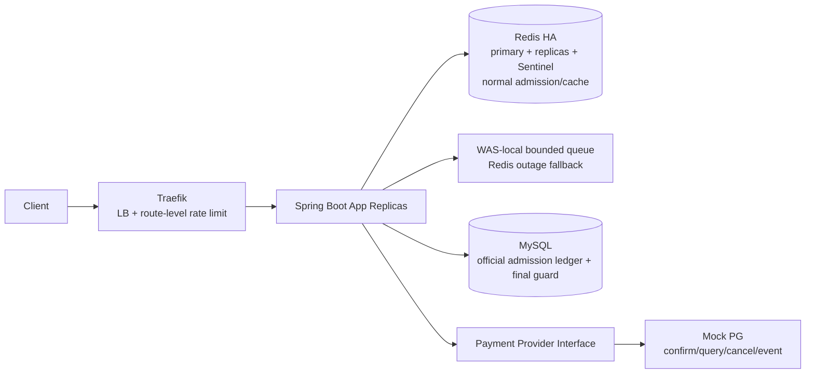
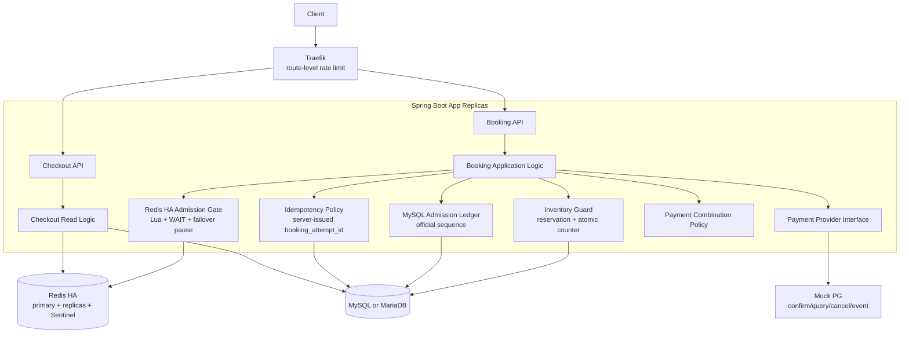
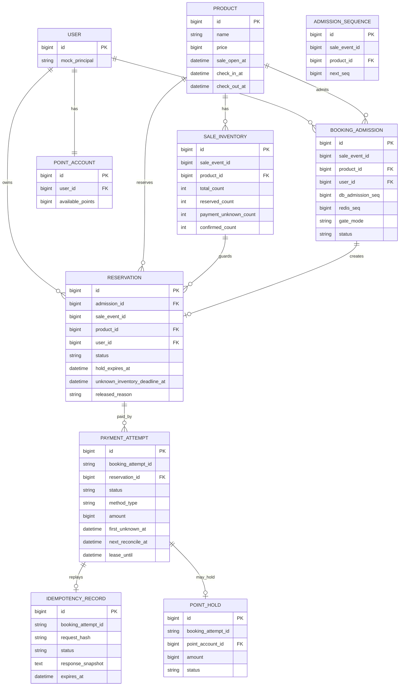
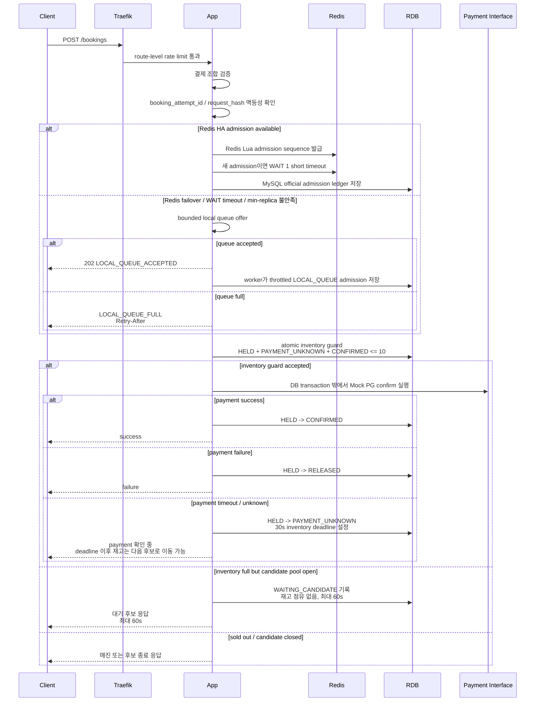
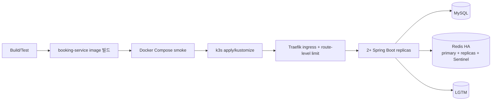

# Peak Booking System — Software Design Document

> **문서 목적**
> 현재 `docs/requirements.md`에 명시된 요구사항을 구현 가능한 설계 항목으로 풀어 쓰되, 요구사항에 없는 기술 선택은 확정하지 않고 `미결정`으로 남긴다. 기술 결정의 최종 권한자는 user다.

---

## 0. 문서 메타데이터

| 항목 | 값 |
|---|---|
| 문서 제목 | Peak Booking System SDD |
| 버전 | 0.9 (Redis HA/local queue fallback 반영) |
| 상태 | 구현 검증 중 / Redis HA + local queue 설계 수용 |
| 작성자 | Sanghun Lee + Codex |
| 마지막 수정 | 2026-06-03 |
| 요구사항 출처 | `docs/requirements.md` |
| 관련 문서 | `docs/decisions/DECISIONS.md`, `docs/system-design/mock-interview.md`, `docs/testing/loadtest-evidence-index.md` |

### 0.1 변경 이력

| 버전 | 날짜 | 작성자 | 변경 사항 |
|---|---|---|---|
| 0.1 | 2026-05-30 | Sanghun Lee + Codex | 기존 요구사항에서 FR/NFR을 최초 추출 |
| 0.2 | 2026-05-30 | Sanghun Lee + Codex | 템플릿용 빈 섹션을 제거하고 Mermaid 다이어그램 추가 |
| 0.3 | 2026-05-30 | Sanghun Lee + Codex | 현재 추출 요구사항에 맞게 재정렬하고 미승인 선택을 open decision으로 낮춤 |
| 0.4 | 2026-05-30 | Sanghun Lee + Codex | 고정 재고 10개, Y페이/Y포인트, 제한된 scale-up/out, source-backed Mock PG 가정 추가 |
| 0.5 | 2026-05-31 | Sanghun Lee + Codex | authoritative admission fairness, Traefik 1차 방어, Redis 장애 시 bounded DB admission fallback 후보를 기록 |
| 0.6 | 2026-05-31 | Sanghun Lee + Codex | Alternatives Considered, Deployment Strategy, Monitoring Strategy 섹션을 추가 |
| 0.7 | 2026-06-01 | Sanghun Lee + Codex | `PAYMENT_UNKNOWN` 재고 점유 deadline, stale `HELD` recovery, SDD ERD/stale pending 문구 정리 |
| 0.8 | 2026-06-03 | Sanghun Lee + Codex | Redis 단일 인스턴스/DB fallback 후보를 Redis HA + failover pause + half-open recovery 구조로 변경 |
| 0.9 | 2026-06-03 | Sanghun Lee + Codex | failover 중 503 pause를 WAS-local bounded queue + throttled worker + drain-grace 복구 정책으로 변경 |

---

## 1. 소개

### 1.1 목적

이 문서는 `00시` 프로모션 시작 시 트래픽이 몰리는 `10개 한정` 초특가 숙소 상품의 주문서 조회, 결제, 최종 주문/예약 생성 흐름을 설계한다.

### 1.2 범위

- **범위 포함**: Checkout 조회 API, Booking 생성 API, 재고 정합성/공정성, 멱등성, 결제 수단 조합, Redis 장애 fallback, 결제 실패 처리, 산출물 문서화.
- **요구사항상 범위 제외**: 실제 PG사 연동, 회원 인증 및 로그인 보안 처리.
- **현재 요구사항에 명시되지 않음**: DB locking 세부값, multi-region/CDN/waiting-room/bot mitigation.

### 1.3 확정된 요구사항 사실

| 영역 | 확정 사실 |
|---|---|
| 언어 | Java 8 이상 또는 Kotlin |
| 프레임워크 | Spring Boot 2.7 이상 |
| RDB | MySQL 또는 MariaDB 계열 |
| Cache | Redis |
| 인프라 | 애플리케이션 서버 2대 이상의 분산 환경 |
| 재고 | 초특가 숙소 상품 `10개 한정` |
| 트래픽 | 평시 `50 TPS`, `00시`부터 `1~5분` 동안 `500~1000 TPS` |
| APIs | `GET Checkout`, `POST Booking` |
| 결제 수단 | 신용카드, Y페이, Y포인트 |
| 허용 결제 조합 | 신용카드+Y포인트, Y페이+Y포인트 |
| 금지 결제 조합 | 신용카드와 Y페이 혼용 |
| 명시적 제외 사항 | 실제 PG사 연동, 회원 인증/로그인 보안 |

### 1.4 수용한 프로젝트 Baseline 결정

Java 21, Spring Boot 3.x, MySQL 8, k6, LGTM stack은 user가 직접 승인한 프로젝트 baseline이다. 이 선택들은 현재 요구사항의 최소 조건을 만족하며, 더 이상 미결정 사항이 아니다. 단, 핵심 의사결정 문서인 `DECISIONS.md`는 **기술 스택 나열이 아니라 요구사항 쟁점 중심으로** 유지한다.

---

## 2. 시스템 개요

본 시스템은 주문서 진입 정보 조회와 결제/예약 완료 요청을 처리하는 Spring Boot 기반 backend다. k3s + Traefik은 scale-out된 WAS 앞단의 LB/API gateway 역할을 맡으며, `POST /bookings` route-level rate limit으로 WAS 보호를 담당한다. Redis는 정상 상태 admission/cache/coordination 컴포넌트로 사용하되, 단일 인스턴스가 아니라 **Redis HA를 기본 장애 대응 구조로** 둔다. Redis failover 중에는 request thread가 MySQL DB fallback으로 직접 우회하지 않고 **WAS-local bounded queue에 요청을 넣은 뒤 throttled worker가 DB admission을 수행한다**. RDB는 **reservation row + MySQL atomic counter guard로 최종 재고 정합성을** 보장한다.



---

## 3. Goals and Non-Goals

### 3.1 목표

- G-1: `10개 한정` 상품에서 **초과판매와 영구 미달판매가 발생하지 않도록 재고 정합성을** 보장한다.
- G-2: **모든 사용자가 동등한 확률로 상품을 구매할 수 있는 구조를** 설계한다.
- G-3: 짧은 간격의 연속 결제 요청이 **중복 처리되지 않도록 멱등성을** 제공한다.
- G-4: 신용카드, Y페이, Y포인트와 허용 복합 결제를 지원한다.
- G-5: Redis 장애 fallback 전략과 결제 실패 대응 로직을 설계하고 근거를 `DECISIONS.md`에 기록한다.
- G-6: `500~1000 TPS` burst에서 시스템 붕괴를 막기 위한 구조를 반영한다.
- G-7: 실제 PG 연동 없이도 payment interface와 Mock PG를 통해 승인/조회/취소/웹훅과 유사한 결제 흐름이 구조적으로 이어지도록 한다.

### 3.2 비목표

- NG-1: 실제 PG사 API/운영 계약 연동은 구현하지 않는다. 다만 Mock PG는 공식 PG 문서의 승인/조회/취소/웹훅 흐름을 참고한다.
- NG-2: 회원 인증 및 로그인 보안 처리는 구현하지 않는다.
- NG-3: 숙소 검색, 추천, 리뷰, 관리자 백오피스는 현재 요구사항에 없다.
- NG-4: multi-region, CDN, WAF, production waiting room, bot mitigation은 현재 요구사항에 없다.

---

## 4. 제약

### 4.1 기술 제약

- Java 8 이상 또는 Kotlin, Spring Boot 2.7 이상.
- MySQL 또는 MariaDB 계열 RDBMS.
- Redis 사용.
- 애플리케이션 서버 2대 이상의 분산 환경.
- 인프라 증설(scale-up/out)이 제한적인 상황.
- 실제 PG 연동은 생략하되, Mock PG는 결제 승인/상태 조회/취소/웹훅 또는 상태 변경 이벤트와 유사한 interface를 제공한다.
- 추가 기술/라이브러리/인프라는 도입 근거를 `DECISIONS.md`에 기록.

### 4.2 설계 Guardrails

- 요구사항에 없는 값을 임의로 확정하지 않는다.
- 대상 초특가 숙소 상품 재고는 요구사항상 `10개`로 고정한다.
- 멱등성은 서버 발급 `booking_attempt_id`, `request_hash`, stored logical response replay, `24h` retention을 사용한다. 이는 요구사항에서 직접 지정한 값이 아니라 `DECISIONS.md` 쟁점 3에서 수용한 설계 결정이다.
- 공정성은 클라이언트 클릭 시각이 아니라 권위 있는 admission gate의 sequence로 판단한다.
- **Redis 장애 시 Booking request thread는 DB admission fallback으로 직접 우회하지 않는다.** Redis HA failover 중에는 bounded WAS-local queue에 offer하고, worker만 throttled DB admission을 수행한다.
- **Redis가 복구되어도 local queue backlog가 남아 있으면 queue drain 또는 drain-grace 전까지 새 요청을 Redis admission으로 바로 보내지 않는다.**
- **Redis 장애 중 unlimited DB fallback은 금지한다.**
- Traefik rate limit은 **WAS/DB 보호 수단이며, 중복 방지나 공정성 원장이 아니다.**
- Java 21, Spring Boot 3.x, MySQL 8, k6, LGTM은 user가 승인한 프로젝트 baseline이다.

---

## 5. 시스템 아키텍처

### 5.1 아키텍처 형태

현재 repo는 단일 Spring Boot application으로 bootstrap되어 있다. 요구사항은 microservice 분리를 요구하지 않으므로, 우선은 하나의 backend 안에서 Checkout, Booking, Payment, Inventory, Idempotency 관심사를 분리하는 구조가 자연스러운 후보이다. 단, modular monolith 채택 자체도 `DECISIONS.md`에서 확인해야 한다.

### 5.2 Component Diagram



---

## 6. Data Design

### 6.1 개념 ERD



### 6.2 Data 결정 상태

| 항목 | 현재 상태 |
|---|---|
| 재고 수량 | 대상 초특가 숙소 상품의 재고는 `10개`로 고정 |
| 재고 모델 | `reservation` row + MySQL atomic counter guard를 수용. `HELD + PAYMENT_UNKNOWN + CONFIRMED <= 10`을 DB 불변식으로 둔다 |
| 사용자/상품 중복 admission 규칙 | 중복 클릭/재시도가 성공 확률을 높이면 안 된다는 방향을 수용. `sale_event_id + product_id + user_id` unique constraint 축으로 방어한다 |
| Admission ledger | MySQL `booking_admission`을 durable fairness/audit ledger로 두는 방향은 수용. Redis sequence는 provisional 값 |
| Idempotency 저장소 | 서버 발급 `booking_attempt_id`, side-effect 필드 기반 `request_hash`, terminal logical response replay를 수용. retention은 `24h` |
| Payment 상태 | PG timeout/unknown은 `PAYMENT_UNKNOWN`으로 두되 재고 점유는 `30s` deadline까지만 허용한다. 이후 reservation은 `RELEASED/EXPIRED`로 닫고 payment_attempt만 `5분` 적극 reconciliation 후 필요 시 `MANUAL_REVIEW_REQUIRED`로 전이한다 |
| Y포인트 잔액 정합성 | Y포인트를 결제 수단으로 보고 `hold -> capture -> release` 상태를 둔다. 범용 포인트 플랫폼이 아니라 point balance + `booking_attempt_id` 기준 point hold record의 최소 모델로 구현한다 |
| DDL/Index 원칙 | 단일 surrogate primary key, 비식별 관계, 비즈니스 조건 기반 unique key를 사용한다. 추가 secondary index는 조회 조건과 카디널리티가 명확할 때만 둔다 |

### 6.3 수용한 Booking Flow 개요

이 흐름은 현재 수용된 큰 방향을 나타낸다. RDB inventory guard는 reservation row와 MySQL atomic counter guard를 사용한다.



---

## 7. Component Design

### 7.1 Checkout 조회 로직

- 주문서 진입에 필요한 상품 정보와 사용자 가용 Y포인트를 조회한다.
- 상품 가격, 판매 시작 시각, 결제 조합 검증에 필요한 product metadata는 짧은 TTL cache로 보호한다.
- 따라서 정상 booking path가 "어떤 DB도 전혀 보지 않는다"는 뜻은 아니다. 깊은 DB transaction과 inventory write path를 보호하는 것이 목표이며, product/open-time 검증은 cache miss 시 얕은 조회가 발생할 수 있다.
- Redis 장애 중 checkout/product metadata cache miss는 booking write-path admission failover 정책과 분리한다. checkout read cache fallback은 사용자 표시 정보를 위한 read path이고, booking write-path admission은 공정성/정합성 write path다.

### 7.2 Booking Application 로직

- 결제 수단 조합 검증, 멱등성 처리, 재고 정합성 확인, 결제 interface 호출, 최종 주문/예약 생성 흐름을 조정한다.
- 외부 PG 연동은 생략하므로 `PaymentPort`와 Mock PG로 승인/조회/취소/웹훅 유사 흐름만 유지한다.
- `mock_pg_scenario`는 운영 API 계약이 아니라 local/test/load-test profile에서 Mock PG 장애를 주입하기 위한 제어값이다. production profile에서는 client가 결제 결과를 선택하는 public field로 노출하면 안 된다.
- PG confirm은 DB transaction 안에서 호출하지 않는다. `HELD` 같은 durable DB state를 먼저 commit한 뒤 transaction 밖에서 PG interface를 호출하고, 결과에 따라 짧은 DB transaction으로 상태를 전이한다.
- PG 호출 전/중 WAS crash로 남은 stale `HELD`도 recovery worker가 회수한다.

### 7.3 Payment Combination Policy

- 허용: 신용카드+Y포인트, Y페이+Y포인트.
- 금지: 신용카드+Y페이 혼용.
- 요청 결제 정보는 `PaymentPlan`으로 정규화하고 `CombinationPolicy`가 조합을 검증한다.
- 결제 수단별 실행은 `PaymentProcessor` 또는 strategy registry로 분리해 Booking API 핵심 로직의 if/else 증가를 막는다.
- Y포인트도 결제 수단으로 취급하며 `hold -> capture -> release` 상태를 가진다.
- Y포인트는 사용자별 point balance와 `booking_attempt_id` 기준 point hold record의 최소 모델로 구현한다.
- point hold record는 `booking_attempt_id` 기준 unique하게 두어 중복 hold/capture/release를 막는다.
- `hold`는 가용 포인트가 충분할 때만 atomic하게 생성한다. PG 명확한 실패면 `release`, PG가 reservation deadline 안에 성공하면 `capture`, PG unknown인 채 reservation이 release되면 point hold도 `release`한다. 이후 늦은 외부 PG 성공은 예약 확정이 아니라 cancel/refund/reconciliation 대상이다.
- 별도 포인트 적립, 소멸 예정 포인트, 포인트 선물, 복잡한 환불 정산, 운영자 포인트 조정 기능은 요구사항 밖이다.
- 단독 결제 허용 범위, 금액 합계 검증, 음수 금액 검증, 동일 수단 중복 입력 검증은 구현 시 domain validation으로 구체화한다.

### 7.4 Redis Failure Policy

- Redis 장애 fallback 전략과 근거는 필수 산출물이다.
- Redis는 정상 경로의 빠른 admission/cache/coordination 컴포넌트이며, 최종 재고 원장이나 최종 공정성 원장이 아니다.
- Redis 장애 대응의 기본 구조는 Redis HA다. self-managed 검증 환경에서는 primary 1대, replica 2대, Sentinel 3대 구성을 목표로 한다. managed Redis를 쓰는 경우에도 primary/replica failover가 있는 HA 상품을 전제로 한다.
- Redis admission write는 Lua script로 처리하고, 새 admission write에는 짧은 `WAIT 1`을 적용한다.
- HA 모드 Redis server에는 `min-replicas-to-write 1`, `min-replicas-max-lag 1~2s`를 적용한다.
- `WAIT` timeout, min-replica 조건 불만족, Sentinel failover 감지, Redis command timeout이 발생하면 request thread는 새 admission을 DB fallback으로 직접 우회하지 않는다.
- failover 중 요청은 WAS-local bounded queue에 offer하고, 성공 시 `202 LOCAL_QUEUE_ACCEPTED`, queue full 시 `LOCAL_QUEUE_FULL + Retry-After`로 응답한다.
- local queue worker는 fixed-delay/batch-size budget 안에서만 MySQL official admission ledger를 기록한다.
- pause TTL 이후에는 half-open probe를 수행한다. probe는 Redis write + `WAIT`가 성공해야 통과한다.
- half-open probe가 성공해도 local queue active_count가 0이 되거나 drain-grace가 지날 때까지 새 외부 요청은 local queue에 유지한다. 실패하면 Retry-After window 동안 반복 probe를 억제한다.
- 모든 요청을 DB로 보내는 unlimited fallback은 금지한다.
- 기존 bounded DB admission fallback 후보는 피크에서 DB 보호와 판매 지속성을 동시에 만족시키기 어려워 기본 정책에서 제거한다.
- candidate pool은 sale event당 `30`으로 고정한다.
- 추가 candidate tranche는 열지 않는다. candidate pool 밖 요청은 fast reject한다.

### 7.5 Redis Admission Design

- Redis는 정상 상태의 fast admission pre-gate다.
- Redis 자료구조는 ZSET + Hash + String counter를 사용한다.
- Redis admission 원자성은 Lua script로 보장한다.
- Redis transaction과 distributed lock은 기본 admission 구현에서 사용하지 않는다.
- Redis sequence만으로는 유효 admission이 아니다. MySQL admission row 저장 성공 후에만 admission이 유효하다.
- Redis HA 모드에서는 새 admission write 후 `WAIT 1`로 replica ACK를 확인한다. 이는 유실 가능성을 줄이는 완화책이지, durable log와 같은 강한 일관성 보장은 아니다.
- DB write bulkhead는 Redis admission 전후의 좁은 admission persistence 구간을 보호한다. 이는 DB에 durable admission row를 남길 여력이 없으면 Redis candidate sequence를 먼저 소비하지 않기 위한 선택이다. 따라서 공정성 설명은 "Redis sequence가 공식 순서"가 아니라 "MySQL admission ledger가 공식 순서이고 Redis sequence는 빠른 후보 판단/진단값"으로 유지한다.
- Redis admission TTL 초기값은 `24h`다. 이는 쟁점 3의 idempotency retention과 맞춘 운영 추적/정리 값이며, correctness나 audit 원장은 MySQL이다.
- Active admission key는 eviction 대상이 되면 안 되며, Redis persistence는 보조 수단일 뿐 MySQL admission table이 복구/감사 원장이다.
- Redis/local queue 세부 결정은 `docs/decisions/DECISIONS.md` 쟁점 2를 따른다.

### 7.6 MySQL Admission Ledger

MySQL admission table은 공정성/감사 기준이 되는 authoritative ledger다. Redis admission은 이 row가 저장된 뒤에만 유효하다.

후보 테이블 필드:

```text
booking_admission
- product_id
- sale_event_id
- user_id
- gate_mode          -- REDIS / REDIS_FAILOVER_PAUSED
- redis_seq          -- nullable diagnostic/reference value
- db_admission_seq   -- official ordering value
- candidate_rank     -- fixed pool 안의 순번, 추가 tranche는 없음
- status             -- ADMITTED / PROCESSING / SUCCEEDED / FAILED / EXPIRED
- admitted_at
- processing_started_at
- completed_at
- expires_at
```

후보 제약:

```text
UNIQUE(product_id, sale_event_id, user_id)
UNIQUE(product_id, sale_event_id, db_admission_seq)
INDEX(product_id, sale_event_id, status, db_admission_seq)
```

`db_admission_seq`는 `admission_sequence` counter row에서 발급한다. 이 counter는 설계상 hot row지만, bounded candidate traffic만 접근하도록 제한한다. 구현 시에는 아래 atomic MySQL update 패턴으로 lock 보유 시간을 줄이는 방향을 우선 고려한다.

```sql
UPDATE admission_sequence
SET next_seq = LAST_INSERT_ID(next_seq + 1)
WHERE product_id = ? AND sale_event_id = ?;

SELECT LAST_INSERT_ID();
```

sequence transaction은 짧게 유지해야 한다. sequence 발급, admission row insert, commit까지만 포함하고, payment call, inventory lock, 긴 business processing을 포함하지 않는다.

### 7.6.1 MySQL Inventory Guard

최종 재고 정합성은 **MySQL `sale_inventory` counter row와 `reservation` row 상태 전이로** 보장한다.

불변식:

```text
HELD + PAYMENT_UNKNOWN + CONFIRMED <= total_stock
```

대상 sale event의 `total_stock`은 `10`이다.

**`PAYMENT_UNKNOWN`은 재고를 무기한 점유하지 않는다.** `unknown_inventory_deadline_at` 초기값은 최초 unknown 기록 후 `30s`이며, 이 deadline 안에 성공을 확인해 `CONFIRMED`로 전이하지 못하면 reservation을 `RELEASED` 또는 `EXPIRED`로 닫고 다음 후보에게 판매 기회를 넘긴다. `MANUAL_REVIEW_REQUIRED`는 payment_attempt reconciliation 상태이며 재고** counter에 포함하지 않는다**.

초기 점유는 짧은 조건부 update로 처리한다.

```sql
UPDATE sale_inventory
SET reserved_count = reserved_count + 1
WHERE product_id = ?
  AND sale_event_id = ?
  AND reserved_count + payment_unknown_count + confirmed_count < total_count;
```

affected row가 `1`이면 같은 transaction 안에서 `reservation` row를 `HELD`로 생성한다. affected row가 `0`이면 sold out 또는 capacity exhausted로 거절한다.

상태 전이별 counter 변경:

| 전이 | Counter 변경 |
|---|---|
| create `HELD` | `reserved_count + 1` |
| `HELD -> CONFIRMED` | `reserved_count - 1`, `confirmed_count + 1` |
| `HELD -> RELEASED/EXPIRED` | `reserved_count - 1` |
| `HELD -> PAYMENT_UNKNOWN` | `reserved_count - 1`, `payment_unknown_count + 1` |
| `PAYMENT_UNKNOWN -> CONFIRMED` | `payment_unknown_count - 1`, `confirmed_count + 1` |
| `PAYMENT_UNKNOWN -> RELEASED/EXPIRED` | `payment_unknown_count - 1` |

`PAYMENT_UNKNOWN -> CONFIRMED`는 **`unknown_inventory_deadline_at` 안에 PG 성공을 확인하고 reservation 상태 전이를 완료한 경우에만 허용한다**. deadline 이후 늦은 PG 성공은 **reservation 확정이 아니라 payment cancel/refund/reconciliation 대상으로** 처리한다.

counter update와 reservation 상태 전이는 같은 DB transaction 안에서 처리한다. **PG confirm 호출은 이 transaction에 포함하지 않는다.**

DDL은 단일 surrogate primary key와 비식별 관계를 기본으로 한다. Unique key는 중복 admission, booking attempt, payment effect처럼 실제 비즈니스 불변식이 unique해야 하는 경우에만 둔다.

Secondary index는 조회 조건과 카디널리티를 근거로 둔다. 카디널리티가 낮은 `status` column 단독 index는 기본으로 만들지 않으며, 애매한 index는 선반영하지 않는다. Query가 느리거나 lock/read pressure가 관측되면 `EXPLAIN`, slow query log, k6/LGTM 결과를 근거로 composite index를 추가한다.

최소 DDL은 별도 `booking` table 없이 `reservation.CONFIRMED`를 최종 예약으로 취급한다. 예약 변경, 바우처, 별도 booking projection이 필요해지면 그때 분리한다.

초기 table set:

- `sale_inventory`
- `admission_sequence`
- `booking_admission`
- `reservation`
- `idempotency_record`
- `payment_attempt`
- `point_account`
- `point_hold`

### 7.7 Idempotency Policy

- 짧은 간격의 연속 결제 요청이 중복 처리되지 않아야 한다.
- **권위 있는 멱등성 key는 client가 임의 생성하지 않고, 서버가 주문서 진입 단계에서 발급하는 `booking_attempt_id`다.**
- `POST /bookings`는 `booking_attempt_id`를 받아 같은 논리적 결제 시도를 이어간다.
- 같은 `booking_attempt_id`에서 side effect에 영향을 주는 요청 내용이 달라지면 `request_hash` conflict로 거절한다.
- terminal 상태의 반복 요청은 저장된 logical response를 replay한다.
- in-progress 또는 `PAYMENT_UNKNOWN` 반복 요청은 **새 PG confirm을 만들지 않고** 현재 상태를 반환하거나 recovery/status 조회 경로로 연결한다.
- `request_hash`에는 `sale_event_id`, `product_id`, 인증된 `user_id`, `booking_attempt_id`, 결제 수단 조합, 수단별 금액, 포인트 사용액, PG 승인 대상 금액, `total_amount`, `currency`, `payment_policy_version`을 포함한다.
- 요청 시각, User-Agent, client IP, trace id, retry count, header 순서, 화면 표시용 문자열은 `request_hash`에서 제외한다.
- `request_hash` 정규화는 key 정렬, 금액 단위 통일, 결제 수단 배열의 domain order 정렬, `null`/빈 값/누락 값의 구분을 포함한다.
- terminal response snapshot은 `http_status`, `business_code`, `booking_attempt_id`, `reservation_id` 또는 `booking_id`, `reservation_status`, `payment_status`, 주요 timestamp, `message_key`, `retryable`, `next_action`만 저장한다.
- 카드 번호, PG secret, 인증 token, PII, gateway trace header 전체, Mock PG raw payload 전체는 저장하지 않는다.
- 멱등성 record retention은 `24h`다. 이 값은 **재고 hold 시간이나 사용자 대기 시간이 아니라 운영 추적, 지연 retry, webhook/recovery 확인, 장애 조사 buffer다**.
- 상태 조회는 별도 endpoint를 MVP 필수로 만들지 않고, 같은 `POST /bookings` replay 응답에 현재 logical state를 포함한다.

### 7.8 Mock Payment Provider 가정

실제 PG사와의 운영 연동은 생략하지만, Mock PG는 단순 boolean stub이 아니라 실제 PG와 유사한 불확실성을 표현해야 한다.

- `confirmPayment(paymentKey/paymentId, orderId, amount)`: 결제 인증 또는 결제 시도를 최종 승인한다. 금액 불일치, 한도 초과, 잔액 부족, 이미 승인됨, timeout/unknown을 시뮬레이션한다.
- `getPaymentByPaymentKey(...)` 또는 `getPaymentByOrderId(...)`: 승인 후 응답 유실이나 timeout 이후 현재 결제 상태를 조회한다.
- `cancelPayment(paymentKey/paymentId, reason, cancelAmount?)`: booking 실패 또는 보상 처리 시 전액/부분 취소 흐름을 시뮬레이션한다.
- `paymentStatusChanged` webhook/event: 결제 상태 변경 또는 비동기 취소 결과를 app이 수신하는 상황을 시뮬레이션한다.

PG timeout/unknown은 즉시 success/failure로 확정하지 않고 `PAYMENT_UNKNOWN`으로 기록한다. 단, 결제 불확실성이 재고를 오래 묶으면 미달 판매가 발생하므로 **`PAYMENT_UNKNOWN`의 재고 점유 deadline은 최초 unknown 기록 후 `30s`로 제한한다**. Recovery worker/scheduler는 기존 WAS 내부에서 bounded thread/batch/concurrency budget으로 실행하며, **stale `HELD`와 `PAYMENT_UNKNOWN`을 모두 처리한다**. MySQL lease로 2개 이상 replica의 중복 처리를 막는다. Webhook은 빠른 반영 경로지만 유일한 정합성 경로가 아니며, **status query 기반 recovery worker가 최종 안전망이다**.

후순위 사용자의 사용자-facing 대기와 PG reconciliation은 분리한다.

- **`PAYMENT_UNKNOWN`은 `unknown_inventory_deadline_at`까지만 재고를 점유한다.** deadline 이후에는 reservation을 `RELEASED` 또는 `EXPIRED`로 닫고 다음 후보에게 판매 기회를 넘긴다.
- 재고를 점유하지 않는 `WAITING_CANDIDATE`의 사용자-facing 대기 window는 최대 `60s`다.
- `WAITING_CANDIDATE`가 `60s` 안에 선순위 `HELD` 또는 `PAYMENT_UNKNOWN` release를 만나면 `db_admission_seq` 순서대로 승격한다.
- `60s` 안에 승격되지 않으면 `WAITING_EXPIRED` 또는 sold-out 계열 응답으로 대기를 종료한다.
- **`WAITING_EXPIRED` 이후 같은 `sale_event_id + product_id + user_id`는 새 admission chance를 받지 않는다.** 같은 사용자의 재요청은 기존 terminal 상태 replay 또는 sold-out 계열 응답이다.
- `WAITING_CANDIDATE`는 고정 candidate pool `30` 안에서만 만들며, 추가 tranche는 열지 않는다.
- reservation이 deadline으로 release된 뒤에도 worker가 payment_attempt status query/cancel/manual-review 경로로 reconciliation한다.
- payment reconciliation의 적극 status/cancel window는 최초 unknown 기록 후 `5분`이다. 이 값은 재고 점유 시간이 아니다.
- worker는 status query를 먼저 수행한다. deadline 안에 PG 성공을 확인하면 `CONFIRMED`, 명확한 실패/미승인/만료를 확인하면 `RELEASED`로 전이한다.
- deadline 안에 취소 가능한 승인/매입 전 상태를 확인하면 cancel을 호출하고, cancel 성공이 확인된 뒤 `RELEASED`로 전이한다.
- deadline까지 최종 성공을 확인하지 못하면 reservation을 release한다. 이후 늦은 PG 성공은 **booking 확정이 아니라 cancel/refund/reconciliation 대상이다**.
- 늦은 PG 성공을 취소/환불하는 과정에서 PG 취소 수수료, 환불 비용, CS 비용이 발생할 수 있다. 이 비용은 **초과판매 방지와 미달판매 방지를 동시에 만족하기 위한 accepted compensation cost로** 둔다. 특정 금액은 PG 계약/정책에 따라 달라지므로 설계에서 고정하지 않는다.
- `5분` 적극 reconciliation window 안에도 payment/cancel 결과가 계속 unknown이면 `payment_attempt.MANUAL_REVIEW_REQUIRED`로 전이한다. 이 상태는 재고를 점유하지 않는다.
- `MANUAL_REVIEW_REQUIRED`는 고빈도 retry 대상이 아니며, 운영 확인 또는 늦은 webhook/status query로 payment/cancel 정산 상태만 닫는다. **이미 release된 reservation을 다시 `CONFIRMED`로 되살리지 않는다.**

PaymentAttempt 보상 상태:

| 상태 | 의미 | 재고 영향 |
|---|---|---|
| `RECONCILING_AFTER_RELEASE` | reservation deadline release 이후 payment 상태를 계속 조회/취소 중 | 없음 |
| `LATE_SUCCESS_CANCEL_PENDING` | release 이후 PG 성공이 늦게 확인되어 cancel/refund가 필요한 상태 | 없음 |
| `CANCELLED_AFTER_RELEASE` | 늦은 PG 성공이 취소/환불로 정리된 상태 | 없음 |
| `MANUAL_REVIEW_REQUIRED` | cancel/refund도 불명확해 수동 확인이 필요한 payment 상태 | 없음 |

Recovery lease는 `payment_attempt` row의 MySQL lease column으로 구현한다.

- column: `next_reconcile_at`, `reconcile_attempt_count`, `first_unknown_at`, `last_reconcile_at`, `lease_owner`, `lease_token`, `lease_until`, `last_error_code`, `manual_review_reason`
- reservation column: `hold_expires_at`, `unknown_inventory_deadline_at`, `released_reason`
- scheduler: `5s fixed delay + 0~5s initial jitter`
- batch: WAS당 `5`
- PG status concurrency: WAS당 `1`
- lease timeout: `30s`
- claim 방식: 짧은 DB transaction에서 stale `HELD` 또는 due `PAYMENT_UNKNOWN` row를 `FOR UPDATE SKIP LOCKED`로 잡고 `lease_owner`, `lease_token`, `lease_until`만 갱신한 뒤 commit한다.
- `next_reconcile_at`은 inventory deadline을 넘기지 않도록 `min(backoff_next_time, hold_expires_at 또는 unknown_inventory_deadline_at)`으로 잡는다. payment reconciliation backoff 때문에 재고 release가 `30s`를 초과하면 안 된다.
- PG status/cancel 호출은 DB transaction 밖에서 수행한다.
- 결과 update는 `lease_token`이 일치할 때만 수행해 stale worker의 늦은 update를 막는다. 늦은 worker/webhook 결과는 reservation이 아직 `HELD` 또는 `PAYMENT_UNKNOWN`이고 deadline 안일 때만 `CONFIRMED`로 반영할 수 있다.

---

## 8. Interface Design

| Method | Path | 목적 | Request/Response 세부 |
|---|---|---|---|
| `GET` | `/api/v1/checkout/{productId}` | 주문서 진입 정보 조회 | 자유롭게 설계 가능 |
| `POST` | `/api/v1/bookings` | 결제 및 예약 완료 | `booking_attempt_id` 기반 멱등 요청 |

---

## 9. Non-Functional Requirements

| 분류 | 요구사항 | 수용 기준 초안 |
|---|---|---|
| 정합성 | 초과판매/미달판매 방지 | `10개` 재고 기준으로 confirmed booking/order가 10을 초과하지 않아야 하며, 결제 실패/장애 후 재고가 영구 누락되지 않아야 함 |
| Fairness | 동등한 확률 | 테스트 가능한 fairness policy가 `DECISIONS.md` 쟁점 1에서 정의되어야 함 |
| 가용성 | TPS 급증 대응 | Traefik route-level rate limit + app/DB bulkhead + Redis HA/local queue fallback으로 `500~1000 TPS` burst에서 WAS/DB 붕괴 방지. 수치와 pass/fail 기준은 쟁점 6/7에서 정의 |
| Idempotency | 연속 결제 요청 중복 방지 | 반복 요청이 중복 결제/중복 예약을 만들지 않아야 함 |
| Redis failure | fallback 전략 | **Redis HA, WAS-local bounded queue, throttled worker, half-open recovery, drain-grace** 방식과 근거가 `DECISIONS.md`에 기록되어야 함 |
| 결제 실패 | 결제 실패 처리 | 실패 결제가 최종 주문/예약 성공으로 남지 않아야 함 |
| 확장성 | 결제 수단 추가 | 새 결제 수단 추가 시 Booking API 핵심 로직 변경이 최소화되어야 함 |

---

## 10. Architecture Decisions

상세 결정은 `docs/decisions/DECISIONS.md`에서 추적한다.

| 결정 영역 | 주제 |
|---|---|
| 쟁점 1 | 재고 정합성과 공정성 기준 |
| 쟁점 2 | Redis 장애 대응과 고가용성 |
| 쟁점 3 | 멱등성 처리 |
| 쟁점 4 | 결제 실패, timeout, unknown 처리 |
| 쟁점 5 | 결제 수단 확장성 |
| 쟁점 6 | 피크 트래픽 방어와 rate limiter |
| 쟁점 7 | 테스트와 관측 기준 |

---

## 11. Risk Register

| ID | 리스크 | 영향 | 관련 결정 |
|---|---|---|---|
| R-1 | Redis admission 또는 failover pause 구현이 결정된 candidate/half-open 정책과 다르게 구현될 수 있음 | 높음 | 쟁점 1 / 쟁점 2 |
| R-2 | Redis HA 설정, Sentinel 감지 시간, app Redis timeout, circuit pause TTL이 맞지 않으면 failover 중 latency가 급증할 수 있음 | 높음 | 쟁점 2 / 쟁점 6 |
| R-3 | Inventory guard 구현이 counter와 reservation 상태 전이를 같은 transaction으로 묶지 못할 수 있음 | 치명적 | 쟁점 1 |
| R-4 | 빠른 반복 결제 요청이 `request_hash`/replay 정책을 우회할 수 있음 | 치명적 | 쟁점 3 |
| R-5 | recovery worker의 lease 구현 오류가 duplicate status/cancel 또는 stale update를 만들 수 있음 | 높음 | 쟁점 4 |
| R-6 | k6/LGTM metric 구현이 pass/fail 기준과 어긋나 검증 근거가 약해질 수 있음 | 중간 | 쟁점 7 |

---

## 12. Requirements Traceability

| 요구사항 ID | 요구사항 | 설계 섹션 | 결정 / 테스트 훅 |
|---|---|---|---|
| FR-1 | Checkout API | §7.1, §8 | TFP-009 |
| FR-2 | Booking API | §7.2, §8 | TFP-001, TFP-006 |
| FR-3 | 결제 수단과 조합 | §7.3 | 쟁점 5, TFP-010 |
| FR-4 | 빠른 반복 결제 요청에 대한 idempotency | §7.7, §9 | 쟁점 3, TFP-002 |
| FR-5 | Redis 장애 fallback | §7.4, §9 | 쟁점 2, TFP-004 |
| FR-6 | 결제 실패 처리 | §7.2, §7.8, §9 | 쟁점 4, TFP-006, TFP-011 |
| NFR-1 | stock=10 정합성과 공정성 | §6, §9 | 쟁점 1, TFP-001 |
| NFR-2 | 50/500~1000 TPS 환경의 HA | §9 | 쟁점 2 / 쟁점 6 |
| NFR-3 | 실행 가능한 소스와 문서 | §17 | 쟁점 7 |

---

## 13. Alternatives Considered

이 섹션은 지금까지 검토한 주요 대안을 요약한다. 최종 수용 여부와 근거는 `docs/decisions/DECISIONS.md`에서 추적한다.

| 주제 | 대안 | 상태 | 근거 / 트레이드오프 |
|---|---|---|---|
| 공정성 기준 시각 | Client click timestamp | 거절 | client 시간과 network path는 신뢰 가능하거나 측정 가능한 공정성 기준이 아니다. |
| 공정성 기준 시각 | Authoritative admission gate sequence | 방향 수용 | 서버 측 Redis/DB sequence는 MySQL에 저장되면 측정과 감사가 가능하다. |
| Gateway rate limit | Traefik route/global instance-local rate limit | 수용 | 요청이 app replica에 닿기 전에 WAS/DB를 보호한다. 공정성이나 중복 방지 원장은 아니다. |
| Gateway rate limit | Traefik Redis-backed distributed rate limit | 거절 | Redis 장애 시 gateway 보호막까지 Redis에 결합되어 Redis failure blast radius가 커진다. |
| Gateway rate limit | 인증 전 user-level Traefik limit | 보류 | 현재 user identity는 mock/trusted 상태다. user-level gateway limit을 신뢰하려면 JWT/principal 지원이 필요하다. |
| Redis data structure | ZSET + Hash + String counter | 방향 수용 | ordering, duplicate lookup, monotonic sequence generation을 지원한다. |
| Redis atomicity | Lua script | 방향 수용 | duplicate check, candidate limit check, sequence issue, queue insert를 원자적으로 처리할 수 있다. |
| Redis atomicity | `MULTI`/`EXEC` transaction | 기본 경로에서 거절 | 경합 상황에서 client-side branching/retry 복잡도가 커진다. |
| Redis coordination | Distributed lock / Redlock | 기본 경로에서 거절 | admission은 하나의 atomic Lua operation으로 처리할 수 있다. lock은 추가 안전 가정을 만들지만 최종 correctness guard가 되지 않는다. |
| Redis failure fallback | Fail-closed Booking path | 단독 기본안으로 거절 | 가장 단순하지만 Redis 단일 장애 동안 판매가 완전히 멈춘다. |
| Redis failure fallback | Bounded DB admission fallback | 기존 후보에서 거절 | Redis down 피크에서 DB 보호와 제한 판매를 동시에 만족시키기 어렵다. |
| Redis failure fallback | Redis HA + failover pause | 이전 기본안 | Redis 단일 장애 시간을 줄이지만 failover 중 판매가 멈춘다. |
| Redis failure fallback | WAS-local bounded queue | 수용 | 추가 인프라 없이 장애 중 요청을 202로 받아두고 worker throttling으로 DB 폭주를 막는다. replica 간 전역 FIFO와 crash durability는 포기한다. |
| Redis failure fallback | Durable admission log 추가 | 보류 | Redis 장애 중에도 판매 지속이 강한 요구가 되면 필요하지만, Queue/Kafka/PubSub HA와 consumer 운영 복잡도가 크다. |
| Redis recovery | failover 중 half-open probe 없이 즉시 재개 | 거절 | Sentinel/client 재연결이 안정화되기 전 요청이 긴 timeout으로 몰릴 수 있다. |
| Redis recovery | pause TTL 이후 Redis write + WAIT half-open probe | 수용 | Redis 회복 확인을 제공한다. 단, local queue backlog/drain-grace 정책을 통과해야 새 요청을 REDIS admission으로 보낸다. |
| DB admission sequence | `admission_sequence` counter row | 방향 수용 | product/sale event별 공식 sequence가 명확하다. 정상 Redis 후보만 접근하므로 hot row 범위를 제한한다. |
| DB admission sequence | `AUTO_INCREMENT`를 공식 sequence로 사용 | 선택하지 않음 | 더 단순하지만 product/sale event별 공식 sequence 설명력이 약하고 fairness ledger로 설명하기 어렵다. |
| Inventory guard | Conditional count update only | 단독 사용 거절 | 단순하지만 payment unknown/release/audit 표현이 약하다. |
| Inventory guard | Per-unit inventory row | 기본안으로 거절 | 단위 재고 reservation을 정확히 표현할 수 있지만 현재 `10개` 한정 이벤트에 비해 schema/state complexity가 크다. |
| Inventory guard | Reservation row + MySQL atomic counter guard | 수용 | payment failure/timeout recovery와 맞고 `HELD + PAYMENT_UNKNOWN + CONFIRMED <= 10`을 DB에서 보장한다. |
| Payment timeout handling | timeout을 즉시 실패로 처리 | 거절 | 단순하지만 PG가 이후 성공할 경우 duplicate charge/booking 위험이 있다. |
| Payment timeout handling | `PAYMENT_UNKNOWN` + `30s` inventory deadline + WAS 내부 recovery worker | 수용 | 실제 PG 불확실성을 모델링하면서도 재고를 오래 묶지 않는다. 늦은 PG 성공은 cancel/refund/reconciliation 대상이며, 취소/환불 비용은 accepted compensation cost다. |
| Payment transaction boundary | DB transaction 안에서 PG confirm 호출 | 거절 | 외부 지연/timeout이 DB lock과 connection을 오래 점유할 수 있다. |
| Payment transaction boundary | durable state commit 후 transaction 밖에서 PG confirm 호출 | 수용 | DB resource 점유 시간을 줄이고 unknown/recovery 상태를 명시할 수 있다. |
| Payment extensibility | Booking service hard-coded if/else | 거절 | 새 결제 수단 추가 시 Booking API 핵심 로직 수정이 커진다. |
| Payment extensibility | `PaymentPlan` + `CombinationPolicy` + `PaymentProcessor` | 수용 | 조합 검증과 수단별 실행 책임을 분리한다. |

---

## 14. Deployment Strategy

### 14.1 수용한 배포 Baseline

- Local orchestration은 기존 repo entrypoint인 `docker-compose.yml`, `backend/`, `k6/`, `infra/observability/`, `k8s/`를 사용한다.
- Backend는 여러 Gradle service module이 아니라 하나의 stateless Spring Boot application이다.
- MySQL, Redis, LGTM은 local infrastructure dependency다.
- k3s + Traefik은 scale-out WAS 가정을 검증하기 위한 local Kubernetes ingress/LB 방향으로 수용한다.
- Traefik rate limit은 Redis-backed distributed limiter가 아니라 instance-local route/global token bucket으로 둔다. 여러 Traefik replica에서 전역 수치가 완전히 정확하지 않을 수 있지만, 이 계층은 correctness나 공정성 원장이 아니라 WAS 보호용 1차 방어다.
- 설계는 최소 2개 app replica를 가정하며, 분산 정합성을 주장하려면 Kubernetes/local verification에서도 2개 이상 replica를 표현해야 한다.

### 14.2 후보 배포 Flow



### 14.3 Rollout Guardrails

- DB migration 도구가 도입되면 application rollout 전에 DB schema migration을 먼저 적용한다.
- App replica는 stateless instance로 배포한다. correctness가 JVM-local lock/session/memory에 의존하면 안 된다.
- MySQL/Redis 연결과 필수 schema check가 통과되기 전에는 replica가 Booking traffic을 받지 않도록 readiness check를 둔다.
- peak 보호를 주장하는 load test 전에는 route-level Traefik rate limit을 먼저 적용해야 한다.
- Redis admission failure는 통제되지 않은 app exception path가 아니라 Redis failover pause, local queue fallback, half-open recovery로 처리한다.
- Redis failover 중 request thread는 MySQL DB fallback으로 직접 우회하지 않는다. local queue worker만 제한된 속도로 DB admission을 수행한다.

### 14.4 초기 Runtime Budget

아래 값은 쟁점 6/7의 첫 k6/LGTM 검증 profile이다. 최종 운영값이 아니라 `2`개 WAS replica, Mock PG normal confirm delay `100ms`, stock `10`을 전제로 한 starting point다.

| 항목 | 초기값 |
|---|---:|
| Traefik `POST /bookings` route limit | average `1000 req/s`, burst `1000`, period `1s` |
| booking endpoint concurrency | WAS당 `64` |
| Hikari maximum pool | WAS당 `10` |
| Hikari connection timeout | `250ms` |
| DB write bulkhead | WAS당 `6` |
| Redis admission command timeout | `50~100ms` |
| Redis HA wait replicas / timeout | `WAIT 1`, `20~50ms` |
| Redis failover retry-after / pause TTL | 환경별 실측 보정. loadtest profile은 `8s` |
| Redis/DB admission candidate pool | sale event당 `30`, 추가 tranche 없음 |
| PG confirm concurrency | WAS당 `5`, 전체 `10` |
| Mock PG client timeout | `500ms` |
| Recovery scheduler | `5s` fixed delay + `0~5s` initial jitter |
| Recovery batch / status query | WAS당 batch `5`, PG status concurrency `1` |
| Recovery backoff | `5s -> 15s -> 45s -> 2m -> 5m`, jitter 포함 |

### 14.5 남은 구현/검증 산출물

- DB migration 도구 선택과 migration 순서.
- local 환경과 향후 production-like 환경의 secret/config 관리 방식.
- Redis admission과 checkout/product metadata cache를 같은 Redis instance/logical DB에서 사용할지 분리할지 여부.
- Redis master failover k6 결과를 최신 코드 기준으로 다시 남기고 [부하 테스트 증거 인덱스](../testing/loadtest-evidence-index.md)에 연결.
- production profile에서 Mock PG scenario injection을 public request body에서 제거하거나 내부 테스트 경계로 제한.

---

## 15. Test Strategy

구현은 TDD로 진행한다. 작은 단위의 실패 테스트를 먼저 작성하고, 구현이 커질수록 slice/integration/acceptance test로 범위를 넓힌다. k6 부하 테스트는 구현 완료 뒤 staging과 유사한 환경에서 실행해 쟁점 6/7의 runtime budget과 pass/fail 기준을 검증한다. k6 검증 범위에는 정상 부하뿐 아니라 부하 중 WAS/Redis/PG 일부 장애를 주입하는 resilience load test가 포함된다.

| 단계 | 테스트 종류 | 검증 질문 |
|---|---|---|
| Unit | Domain/value/application policy test | 순수 domain rule과 상태 전이가 요구사항 불변식을 지키는가 |
| Slice | Controller/repository slice test | API validation, serialization, query/mapping이 의도대로 동작하는가 |
| Integration / Acceptance | Spring + MySQL/Redis/Mock PG | 중복 클릭, Redis 장애, PG unknown, app crash 흐름이 end-to-end로 안전한가 |
| k6 Smoke | 낮은 RPS의 짧은 실행 | 배포 환경과 metric pipeline이 살아 있는가 |
| k6 Load | `50 TPS`, `500~1000 TPS` | 정상/피크 부하에서 correctness/resource threshold를 만족하는가 |
| k6 Resilience / Failure Mix | Redis failover, WAS 1대 down, PG timeout/unknown, duplicate storm, spike 혼합 | 일부 구성요소 장애 중에도 hard correctness fail 없이 통제된 응답과 복구 상태 전이를 유지하는가 |

부하 테스트는 unit/integration TDD를 대체하지 않는다. unit/integration test는 구현 전에 작성하고, k6는 구현 후 local 또는 staging-like 환경에서 실행한다. 정상 부하만 통과하는 것은 충분하지 않으며, Redis HA failover 중 pause/recovery, WAS 1대 장애 시 LB/생존 replica 처리, PG timeout/unknown 시 `PAYMENT_UNKNOWN`/recovery 전이, 중복 클릭 폭주 시 멱등성 replay가 부하 상태에서 함께 검증되어야 한다. 장시간 soak/endurance test와 destructive stress test는 첫 구현의 필수 pass/fail 기준이 아니다.

원시 부하 테스트 결과는 `loadtest-results/`에 로컬 보존하고 Git에는 올리지 않는다. 제출 문서는 [부하 테스트 증거 인덱스](../testing/loadtest-evidence-index.md)를 통해 어떤 주장이 어떤 테스트/원시 결과와 연결되는지 보여준다.

---

## 16. Monitoring Strategy

### 16.1 수용한 Monitoring Baseline

LGTM은 local observability stack으로 수용된 프로젝트 baseline이다. Monitoring의 목적은 generic JVM health를 보여주는 데 그치지 않고, **overload/correctness 주장을 증명하거나 반증하는 것이다**.

### 16.2 필요한 신호

| 영역 | 신호 |
|---|---|
| Traffic / gateway | Traefik request rate, `429/503` count, route-level rate-limit hit count, route별 latency |
| App health | JVM CPU/memory, request latency, error count, active request thread, retry count |
| Redis admission | Lua latency, timeout count, duplicate admission count, BUSY count, candidate pool size, mode transition count |
| DB admission | admission insert latency, `db_admission_seq` issue latency, lock wait, deadlock/timeout count, Hikari active/idle/pending |
| Inventory correctness | succeeded count, held/payment_unknown count, stale held count, inventory deadline release count, failed/expired count, remaining stock, oversell invariant violation |
| Payment path | PG mock confirm latency, failure count, timeout/unknown count, cancel/reconciliation count, manual review count, late success after release count |
| Fallback | `REDIS` vs `REDIS_FAILOVER_PAUSED` vs `LOCAL_QUEUE`, local queue accepted/full/active_count/drain time, worker batch 처리량, half-open probe success/failure, candidate pool accepted/rejected count |

### 16.3 Alert / Pass-Fail 기준

쟁점 7은 correctness hard fail과 tuning 가능한 latency/resource threshold를 분리한다. 아래 값은 첫 검증 기준이며, 충분한 k6/LGTM 결과를 얻은 뒤 조정한다.

#### Hard correctness fail

- **confirmed booking이 `10`을 초과하면 critical correctness failure다.**
- **`HELD + PAYMENT_UNKNOWN + CONFIRMED <= total_stock`가 깨지면 critical correctness failure다.**
- 같은 `user_id + sale_event_id`에서 confirmed booking이 중복되면 critical correctness failure다.
- 같은 `booking_attempt_id`에서 PG confirm side effect가 2회 이상 발생하면 critical correctness failure다.
- **Redis failover 중 request thread가 MySQL DB fallback으로 무제한 우회하면 critical correctness failure다.**
- **local queue worker가 설정된 batch/fixed-delay budget을 넘어 DB admission을 폭주시켜도 critical resilience failure다.**
- **PG timeout/unknown을 즉시 success로 조용히 확정하거나, `30s` deadline 뒤 release된 reservation을 늦은 PG 성공으로 다시 확정하면 critical correctness failure다.**

#### Latency threshold

| 경로 | Pass | Warning |
|---|---:|---:|
| `GET /checkout` | p95 `<= 200ms` | p95 `> 100ms` |
| `POST /bookings` normal confirmed | p95 `<= 500ms` | p95 `> 300ms` |
| DB/PG 없는 controlled rejection | p95 `<= 200ms` | p95 `> 100ms` |
| Redis failover local queue accept/full | p95 `<= 500ms` | p95 `> 300ms` |
| PG timeout -> `PAYMENT_UNKNOWN` | p95 `<= 700ms` | p95 `> 600ms` |

p99는 초기 pass/fail이 아니라 warning/관측 지표로 둔다.

#### Resource / recovery threshold

- 의도하지 않은 app restart는 `0`이어야 한다.
- technical 5xx/timeout rate는 `< 1%`여야 한다. 의도된 `429`, sold out, candidate rejected, duplicate replay는 technical failure에서 제외한다.
- Hikari pending이 `30s` 이상 지속 증가하면 DB protection failure로 본다.
- DB deadlock은 `0`을 목표로 하며, lock wait timeout이 발생하면 blocker로 분석한다.
- stale `HELD`와 `PAYMENT_UNKNOWN`의 재고 점유는 `30s`를 초과하면 fail이다. deadline 이후에는 reservation을 `RELEASED/EXPIRED`로 닫고 다음 후보에게 판매 기회를 넘긴다.
- reservation release 이후에도 payment_attempt reconciliation은 `5분` 적극 status/cancel window 안에서 계속 진행한다. 끝까지 불명확하면 `payment_attempt.MANUAL_REVIEW_REQUIRED`로 전이한다.
- 후순위 `WAITING_CANDIDATE`가 사용자-facing 대기 상태로 `60s`를 초과해 남아 있으면 fail이다.
- Redis failover pause가 Retry-After window를 반복 초과하거나 half-open probe가 계속 실패하면 degraded mode alert 대상이다.
- k6 peak test에서 의도된 `429/503` shedding과 무관한 app 5xx가 지속되면 overload failure로 본다.

#### Tuning policy

- **Hard correctness fail은 threshold 보정으로 완화하지 않는다.**
- Hikari pending이 `30s` 이상 증가하면 DB write bulkhead를 줄이고 query/lock을 분석한다.
- DB lock wait timeout 또는 deadlock은 blocker로 보고 DDL/query/transaction을 수정한다.
- app CPU/heap이 고갈되면 booking concurrency 또는 Traefik route limit을 낮춘다.
- stale `HELD` 또는 `PAYMENT_UNKNOWN` 재고 점유가 `30s`를 초과하면 blocker로 보고 release/worker/lease 구현을 수정한다.
- payment reconciliation backlog가 `5분`을 초과하고 자원 여유가 있으면 recovery PG status concurrency를 WAS당 `1 -> 2`까지만 실험한다.
- normal p95가 `500ms`를 초과해도 resource 지표가 정상이면 threshold 상향 전 병목을 분석한다.
- confirmed count가 반복적으로 `10`에 못 미치고 DB/PG 자원 여유가 있으면 candidate pool 변경을 자동 튜닝이 아니라 별도 설계 변경으로 처리한다.
- p99는 초기 pass/fail 기준이 아니라 warning/관측 지표로 유지한다.
- controlled rejection은 technical failure와 분리해 측정한다.

### 16.4 남은 구현 산출물

- 구현 후 concrete metric name.
- alert를 local-only documentation으로 둘지 repo에 실제 alert rule로 둘지 여부.

---

## 17. Local Execution And Verification Handoff

k6/LGTM은 공식 baseline tooling이다. 아래 entrypoint는 현재 repo의 로컬 검증 루프이며, 쟁점 7에서는 도구 채택 여부가 아니라 도메인 부하 시나리오와 pass/fail 기준을 정한다.

```bash
cd backend
./gradlew compileJava test --no-daemon
cd ..

docker compose up -d mysql redis lgtm booking-service
docker compose run --rm -e RATE=20 -e DURATION=10s k6
```

---

## 18. 남은 구현 질문

1. 최소 DDL table set의 column/type/migration은 어떻게 둘 것인가?
2. k6/LGTM 실행 결과에 따른 runtime budget 보정값을 어떻게 기록하고 적용할 것인가?

---

## References

- [Requirements](../requirements.md)
- [Decision log](../decisions/DECISIONS.md)
- [Mock-interview design](mock-interview.md)
- [Load-test result summary form](../testing/loadtest-evidence-index.md)
