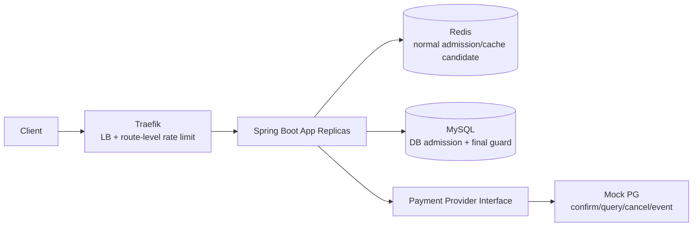
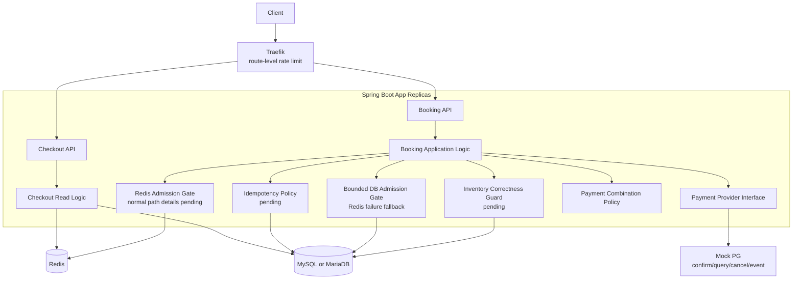
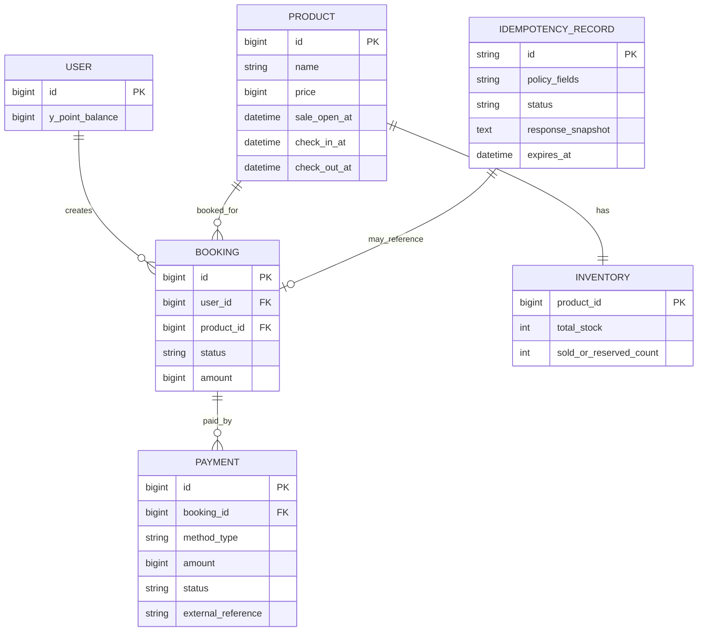
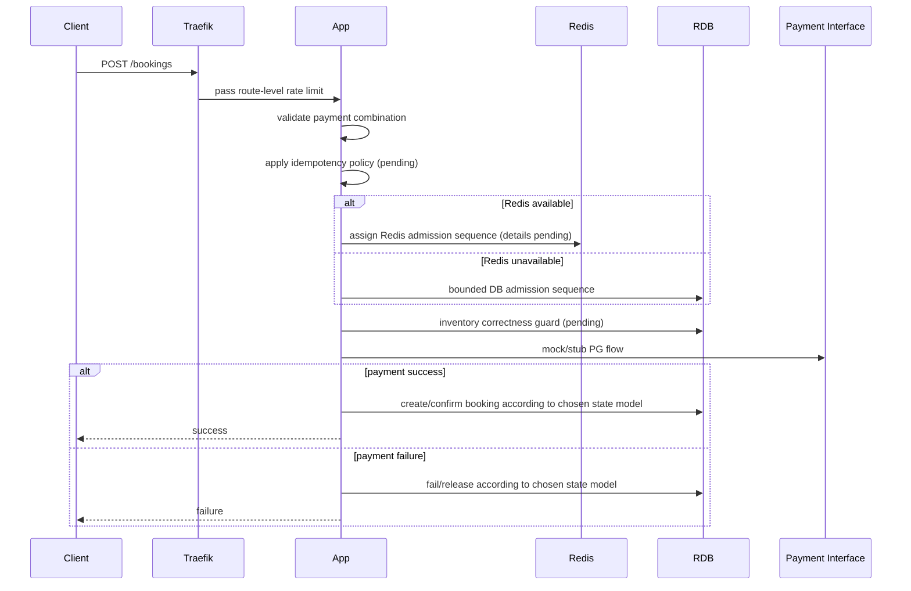
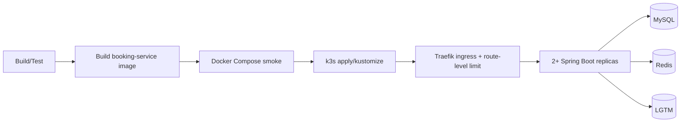

# Peak Booking System — Software Design Document

> **문서 목적**
> 현재 `docs/requirements.md`에 명시된 요구사항을 구현 가능한 설계 항목으로 풀어 쓰되, 요구사항에 없는 기술 선택은 확정하지 않고 `Open Decision`으로 남긴다. 기술 결정의 최종 권한자는 user다.

---

## 0. Document Metadata

| 항목 | 값 |
|---|---|
| Document Title | Peak Booking System SDD |
| Version | 0.6 (Design-Doc Completeness Draft) |
| Status | Draft / Decisions Pending |
| Author(s) | Sanghun Lee + Codex |
| Last Updated | 2026-05-31 |
| Requirement Source | `docs/requirements.md` |
| Related Documents | `docs/decisions/DECISIONS.md`, `docs/system-design/mock-interview.md`, `docs/system-design/redis-admission-design.md`, `docs/testing/test-first-scenarios.md`, `docs/research/source-backed-research-note.md` |

### 0.1 Revision History

| Version | Date | Author | Change |
|---|---|---|---|
| 0.1 | 2026-05-30 | Sanghun Lee + Codex | Initial FR/NFR extraction from previous requirements |
| 0.2 | 2026-05-30 | Sanghun Lee + Codex | Removed template-only sections and added Mermaid diagrams |
| 0.3 | 2026-05-30 | Sanghun Lee + Codex | Realigned to current extracted requirements and demoted unapproved choices to open decisions |
| 0.4 | 2026-05-30 | Sanghun Lee + Codex | Added fixed stock=10, Y페이/Y포인트, constrained scale-up/out, and source-backed Mock PG assumptions |
| 0.5 | 2026-05-31 | Sanghun Lee + Codex | Recorded authoritative admission fairness, Traefik first-line overload defense, and bounded DB admission fallback for Redis failure |
| 0.6 | 2026-05-31 | Sanghun Lee + Codex | Added Alternatives Considered, Deployment Strategy, and Monitoring Strategy sections |

---

## 1. Introduction

### 1.1 Purpose

이 문서는 `00시` 프로모션 시작 시 트래픽이 몰리는 `10개 한정` 초특가 숙소 상품의 주문서 조회, 결제, 최종 주문/예약 생성 흐름을 설계한다.

### 1.2 Scope

- **In scope**: Checkout 조회 API, Booking 생성 API, 재고 정합성/공정성, 멱등성, 결제 수단 조합, Redis 장애 fallback, 결제 실패 처리, 산출물 문서화.
- **Out of scope by requirements**: 실제 PG사 연동, 회원 인증 및 로그인 보안 처리.
- **Not specified by current requirements**: 한 사용자당 구매 제한, idempotency key/hash 세부 정책, DB locking 방식, fairness 알고리즘, multi-region/CDN/waiting-room/bot mitigation.

### 1.3 Confirmed Requirement Facts

| Area | Confirmed Fact |
|---|---|
| Language | Java 8 이상 또는 Kotlin |
| Framework | Spring Boot 2.7 이상 |
| RDB | MySQL 또는 MariaDB 계열 |
| Cache | Redis |
| Infra | 애플리케이션 서버 2대 이상의 분산 환경 |
| Stock | 초특가 숙소 상품 `10개 한정` |
| Traffic | 평시 `50 TPS`, `00시`부터 `1~5분` 동안 `500~1000 TPS` |
| APIs | `GET Checkout`, `POST Booking` |
| Payment methods | 신용카드, Y페이, Y포인트 |
| Allowed combinations | 신용카드+Y포인트, Y페이+Y포인트 |
| Disallowed combination | 신용카드와 Y페이 혼용 |
| Explicit exclusions | 실제 PG사 연동, 회원 인증/로그인 보안 |

### 1.4 Accepted Project Baseline Decisions

DEC-000에 따라 Java 21, Spring Boot 3.x, MySQL 8, k6, LGTM stack은 user가 직접 승인한 프로젝트 baseline이다. 이 선택들은 현재 요구사항의 최소 조건을 만족하며, 더 이상 미결정 사항이 아니다.

---

## 2. System Overview

본 시스템은 주문서 진입 정보 조회와 결제/예약 완료 요청을 처리하는 Spring Boot 기반 backend다. k3s + Traefik은 scale-out된 WAS 앞단의 LB/API gateway 후보이며, `POST /bookings` route-level rate limit으로 WAS 보호를 담당한다. Redis는 정상 상태 admission gate 후보이며, Redis 장애 시에는 MySQL 기반 bounded DB admission gate로 제한 fallback한다. RDB는 최종 재고 정합성 guard의 권위가 되어야 하지만, 구체 테이블/제약/transaction 방식은 DEC-003에서 결정한다.



---

## 3. Goals and Non-Goals

### 3.1 Goals

- G-1: `10개 한정` 상품에서 초과판매와 영구 미달판매가 발생하지 않도록 재고 정합성을 보장한다.
- G-2: 모든 사용자가 동등한 확률로 상품을 구매할 수 있는 구조를 설계한다.
- G-3: 짧은 간격의 연속 결제 요청이 중복 처리되지 않도록 멱등성을 제공한다.
- G-4: 신용카드, Y페이, Y포인트와 허용 복합 결제를 지원한다.
- G-5: Redis 장애 fallback 전략과 결제 실패 대응 로직을 설계하고 근거를 `DECISIONS.md`에 기록한다.
- G-6: `500~1000 TPS` burst에서 시스템 붕괴를 막기 위한 구조를 반영한다.
- G-7: 실제 PG 연동 없이도 payment interface와 Mock PG를 통해 승인/조회/취소/웹훅과 유사한 결제 흐름이 구조적으로 이어지도록 한다.

### 3.2 Non-Goals

- NG-1: 실제 PG사 API/운영 계약 연동은 구현하지 않는다. 다만 Mock PG는 공식 PG 문서의 승인/조회/취소/웹훅 흐름을 참고한다.
- NG-2: 회원 인증 및 로그인 보안 처리는 구현하지 않는다.
- NG-3: 숙소 검색, 추천, 리뷰, 관리자 백오피스는 현재 요구사항에 없다.
- NG-4: multi-region, CDN, WAF, production waiting room, bot mitigation은 현재 요구사항에 없다.

---

## 4. Constraints

### 4.1 Technical Constraints

- Java 8 이상 또는 Kotlin, Spring Boot 2.7 이상.
- MySQL 또는 MariaDB 계열 RDBMS.
- Redis 사용.
- 애플리케이션 서버 2대 이상의 분산 환경.
- 인프라 증설(scale-up/out)이 제한적인 상황.
- 실제 PG 연동은 생략하되, Mock PG는 결제 승인/상태 조회/취소/웹훅 또는 상태 변경 이벤트와 유사한 interface를 제공한다.
- 추가 기술/라이브러리/인프라는 도입 근거를 `DECISIONS.md`에 기록.

### 4.2 Design Guardrails

- 요구사항에 없는 값을 임의로 확정하지 않는다.
- 대상 초특가 숙소 상품 재고는 요구사항상 `10개`로 고정한다.
- `Idempotency-Key`, request hash, stored response replay는 후보 정책이며, 최종 결정 전에는 요구사항으로 표현하지 않는다.
- 공정성은 클라이언트 클릭 시각이 아니라 권위 있는 admission gate의 sequence로 판단한다.
- Redis 장애 시 Booking write path는 bounded DB admission gate로 제한 fallback한다. unlimited DB fallback은 금지한다.
- Traefik rate limit은 WAS/DB 보호 수단이며, 중복 방지나 공정성 원장이 아니다.
- Java 21, Spring Boot 3.x, MySQL 8, k6, LGTM은 DEC-000에서 승인된 프로젝트 baseline이다.

---

## 5. System Architecture

### 5.1 Architecture Shape

현재 repo는 단일 Spring Boot application으로 bootstrap되어 있다. 요구사항은 microservice 분리를 요구하지 않으므로, 우선은 하나의 backend 안에서 Checkout, Booking, Payment, Inventory, Idempotency 관심사를 분리하는 구조가 자연스러운 후보이다. 단, modular monolith 채택 자체도 `DECISIONS.md`에서 확인해야 한다.

### 5.2 Component Diagram



---

## 6. Data Design

### 6.1 Conceptual ERD



### 6.2 Data Decisions Still Open

| Topic | Current State |
|---|---|
| Stock quantity | Fixed at `10` for the target limited accommodation product |
| Inventory model | Count row, per-unit row, reservation table, or another model is open |
| User/product duplicate admission rule | Accepted direction: duplicate click/retry must not increase chance; exact unique constraints and idempotency interaction remain open |
| Admission ledger | Accepted direction: MySQL `booking_admission` is durable fairness/audit ledger; Redis sequence is provisional |
| Idempotency storage | Required conceptually, but key/hash/replay/TTL policy is open |
| Payment state | Failure handling required; timeout/unknown/reconciliation policy is open |
| Y포인트 balance consistency | Payment method support requires Y포인트, but ledger/balance model is open |

### 6.3 Candidate Booking Flow

이 흐름은 확정 설계가 아니라, 결정해야 할 경계들을 드러내기 위한 후보 흐름이다.



---

## 7. Component Design

### 7.1 Checkout Read Logic

- 주문서 진입에 필요한 상품 정보와 사용자 가용 Y포인트를 조회한다.
- Redis 사용 여부와 cache fallback 세부 방식은 설계 후보이며, Redis 장애 fallback 요구와 함께 결정한다.

### 7.2 Booking Application Logic

- 결제 수단 조합 검증, 멱등성 처리, 재고 정합성 확인, 결제 interface 호출, 최종 주문/예약 생성 흐름을 조정한다.
- 외부 PG 연동은 생략하므로 `PaymentPort`와 Mock PG로 승인/조회/취소/웹훅 유사 흐름만 유지한다.
- DB transaction boundary와 payment call boundary는 미결정 쟁점이다.

### 7.3 Payment Combination Policy

- 허용: 신용카드+Y포인트, Y페이+Y포인트.
- 금지: 신용카드+Y페이 혼용.
- 단독 결제 허용 범위, 금액 합계 검증, 음수 금액 검증, 동일 수단 중복 입력 검증은 현재 요구사항에 직접 명시되지 않았으나, 결제 도메인 검증 후보로 DEC-006에서 다룬다.

### 7.4 Redis Failure Policy

- Redis 장애 fallback 전략과 근거는 필수 산출물이다.
- Booking write path는 Redis 장애 시 bounded DB admission gate로 전환한다.
- bounded DB admission은 candidate pool, app semaphore/bulkhead, 짧은 timeout으로 제한한다.
- 모든 요청을 DB로 보내는 unlimited fallback은 금지한다.
- 같은 event epoch에서 Redis 장애가 감지되면 `DB_FALLBACK`으로 전환하고 Redis가 복구되어도 Redis gate로 돌아가지 않는다.
- candidate pool 크기, rate limit, semaphore/connection budget은 아직 미정이다.

### 7.5 Redis Admission Design

- Redis는 정상 상태의 fast admission pre-gate다.
- Redis 자료구조는 ZSET + Hash + String counter를 사용한다.
- Redis admission 원자성은 Lua script로 보장한다.
- Redis transaction과 distributed lock은 기본 admission 구현에서 사용하지 않는다.
- Redis sequence만으로는 유효 admission이 아니다. MySQL admission row 저장 성공 후에만 admission이 유효하다.
- Redis TTL은 `max(idempotency replay window, payment reconciliation window) + operational buffer`로 산정한다.
- Active admission key는 eviction 대상이 되면 안 되며, Redis persistence는 보조 수단일 뿐 MySQL admission table이 복구/감사 원장이다.
- 자세한 내용은 [Redis Admission Design Note](redis-admission-design.md)를 따른다.

### 7.6 MySQL Admission Ledger

The MySQL admission table is the authoritative fairness/audit ledger. Redis admission is valid only after this row is persisted.

Candidate table fields:

```text
booking_admission
- product_id
- event_epoch
- user_id
- gate_mode          -- REDIS / DB_FALLBACK
- redis_seq          -- nullable diagnostic/reference value
- db_admission_seq   -- official ordering value
- tranche_no
- status             -- ADMITTED / PROCESSING / SUCCEEDED / FAILED / EXPIRED
- admitted_at
- processing_started_at
- completed_at
- expires_at
```

Candidate constraints:

```text
UNIQUE(product_id, event_epoch, user_id)
UNIQUE(product_id, event_epoch, db_admission_seq)
INDEX(product_id, event_epoch, status, db_admission_seq)
```

`db_admission_seq` is issued by an `admission_sequence` counter row. This counter is a hot row by design, but it is only reached by bounded candidate traffic. The preferred implementation should minimize lock hold time with an atomic MySQL update pattern:

```sql
UPDATE admission_sequence
SET next_seq = LAST_INSERT_ID(next_seq + 1)
WHERE product_id = ? AND event_epoch = ?;

SELECT LAST_INSERT_ID();
```

The sequence transaction must stay short: issue sequence, insert admission row, commit. It must not include payment calls, inventory locks, or long business processing.

### 7.7 Idempotency Policy

- 짧은 간격의 연속 결제 요청이 중복 처리되지 않아야 한다.
- key 전달 방식, 요청 body hash, 저장 결과 replay, conflict response, TTL은 미정이다.

### 7.8 Mock Payment Provider Assumptions

실제 PG사와의 운영 연동은 생략하지만, Mock PG는 단순 boolean stub이 아니라 실제 PG와 유사한 불확실성을 표현해야 한다.

- `confirmPayment(paymentKey/paymentId, orderId, amount)`: 결제 인증 또는 결제 시도를 최종 승인한다. 금액 불일치, 한도 초과, 잔액 부족, 이미 승인됨, timeout/unknown을 시뮬레이션한다.
- `getPaymentByPaymentKey(...)` 또는 `getPaymentByOrderId(...)`: 승인 후 응답 유실이나 timeout 이후 현재 결제 상태를 조회한다.
- `cancelPayment(paymentKey/paymentId, reason, cancelAmount?)`: booking 실패 또는 보상 처리 시 전액/부분 취소 흐름을 시뮬레이션한다.
- `paymentStatusChanged` webhook/event: 결제 상태 변경 또는 비동기 취소 결과를 app이 수신하는 상황을 시뮬레이션한다.

이 가정은 DEC-005의 판단 재료이며, transaction boundary와 recovery worker/scheduler 도입 여부는 아직 확정하지 않는다.

---

## 8. Interface Design

| Method | Path | Purpose | Request/Response Detail |
|---|---|---|---|
| `GET` | `/api/v1/checkout/{productId}` | 주문서 진입 정보 조회 | 자유롭게 설계 가능 |
| `POST` | `/api/v1/bookings` | 결제 및 예약 완료 | 자유롭게 설계 가능. 멱등성 전달 방식은 미정 |

---

## 9. Non-Functional Requirements

| Category | Requirement | Acceptance Criteria Draft |
|---|---|---|
| Correctness | 초과판매/미달판매 방지 | `10개` 재고 기준으로 confirmed booking/order가 10을 초과하지 않아야 하며, 결제 실패/장애 후 재고가 영구 누락되지 않아야 함 |
| Fairness | 동등한 확률 | 테스트 가능한 fairness policy가 DEC-001에서 정의되어야 함 |
| Availability | TPS 급증 대응 | Traefik route-level rate limit + app/DB bulkhead로 `500~1000 TPS` burst에서 WAS/DB 붕괴 방지. 수치와 pass/fail 기준은 DEC-007/DEC-008에서 정의 |
| Idempotency | 연속 결제 요청 중복 방지 | 반복 요청이 중복 결제/중복 예약을 만들지 않아야 함 |
| Redis failure | fallback 전략 | Redis 장애 대응 방식과 근거가 DEC-002에 기록되어야 함 |
| Payment failure | 결제 실패 처리 | 실패 결제가 최종 주문/예약 성공으로 남지 않아야 함 |
| Extensibility | 결제 수단 추가 | 새 결제 수단 추가 시 Booking API 핵심 로직 변경이 최소화되어야 함 |

---

## 10. Architecture Decisions

Detailed decisions are tracked in `docs/decisions/DECISIONS.md`.

| Decision ID | Topic |
|---|---|
| DEC-000 | Current repo stack/tooling acceptance (Accepted) |
| DEC-001 | Stock model and fairness policy (Partially Accepted) |
| DEC-002 | Redis failure fallback policy (Accepted) |
| DEC-003 | RDB inventory correctness guard |
| DEC-004 | Idempotency policy |
| DEC-005 | Payment failure and PG abstraction |
| DEC-006 | Payment method extensibility |
| DEC-007 | HA/load shedding/backpressure (Partially Accepted) |
| DEC-008 | Test/load/observability strategy |

---

## 11. Risk Register

| ID | Risk | Impact | Required Decision |
|---|---|---|---|
| R-1 | Redis admission details and DB fallback epoch are not yet specified | High | DEC-001 / DEC-002 |
| R-2 | Redis fallback bypasses protection and overloads RDB if bounds are misconfigured | High | DEC-002 / DEC-007 |
| R-3 | Inventory guard allows oversell or permanent undersell | Critical | DEC-003 |
| R-4 | Rapid repeated payment requests create duplicate effects | Critical | DEC-004 |
| R-5 | Payment failure/timeout leaves inconsistent booking/payment state | High | DEC-005 |
| R-6 | Load-test and observability tools exist, but domain-specific pass/fail criteria are not defined | Medium | DEC-008 |

---

## 12. Requirements Traceability

| Req ID | Requirement | Design Section | Decision / Test Hook |
|---|---|---|---|
| FR-1 | Checkout API | §7.1, §8 | TFP-009 |
| FR-2 | Booking API | §7.2, §8 | TFP-001, TFP-006 |
| FR-3 | Payment methods and combinations | §7.3 | DEC-006, TFP-010 |
| FR-4 | Idempotency for rapid payment requests | §7.5, §9 | DEC-004, TFP-002 |
| FR-5 | Redis failure fallback | §7.4, §9 | DEC-002, TFP-004 |
| FR-6 | Payment failure handling | §7.2, §7.8, §9 | DEC-005, TFP-006, TFP-011 |
| NFR-1 | Stock=10 correctness and fairness | §6, §9 | DEC-001, DEC-003, TFP-001 |
| NFR-2 | HA under 50/500~1000 TPS | §9 | DEC-007 |
| NFR-3 | Runnable source and docs | §16 | DEC-008 |

---

## 13. Alternatives Considered

This section summarizes the major alternatives considered so far. Final acceptance and rationale are tracked in `docs/decisions/DECISIONS.md`.

| Topic | Alternative | Status | Rationale / Trade-off |
|---|---|---|---|
| Fairness clock | Client click timestamp | Rejected | Client time/network path is not a trustworthy or measurable fairness source. |
| Fairness clock | Authoritative admission gate sequence | Accepted Direction | Server-side Redis/DB sequence is measurable and auditable when persisted to MySQL. |
| Gateway rate limit | Traefik route/global rate limit | Accepted Direction | Protects WAS/DB before requests hit app replicas; not a fairness or duplicate-prevention ledger. |
| Gateway rate limit | User-level Traefik limit before authentication | Deferred | User identity is mock/trusted for now; JWT/principal support is needed before treating user-level gateway limits as trustworthy. |
| Redis data structure | ZSET + Hash + String counter | Accepted Direction | Supports ordering, duplicate lookup, and monotonic sequence generation. |
| Redis atomicity | Lua script | Accepted Direction | Keeps duplicate check, candidate limit check, sequence issue, and queue insert atomic. |
| Redis atomicity | `MULTI`/`EXEC` transaction | Rejected for default path | More client-side branching/retry complexity under contention. |
| Redis coordination | Distributed lock / Redlock | Rejected for default path | Admission can be handled by one atomic Lua operation; locks add safety assumptions without becoming final correctness guard. |
| Redis failure fallback | Fail-closed Booking path | Rejected as primary policy | Simpler but weak against the requirement to operate under failure. |
| Redis failure fallback | Bounded DB admission fallback | Accepted | Preserves limited operation and fairness ledger while protecting DB with budgets. |
| Redis recovery | Return to Redis in same epoch | Rejected | Merging Redis and DB fallback orderings can break fairness. |
| Redis recovery | Sticky `DB_FALLBACK` for same epoch | Accepted | Simpler and avoids ordering merge. |
| DB admission sequence | `admission_sequence` counter row | Accepted Direction | Clear per-product/epoch official sequence; hot row must be bounded and tested. |
| DB admission sequence | `AUTO_INCREMENT` as official sequence | Not selected | Simpler but less explicit per product/epoch and harder to explain as fairness ledger. |
| Inventory guard | Conditional count update | Open | Simple but may create hot row contention; DEC-003 pending. |
| Inventory guard | Per-unit inventory row | Open | Precise unit reservation model but more schema/state complexity; DEC-003 pending. |
| Inventory guard | Reservation table + expiry/release | Open | Strong fit for payment failure/timeout recovery; DEC-003/DEC-005 pending. |
| Payment timeout handling | Treat timeout as immediate failure | Open / risky | Simple but can create duplicate charge/booking risk if PG eventually succeeds. |
| Payment timeout handling | Reconciliation state/worker | Open | More operational complexity but better models real PG uncertainty. |

---

## 14. Deployment Strategy

### 14.1 Accepted Deployment Baseline

- Local orchestration uses the existing repo entrypoints: `docker-compose.yml`, `backend/`, `k6/`, `infra/observability/`, and `k8s/`.
- The backend is one stateless Spring Boot application, not multiple Gradle service modules.
- MySQL, Redis, and LGTM are local infrastructure dependencies.
- k3s + Traefik is the accepted local Kubernetes ingress/LB direction for scale-out WAS assumptions.
- At least 2 app replicas are assumed for the design and must be represented in Kubernetes/local verification before claiming distributed correctness.

### 14.2 Deployment Flow Candidate



### 14.3 Rollout Guardrails

- Apply DB schema migrations before application rollout once migration tooling is introduced.
- Deploy app replicas as stateless instances; no JVM-local lock/session/memory may be required for correctness.
- Use readiness checks so replicas do not receive Booking traffic before MySQL/Redis connectivity and required schema checks pass.
- Route-level Traefik rate limits must be applied before load tests that claim peak protection.
- Redis admission failure must be treated as a mode transition to bounded DB fallback, not as an uncontrolled app exception path.

### 14.4 Still Open

- Exact k3s manifests, Traefik middleware values, resource requests/limits, HPA usage, and readiness/liveness probes.
- DB migration tool choice and migration ordering.
- Secret/config management for local vs future production-like environments.
- Whether Redis admission and checkout cache use the same Redis instance/logical DB or are split.
- Exact app replica count for k6 validation beyond the minimum `2+` assumption.

---

## 15. Monitoring Strategy

### 15.1 Accepted Monitoring Baseline

DEC-000 accepts LGTM as the local observability stack. Monitoring exists to prove or falsify the overload/correctness claims, not just to display generic JVM health.

### 15.2 Required Signals

| Area | Signals |
|---|---|
| Traffic / gateway | Traefik request rate, `429/503` count, route-level rate-limit hit count, latency by route |
| App health | JVM CPU/memory, request latency, error count, active request threads, retry count |
| Redis admission | Lua latency, timeout count, duplicate admission count, BUSY count, candidate pool size, mode transition count |
| DB admission | admission insert latency, `db_admission_seq` issue latency, lock wait, deadlock/timeout count, Hikari active/idle/pending |
| Inventory correctness | succeeded count, held/processing count, failed/expired count, remaining stock, oversell invariant violations |
| Payment path | PG mock confirm latency, failure count, timeout/unknown count, cancel/reconciliation count |
| Fallback | `NORMAL_REDIS` vs `DB_FALLBACK` mode, fallback admission accepted/rejected count, candidate tranche open count |

### 15.3 Alert / Pass-Fail Candidates

The exact thresholds remain DEC-008 decisions. Initial alert candidates:

- confirmed bookings exceed `10`: critical correctness failure.
- Redis admission unavailable and DB fallback budget exhausted: degraded mode alert.
- Hikari pending connections continuously increasing during fallback: DB protection failure.
- DB lock wait timeout or deadlock count above threshold during admission sequence issuance: sequence hot-row risk.
- Payment `UNKNOWN` count not draining within reconciliation window: recovery risk.
- k6 peak test shows sustained app 5xx unrelated to intentional `429/503` shedding: overload failure.

### 15.4 Still Open

- Concrete metric names after implementation.
- LGTM dashboard layout and required screenshots/evidence for DEC-008.
- Exact SLO/pass-fail thresholds for p95/p99 latency, error rate, lock wait, Hikari pending, and payment unknown drain time.
- Whether alerts are local-only documentation or actual alert rules in the repo.

---

## 16. Local Execution And Verification Handoff

DEC-000에 따라 k6/LGTM은 공식 baseline tooling이다. 아래 entrypoint는 현재 repo의 로컬 검증 루프이며, DEC-008에서는 도구 채택 여부가 아니라 도메인 부하 시나리오와 pass/fail 기준을 정한다.

```bash
cd backend
./gradlew compileJava test --no-daemon
cd ..

docker compose up -d mysql redis lgtm booking-service
docker compose run --rm -e RATE=20 -e DURATION=10s k6
```

---

## 17. Open Questions

1. Redis 장애 fallback의 candidate pool, rate limit, semaphore, DB connection budget 초기값은 무엇인가?
2. Admission status transitions and candidate tranche open criteria are not finalized.
3. RDB 재고 정합성은 count row, per-unit row, reservation table 중 무엇으로 보장할 것인가?
4. 멱등성은 어떤 key, body 비교, replay, TTL 정책을 사용할 것인가?
5. 결제 실패와 timeout/unknown 결과를 같은 실패로 볼 것인가, 별도 reconciliation 대상으로 볼 것인가?
6. Mock PG의 webhook/status query를 recovery worker/scheduler로 처리할 것인가, 요청 재시도 경로에서만 처리할 것인가?
7. k6/LGTM을 사용해 어떤 부하 시나리오, 관측 지표, pass/fail 기준을 둘 것인가?

---

## References

- [Requirements](../requirements.md)
- [Decision log](../decisions/DECISIONS.md)
- [Mock-interview design](mock-interview.md)
- [Redis admission design](redis-admission-design.md)
- [Test-first scenarios](../testing/test-first-scenarios.md)
- [Source-backed research note](../research/source-backed-research-note.md)
