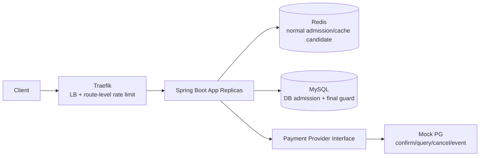
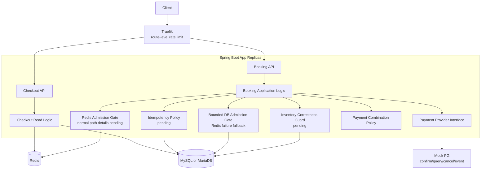
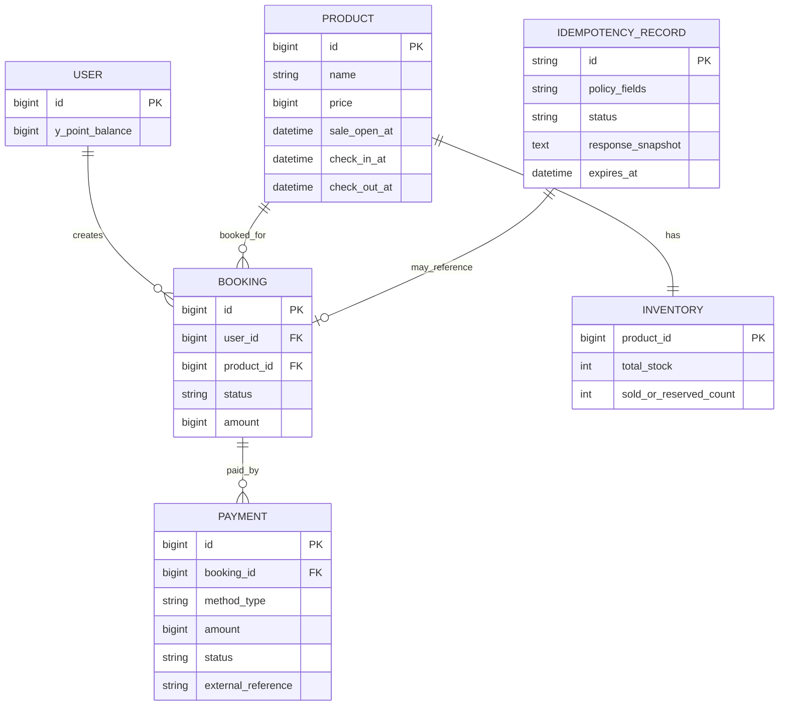
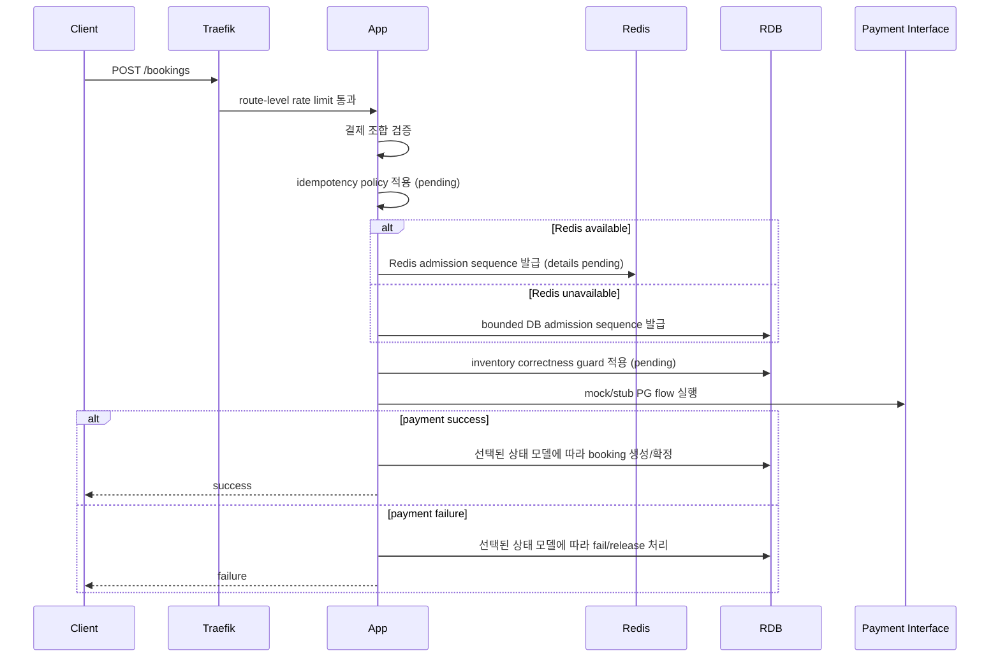
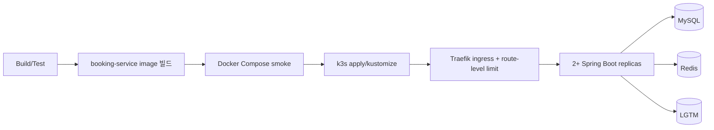

# Peak Booking System — Software Design Document

> **문서 목적**
> 현재 `docs/requirements.md`에 명시된 요구사항을 구현 가능한 설계 항목으로 풀어 쓰되, 요구사항에 없는 기술 선택은 확정하지 않고 `미결정`으로 남긴다. 기술 결정의 최종 권한자는 user다.

---

## 0. 문서 메타데이터

| 항목 | 값 |
|---|---|
| 문서 제목 | Peak Booking System SDD |
| 버전 | 0.6 (설계 문서 보강 초안) |
| 상태 | 초안 / 결정 진행 중 |
| 작성자 | Sanghun Lee + Codex |
| 마지막 수정 | 2026-05-31 |
| 요구사항 출처 | `docs/requirements.md` |
| 관련 문서 | `docs/decisions/DECISIONS.md`, `docs/system-design/mock-interview.md`, `docs/system-design/redis-admission-design.md`, `docs/testing/test-first-scenarios.md`, `docs/research/source-backed-research-note.md` |

### 0.1 변경 이력

| 버전 | 날짜 | 작성자 | 변경 사항 |
|---|---|---|---|
| 0.1 | 2026-05-30 | Sanghun Lee + Codex | 기존 요구사항에서 FR/NFR을 최초 추출 |
| 0.2 | 2026-05-30 | Sanghun Lee + Codex | 템플릿용 빈 섹션을 제거하고 Mermaid 다이어그램 추가 |
| 0.3 | 2026-05-30 | Sanghun Lee + Codex | 현재 추출 요구사항에 맞게 재정렬하고 미승인 선택을 open decision으로 낮춤 |
| 0.4 | 2026-05-30 | Sanghun Lee + Codex | 고정 재고 10개, Y페이/Y포인트, 제한된 scale-up/out, source-backed Mock PG 가정 추가 |
| 0.5 | 2026-05-31 | Sanghun Lee + Codex | authoritative admission fairness, Traefik 1차 방어, Redis 장애 시 bounded DB admission fallback을 기록 |
| 0.6 | 2026-05-31 | Sanghun Lee + Codex | Alternatives Considered, Deployment Strategy, Monitoring Strategy 섹션을 추가 |

---

## 1. 소개

### 1.1 목적

이 문서는 `00시` 프로모션 시작 시 트래픽이 몰리는 `10개 한정` 초특가 숙소 상품의 주문서 조회, 결제, 최종 주문/예약 생성 흐름을 설계한다.

### 1.2 범위

- **범위 포함**: Checkout 조회 API, Booking 생성 API, 재고 정합성/공정성, 멱등성, 결제 수단 조합, Redis 장애 fallback, 결제 실패 처리, 산출물 문서화.
- **요구사항상 범위 제외**: 실제 PG사 연동, 회원 인증 및 로그인 보안 처리.
- **현재 요구사항에 명시되지 않음**: 한 사용자당 구매 제한, idempotency key/hash 세부 정책, DB locking 방식, fairness 알고리즘, multi-region/CDN/waiting-room/bot mitigation.

### 1.3 확정된 요구사항 사실

| 영역 | 확정 사실 |
|---|---|
| 언어 | Java 8 이상 또는 Kotlin |
| 프레임워크 | Spring Boot 2.7 이상 |
| RDB | MySQL 또는 MariaDB 계열 |
| Cache | Redis |
| 인프라 | 애플리케이션 서버 2대 이상의 분산 환경 |
| 재고 | 초특가 숙소 상품 `10개 한정` |
| 트래픽 | 평시 `50 TPS`, `00시`부터 `1~5분` 동안 `500~1000 TPS` |
| APIs | `GET Checkout`, `POST Booking` |
| 결제 수단 | 신용카드, Y페이, Y포인트 |
| 허용 결제 조합 | 신용카드+Y포인트, Y페이+Y포인트 |
| 금지 결제 조합 | 신용카드와 Y페이 혼용 |
| 명시적 제외 사항 | 실제 PG사 연동, 회원 인증/로그인 보안 |

### 1.4 수용한 프로젝트 Baseline 결정

DEC-000에 따라 Java 21, Spring Boot 3.x, MySQL 8, k6, LGTM stack은 user가 직접 승인한 프로젝트 baseline이다. 이 선택들은 현재 요구사항의 최소 조건을 만족하며, 더 이상 미결정 사항이 아니다.

---

## 2. 시스템 개요

본 시스템은 주문서 진입 정보 조회와 결제/예약 완료 요청을 처리하는 Spring Boot 기반 backend다. k3s + Traefik은 scale-out된 WAS 앞단의 LB/API gateway 후보이며, `POST /bookings` route-level rate limit으로 WAS 보호를 담당한다. Redis는 정상 상태 admission gate 후보이며, Redis 장애 시에는 MySQL 기반 bounded DB admission gate로 제한 fallback한다. RDB는 최종 재고 정합성 guard의 권위가 되어야 하지만, 구체 테이블/제약/transaction 방식은 DEC-003에서 결정한다.



---

## 3. Goals and Non-Goals

### 3.1 목표

- G-1: `10개 한정` 상품에서 초과판매와 영구 미달판매가 발생하지 않도록 재고 정합성을 보장한다.
- G-2: 모든 사용자가 동등한 확률로 상품을 구매할 수 있는 구조를 설계한다.
- G-3: 짧은 간격의 연속 결제 요청이 중복 처리되지 않도록 멱등성을 제공한다.
- G-4: 신용카드, Y페이, Y포인트와 허용 복합 결제를 지원한다.
- G-5: Redis 장애 fallback 전략과 결제 실패 대응 로직을 설계하고 근거를 `DECISIONS.md`에 기록한다.
- G-6: `500~1000 TPS` burst에서 시스템 붕괴를 막기 위한 구조를 반영한다.
- G-7: 실제 PG 연동 없이도 payment interface와 Mock PG를 통해 승인/조회/취소/웹훅과 유사한 결제 흐름이 구조적으로 이어지도록 한다.

### 3.2 비목표

- NG-1: 실제 PG사 API/운영 계약 연동은 구현하지 않는다. 다만 Mock PG는 공식 PG 문서의 승인/조회/취소/웹훅 흐름을 참고한다.
- NG-2: 회원 인증 및 로그인 보안 처리는 구현하지 않는다.
- NG-3: 숙소 검색, 추천, 리뷰, 관리자 백오피스는 현재 요구사항에 없다.
- NG-4: multi-region, CDN, WAF, production waiting room, bot mitigation은 현재 요구사항에 없다.

---

## 4. 제약

### 4.1 기술 제약

- Java 8 이상 또는 Kotlin, Spring Boot 2.7 이상.
- MySQL 또는 MariaDB 계열 RDBMS.
- Redis 사용.
- 애플리케이션 서버 2대 이상의 분산 환경.
- 인프라 증설(scale-up/out)이 제한적인 상황.
- 실제 PG 연동은 생략하되, Mock PG는 결제 승인/상태 조회/취소/웹훅 또는 상태 변경 이벤트와 유사한 interface를 제공한다.
- 추가 기술/라이브러리/인프라는 도입 근거를 `DECISIONS.md`에 기록.

### 4.2 설계 Guardrails

- 요구사항에 없는 값을 임의로 확정하지 않는다.
- 대상 초특가 숙소 상품 재고는 요구사항상 `10개`로 고정한다.
- `Idempotency-Key`, request hash, stored response replay는 후보 정책이며, 최종 결정 전에는 요구사항으로 표현하지 않는다.
- 공정성은 클라이언트 클릭 시각이 아니라 권위 있는 admission gate의 sequence로 판단한다.
- Redis 장애 시 Booking write path는 bounded DB admission gate로 제한 fallback한다. unlimited DB fallback은 금지한다.
- Traefik rate limit은 WAS/DB 보호 수단이며, 중복 방지나 공정성 원장이 아니다.
- Java 21, Spring Boot 3.x, MySQL 8, k6, LGTM은 DEC-000에서 승인된 프로젝트 baseline이다.

---

## 5. 시스템 아키텍처

### 5.1 아키텍처 형태

현재 repo는 단일 Spring Boot application으로 bootstrap되어 있다. 요구사항은 microservice 분리를 요구하지 않으므로, 우선은 하나의 backend 안에서 Checkout, Booking, Payment, Inventory, Idempotency 관심사를 분리하는 구조가 자연스러운 후보이다. 단, modular monolith 채택 자체도 `DECISIONS.md`에서 확인해야 한다.

### 5.2 Component Diagram



---

## 6. Data Design

### 6.1 개념 ERD



### 6.2 아직 미결정인 Data 결정

| 항목 | 현재 상태 |
|---|---|
| 재고 수량 | 대상 초특가 숙소 상품의 재고는 `10개`로 고정 |
| 재고 모델 | count row, per-unit row, reservation table 또는 다른 모델 중 미결정 |
| 사용자/상품 중복 admission 규칙 | 중복 클릭/재시도가 성공 확률을 높이면 안 된다는 방향은 수용. 정확한 unique constraint와 idempotency 관계는 미결정 |
| Admission ledger | MySQL `booking_admission`을 durable fairness/audit ledger로 두는 방향은 수용. Redis sequence는 provisional 값 |
| Idempotency 저장소 | 개념적으로 필요하지만 key/hash/replay/TTL 정책은 미결정 |
| Payment 상태 | 실패 처리는 필요하지만 timeout/unknown/reconciliation 정책은 미결정 |
| Y포인트 잔액 정합성 | 결제 수단 지원을 위해 필요하지만 ledger/balance 모델은 미결정 |

### 6.3 후보 Booking Flow

이 흐름은 확정 설계가 아니라, 결정해야 할 경계들을 드러내기 위한 후보 흐름이다.



---

## 7. Component Design

### 7.1 Checkout 조회 로직

- 주문서 진입에 필요한 상품 정보와 사용자 가용 Y포인트를 조회한다.
- Redis 사용 여부와 cache fallback 세부 방식은 설계 후보이며, Redis 장애 fallback 요구와 함께 결정한다.

### 7.2 Booking Application 로직

- 결제 수단 조합 검증, 멱등성 처리, 재고 정합성 확인, 결제 interface 호출, 최종 주문/예약 생성 흐름을 조정한다.
- 외부 PG 연동은 생략하므로 `PaymentPort`와 Mock PG로 승인/조회/취소/웹훅 유사 흐름만 유지한다.
- DB transaction boundary와 payment call boundary는 미결정 쟁점이다.

### 7.3 Payment Combination Policy

- 허용: 신용카드+Y포인트, Y페이+Y포인트.
- 금지: 신용카드+Y페이 혼용.
- 단독 결제 허용 범위, 금액 합계 검증, 음수 금액 검증, 동일 수단 중복 입력 검증은 현재 요구사항에 직접 명시되지 않았으나, 결제 도메인 검증 후보로 DEC-006에서 다룬다.

### 7.4 Redis Failure Policy

- Redis 장애 fallback 전략과 근거는 필수 산출물이다.
- Booking write path는 Redis 장애 시 bounded DB admission gate로 전환한다.
- bounded DB admission은 candidate pool, app semaphore/bulkhead, 짧은 timeout으로 제한한다.
- 모든 요청을 DB로 보내는 unlimited fallback은 금지한다.
- 같은 event epoch에서 Redis 장애가 감지되면 `DB_FALLBACK`으로 전환하고 Redis가 복구되어도 Redis gate로 돌아가지 않는다.
- candidate pool 크기, rate limit, semaphore/connection budget은 DEC-007의 초기 runtime budget을 적용하고 k6/LGTM 결과로 조정한다.

### 7.5 Redis Admission Design

- Redis는 정상 상태의 fast admission pre-gate다.
- Redis 자료구조는 ZSET + Hash + String counter를 사용한다.
- Redis admission 원자성은 Lua script로 보장한다.
- Redis transaction과 distributed lock은 기본 admission 구현에서 사용하지 않는다.
- Redis sequence만으로는 유효 admission이 아니다. MySQL admission row 저장 성공 후에만 admission이 유효하다.
- Redis TTL은 `max(idempotency replay window, payment reconciliation window) + operational buffer`로 산정한다.
- Active admission key는 eviction 대상이 되면 안 되며, Redis persistence는 보조 수단일 뿐 MySQL admission table이 복구/감사 원장이다.
- 자세한 내용은 [Redis Admission Design Note](redis-admission-design.md)를 따른다.

### 7.6 MySQL Admission Ledger

MySQL admission table은 공정성/감사 기준이 되는 authoritative ledger다. Redis admission은 이 row가 저장된 뒤에만 유효하다.

후보 테이블 필드:

```text
booking_admission
- product_id
- event_epoch
- user_id
- gate_mode          -- REDIS / DB_FALLBACK
- redis_seq          -- nullable diagnostic/reference value
- db_admission_seq   -- official ordering value
- tranche_no
- status             -- ADMITTED / PROCESSING / SUCCEEDED / FAILED / EXPIRED
- admitted_at
- processing_started_at
- completed_at
- expires_at
```

후보 제약:

```text
UNIQUE(product_id, event_epoch, user_id)
UNIQUE(product_id, event_epoch, db_admission_seq)
INDEX(product_id, event_epoch, status, db_admission_seq)
```

`db_admission_seq`는 `admission_sequence` counter row에서 발급한다. 이 counter는 설계상 hot row지만, bounded candidate traffic만 접근하도록 제한한다. 구현 시에는 아래 atomic MySQL update 패턴으로 lock 보유 시간을 줄이는 방향을 우선 고려한다.

```sql
UPDATE admission_sequence
SET next_seq = LAST_INSERT_ID(next_seq + 1)
WHERE product_id = ? AND event_epoch = ?;

SELECT LAST_INSERT_ID();
```

sequence transaction은 짧게 유지해야 한다. sequence 발급, admission row insert, commit까지만 포함하고, payment call, inventory lock, 긴 business processing을 포함하지 않는다.

### 7.7 Idempotency Policy

- 짧은 간격의 연속 결제 요청이 중복 처리되지 않아야 한다.
- key 전달 방식, 요청 body hash, 저장 결과 replay, conflict response, TTL은 미정이다.

### 7.8 Mock Payment Provider 가정

실제 PG사와의 운영 연동은 생략하지만, Mock PG는 단순 boolean stub이 아니라 실제 PG와 유사한 불확실성을 표현해야 한다.

- `confirmPayment(paymentKey/paymentId, orderId, amount)`: 결제 인증 또는 결제 시도를 최종 승인한다. 금액 불일치, 한도 초과, 잔액 부족, 이미 승인됨, timeout/unknown을 시뮬레이션한다.
- `getPaymentByPaymentKey(...)` 또는 `getPaymentByOrderId(...)`: 승인 후 응답 유실이나 timeout 이후 현재 결제 상태를 조회한다.
- `cancelPayment(paymentKey/paymentId, reason, cancelAmount?)`: booking 실패 또는 보상 처리 시 전액/부분 취소 흐름을 시뮬레이션한다.
- `paymentStatusChanged` webhook/event: 결제 상태 변경 또는 비동기 취소 결과를 app이 수신하는 상황을 시뮬레이션한다.

이 가정은 DEC-005의 판단 재료이며, transaction boundary와 recovery worker/scheduler 도입 여부는 아직 확정하지 않는다.

---

## 8. Interface Design

| Method | Path | 목적 | Request/Response 세부 |
|---|---|---|---|
| `GET` | `/api/v1/checkout/{productId}` | 주문서 진입 정보 조회 | 자유롭게 설계 가능 |
| `POST` | `/api/v1/bookings` | 결제 및 예약 완료 | 자유롭게 설계 가능. 멱등성 전달 방식은 미정 |

---

## 9. Non-Functional Requirements

| 분류 | 요구사항 | 수용 기준 초안 |
|---|---|---|
| 정합성 | 초과판매/미달판매 방지 | `10개` 재고 기준으로 confirmed booking/order가 10을 초과하지 않아야 하며, 결제 실패/장애 후 재고가 영구 누락되지 않아야 함 |
| Fairness | 동등한 확률 | 테스트 가능한 fairness policy가 DEC-001에서 정의되어야 함 |
| 가용성 | TPS 급증 대응 | Traefik route-level rate limit + app/DB bulkhead로 `500~1000 TPS` burst에서 WAS/DB 붕괴 방지. 수치와 pass/fail 기준은 DEC-007/DEC-008에서 정의 |
| Idempotency | 연속 결제 요청 중복 방지 | 반복 요청이 중복 결제/중복 예약을 만들지 않아야 함 |
| Redis failure | fallback 전략 | Redis 장애 대응 방식과 근거가 DEC-002에 기록되어야 함 |
| 결제 실패 | 결제 실패 처리 | 실패 결제가 최종 주문/예약 성공으로 남지 않아야 함 |
| 확장성 | 결제 수단 추가 | 새 결제 수단 추가 시 Booking API 핵심 로직 변경이 최소화되어야 함 |

---

## 10. Architecture Decisions

상세 결정은 `docs/decisions/DECISIONS.md`에서 추적한다.

| 결정 ID | 주제 |
|---|---|
| DEC-000 | 현재 repo stack/tooling 채택 (수용) |
| DEC-001 | 재고 모델과 공정성 정책 (부분 수용) |
| DEC-002 | Redis 장애 fallback 정책 (수용) |
| DEC-003 | RDB 재고 정합성 guard |
| DEC-004 | Idempotency 정책 |
| DEC-005 | 결제 실패와 PG abstraction |
| DEC-006 | 결제 수단 확장성 |
| DEC-007 | HA/load shedding/backpressure (부분 수용) |
| DEC-008 | 테스트/load/observability 전략 |

---

## 11. Risk Register

| ID | 리스크 | 영향 | 필요한 결정 |
|---|---|---|---|
| R-1 | Redis admission 세부와 DB fallback epoch 정책이 아직 충분히 구체화되지 않음 | 높음 | DEC-001 / DEC-002 |
| R-2 | bound 설정이 잘못되면 Redis fallback이 보호 장치를 우회해 RDB를 과부하시킬 수 있음 | 높음 | DEC-002 / DEC-007 |
| R-3 | Inventory guard가 oversell 또는 영구 undersell을 허용할 수 있음 | 치명적 | DEC-003 |
| R-4 | 빠른 반복 결제 요청이 중복 효과를 만들 수 있음 | 치명적 | DEC-004 |
| R-5 | 결제 실패/timeout이 booking/payment 상태 불일치로 남을 수 있음 | 높음 | DEC-005 |
| R-6 | load-test/observability 도구는 있지만 도메인별 pass/fail 기준이 아직 없음 | 중간 | DEC-008 |

---

## 12. Requirements Traceability

| 요구사항 ID | 요구사항 | 설계 섹션 | 결정 / 테스트 훅 |
|---|---|---|---|
| FR-1 | Checkout API | §7.1, §8 | TFP-009 |
| FR-2 | Booking API | §7.2, §8 | TFP-001, TFP-006 |
| FR-3 | 결제 수단과 조합 | §7.3 | DEC-006, TFP-010 |
| FR-4 | 빠른 반복 결제 요청에 대한 idempotency | §7.7, §9 | DEC-004, TFP-002 |
| FR-5 | Redis 장애 fallback | §7.4, §9 | DEC-002, TFP-004 |
| FR-6 | 결제 실패 처리 | §7.2, §7.8, §9 | DEC-005, TFP-006, TFP-011 |
| NFR-1 | stock=10 정합성과 공정성 | §6, §9 | DEC-001, DEC-003, TFP-001 |
| NFR-2 | 50/500~1000 TPS 환경의 HA | §9 | DEC-007 |
| NFR-3 | 실행 가능한 소스와 문서 | §16 | DEC-008 |

---

## 13. Alternatives Considered

이 섹션은 지금까지 검토한 주요 대안을 요약한다. 최종 수용 여부와 근거는 `docs/decisions/DECISIONS.md`에서 추적한다.

| 주제 | 대안 | 상태 | 근거 / 트레이드오프 |
|---|---|---|---|
| 공정성 기준 시각 | Client click timestamp | 거절 | client 시간과 network path는 신뢰 가능하거나 측정 가능한 공정성 기준이 아니다. |
| 공정성 기준 시각 | Authoritative admission gate sequence | 방향 수용 | 서버 측 Redis/DB sequence는 MySQL에 저장되면 측정과 감사가 가능하다. |
| Gateway rate limit | Traefik route/global rate limit | 방향 수용 | 요청이 app replica에 닿기 전에 WAS/DB를 보호한다. 공정성이나 중복 방지 원장은 아니다. |
| Gateway rate limit | 인증 전 user-level Traefik limit | 보류 | 현재 user identity는 mock/trusted 상태다. user-level gateway limit을 신뢰하려면 JWT/principal 지원이 필요하다. |
| Redis data structure | ZSET + Hash + String counter | 방향 수용 | ordering, duplicate lookup, monotonic sequence generation을 지원한다. |
| Redis atomicity | Lua script | 방향 수용 | duplicate check, candidate limit check, sequence issue, queue insert를 원자적으로 처리할 수 있다. |
| Redis atomicity | `MULTI`/`EXEC` transaction | 기본 경로에서 거절 | 경합 상황에서 client-side branching/retry 복잡도가 커진다. |
| Redis coordination | Distributed lock / Redlock | 기본 경로에서 거절 | admission은 하나의 atomic Lua operation으로 처리할 수 있다. lock은 추가 안전 가정을 만들지만 최종 correctness guard가 되지 않는다. |
| Redis failure fallback | Fail-closed Booking path | 주 정책으로 거절 | 단순하지만 장애 상황에서도 동작해야 한다는 요구에 약하다. |
| Redis failure fallback | Bounded DB admission fallback | 수용 | DB budget으로 보호하면서 제한적 동작과 fairness ledger를 유지한다. |
| Redis recovery | 같은 epoch에서 Redis로 복귀 | 거절 | Redis ordering과 DB fallback ordering을 병합하면 공정성이 깨질 수 있다. |
| Redis recovery | 같은 epoch에서 sticky `DB_FALLBACK` 유지 | 수용 | 더 단순하고 ordering 병합 문제를 피한다. |
| DB admission sequence | `admission_sequence` counter row | 방향 수용 | product/epoch별 공식 sequence가 명확하다. hot row는 bounded 처리와 테스트가 필요하다. |
| DB admission sequence | `AUTO_INCREMENT`를 공식 sequence로 사용 | 선택하지 않음 | 더 단순하지만 product/epoch별 공식 sequence 설명력이 약하고 fairness ledger로 설명하기 어렵다. |
| Inventory guard | Conditional count update | 미결정 | 단순하지만 hot row contention이 생길 수 있다. DEC-003에서 결정한다. |
| Inventory guard | Per-unit inventory row | 미결정 | 단위 재고 reservation을 정확히 표현할 수 있지만 schema/state complexity가 증가한다. DEC-003에서 결정한다. |
| Inventory guard | Reservation table + expiry/release | 미결정 | payment failure/timeout recovery와 잘 맞지만 DEC-003/DEC-005 결정이 필요하다. |
| Payment timeout handling | timeout을 즉시 실패로 처리 | 미결정 / 위험 | 단순하지만 PG가 이후 성공할 경우 duplicate charge/booking 위험이 있다. |
| Payment timeout handling | Reconciliation state/worker | 미결정 | 운영 복잡도는 커지지만 실제 PG 불확실성을 더 잘 모델링한다. |

---

## 14. Deployment Strategy

### 14.1 수용한 배포 Baseline

- Local orchestration은 기존 repo entrypoint인 `docker-compose.yml`, `backend/`, `k6/`, `infra/observability/`, `k8s/`를 사용한다.
- Backend는 여러 Gradle service module이 아니라 하나의 stateless Spring Boot application이다.
- MySQL, Redis, LGTM은 local infrastructure dependency다.
- k3s + Traefik은 scale-out WAS 가정을 검증하기 위한 local Kubernetes ingress/LB 방향으로 수용한다.
- 설계는 최소 2개 app replica를 가정하며, 분산 정합성을 주장하려면 Kubernetes/local verification에서도 2개 이상 replica를 표현해야 한다.

### 14.2 후보 배포 Flow



### 14.3 Rollout Guardrails

- DB migration 도구가 도입되면 application rollout 전에 DB schema migration을 먼저 적용한다.
- App replica는 stateless instance로 배포한다. correctness가 JVM-local lock/session/memory에 의존하면 안 된다.
- MySQL/Redis 연결과 필수 schema check가 통과되기 전에는 replica가 Booking traffic을 받지 않도록 readiness check를 둔다.
- peak 보호를 주장하는 load test 전에는 route-level Traefik rate limit을 먼저 적용해야 한다.
- Redis admission failure는 통제되지 않은 app exception path가 아니라 bounded DB fallback으로의 mode transition으로 처리한다.

### 14.4 초기 Runtime Budget

아래 값은 DEC-007/DEC-008의 첫 k6/LGTM 검증 profile이다. 최종 운영값이 아니라 `2`개 WAS replica, Mock PG normal confirm delay `100ms`, stock `10`을 전제로 한 starting point다.

| 항목 | 초기값 |
|---|---:|
| Traefik `POST /bookings` route limit | average `1000 req/s`, burst `1000`, period `1s` |
| booking endpoint concurrency | WAS당 `64` |
| Hikari maximum pool | WAS당 `10` |
| Hikari connection timeout | `250ms` |
| DB write bulkhead | WAS당 `6` |
| DB fallback admission bulkhead | WAS당 `2` |
| Redis admission command timeout | `50ms` |
| Redis/DB admission candidate pool | sale event당 `30` |
| PG confirm concurrency | WAS당 `5`, 전체 `10` |
| Mock PG client timeout | `500ms` |
| Recovery scheduler | `5s` fixed delay + `0~5s` initial jitter |
| Recovery batch / status query | WAS당 batch `5`, PG status concurrency `1` |
| Recovery backoff | `5s -> 15s -> 45s -> 2m -> 5m`, jitter 포함 |

### 14.5 미결정 사항

- 정확한 k3s manifest, resource request/limit, HPA 사용 여부, readiness/liveness probe.
- DB migration 도구 선택과 migration 순서.
- local 환경과 향후 production-like 환경의 secret/config 관리 방식.
- Redis admission과 checkout cache를 같은 Redis instance/logical DB에서 사용할지 분리할지 여부.
- 초기 runtime budget을 실제 local/k3s resource에서 조정할지 여부.

---

## 15. Monitoring Strategy

### 15.1 수용한 Monitoring Baseline

DEC-000은 LGTM을 local observability stack으로 수용한다. Monitoring의 목적은 generic JVM health를 보여주는 데 그치지 않고, overload/correctness 주장을 증명하거나 반증하는 것이다.

### 15.2 필요한 신호

| 영역 | 신호 |
|---|---|
| Traffic / gateway | Traefik request rate, `429/503` count, route-level rate-limit hit count, route별 latency |
| App health | JVM CPU/memory, request latency, error count, active request thread, retry count |
| Redis admission | Lua latency, timeout count, duplicate admission count, BUSY count, candidate pool size, mode transition count |
| DB admission | admission insert latency, `db_admission_seq` issue latency, lock wait, deadlock/timeout count, Hikari active/idle/pending |
| Inventory correctness | succeeded count, held/processing count, failed/expired count, remaining stock, oversell invariant violation |
| Payment path | PG mock confirm latency, failure count, timeout/unknown count, cancel/reconciliation count |
| Fallback | `NORMAL_REDIS` vs `DB_FALLBACK` mode, fallback admission accepted/rejected count, candidate tranche open count |

### 15.3 Alert / Pass-Fail 기준

DEC-008은 correctness hard fail과 tuning 가능한 latency/resource threshold를 분리한다. 아래 값은 첫 검증 기준이며, 충분한 k6/LGTM 결과를 얻은 뒤 조정한다.

#### Hard correctness fail

- confirmed booking이 `10`을 초과하면 critical correctness failure다.
- `confirmed_count + reserved_count <= total_stock`가 깨지면 critical correctness failure다.
- 같은 `user_id + sale_event_id`에서 confirmed booking이 중복되면 critical correctness failure다.
- 같은 `booking_attempt_id`에서 PG confirm side effect가 2회 이상 발생하면 critical correctness failure다.
- Redis 장애 중 unlimited DB fallback이 발생하면 critical correctness failure다.
- PG timeout/unknown을 즉시 success/release로 조용히 확정하면 critical correctness failure다.

#### Latency threshold

| 경로 | Pass | Warning |
|---|---:|---:|
| `GET /checkout` | p95 `<= 200ms` | p95 `> 100ms` |
| `POST /bookings` normal confirmed | p95 `<= 500ms` | p95 `> 300ms` |
| DB/PG 없는 controlled rejection | p95 `<= 200ms` | p95 `> 100ms` |
| Redis down DB fallback rejection | p95 `<= 500ms` | p95 `> 300ms` |
| PG timeout -> `PAYMENT_UNKNOWN` | p95 `<= 700ms` | p95 `> 600ms` |

p99는 초기 pass/fail이 아니라 warning/관측 지표로 둔다.

#### Resource / recovery threshold

- 의도하지 않은 app restart는 `0`이어야 한다.
- technical 5xx/timeout rate는 `< 1%`여야 한다. 의도된 `429`, sold out, candidate rejected, duplicate replay는 technical failure에서 제외한다.
- Hikari pending이 `30s` 이상 지속 증가하면 DB protection failure로 본다.
- DB deadlock은 `0`을 목표로 하며, lock wait timeout이 발생하면 blocker로 분석한다.
- Mock PG가 최종 상태를 제공하는 Payment `UNKNOWN`은 `60s` 안에 drain되어야 한다.
- Redis admission unavailable 상태에서 DB fallback budget도 소진되면 degraded mode alert 대상이다.
- k6 peak test에서 의도된 `429/503` shedding과 무관한 app 5xx가 지속되면 overload failure로 본다.

### 15.4 미결정 사항

- 구현 후 concrete metric name.
- DEC-008에 필요한 LGTM dashboard layout과 screenshot/evidence.
- alert를 local-only documentation으로 둘지 repo에 실제 alert rule로 둘지 여부.

---

## 16. Local Execution And Verification Handoff

DEC-000에 따라 k6/LGTM은 공식 baseline tooling이다. 아래 entrypoint는 현재 repo의 로컬 검증 루프이며, DEC-008에서는 도구 채택 여부가 아니라 도메인 부하 시나리오와 pass/fail 기준을 정한다.

```bash
cd backend
./gradlew compileJava test --no-daemon
cd ..

docker compose up -d mysql redis lgtm booking-service
docker compose run --rm -e RATE=20 -e DURATION=10s k6
```

---

## 17. 미결정 질문

1. Admission status transition과 candidate tranche open 기준은 아직 확정되지 않았다.
2. RDB 재고 정합성은 count row, per-unit row, reservation table 중 무엇으로 보장할 것인가?
3. 멱등성은 어떤 key, body 비교, replay, TTL 정책을 사용할 것인가?
4. 결제 실패와 timeout/unknown 결과를 같은 실패로 볼 것인가, 별도 reconciliation 대상으로 볼 것인가?
5. Mock PG의 webhook/status query를 recovery worker/scheduler로 처리할 것인가, 요청 재시도 경로에서만 처리할 것인가?
6. DEC-007/DEC-008 초기 runtime budget과 threshold를 실제 k6/LGTM 결과에 따라 어떻게 조정할 것인가?

---

## References

- [Requirements](../requirements.md)
- [Decision log](../decisions/DECISIONS.md)
- [Mock-interview design](mock-interview.md)
- [Redis admission design](redis-admission-design.md)
- [Test-first scenarios](../testing/test-first-scenarios.md)
- [Source-backed research note](../research/source-backed-research-note.md)
